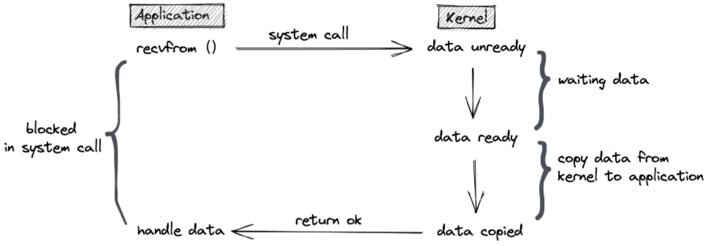
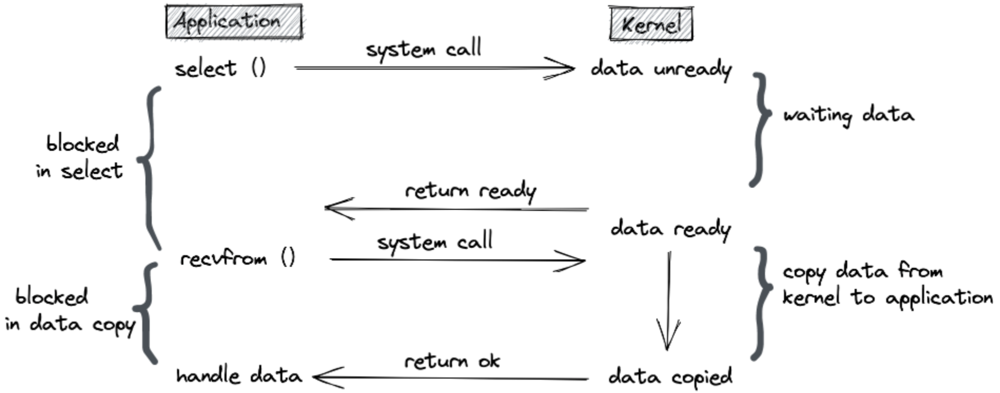
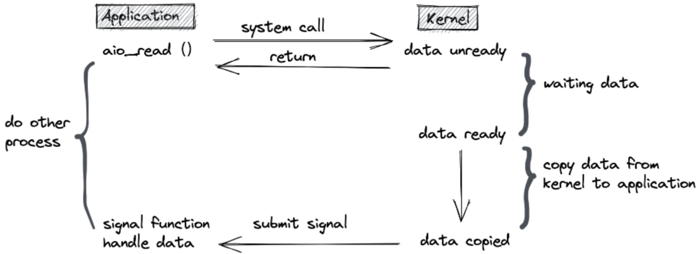
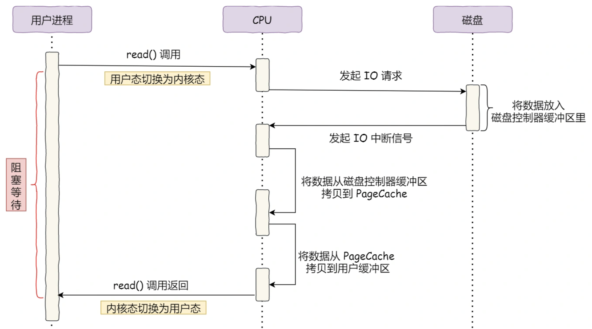
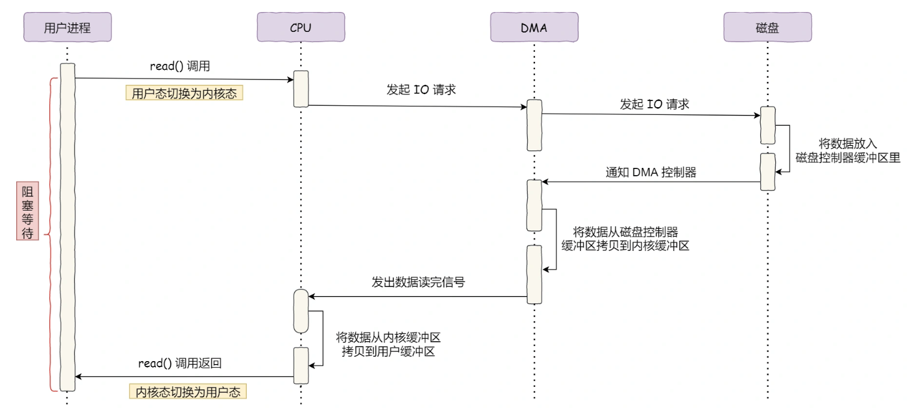
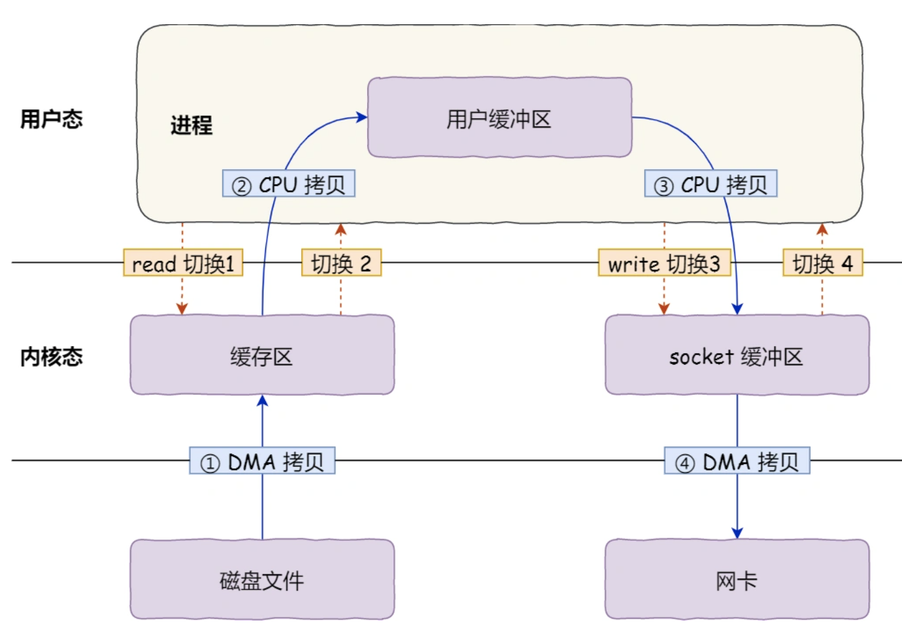
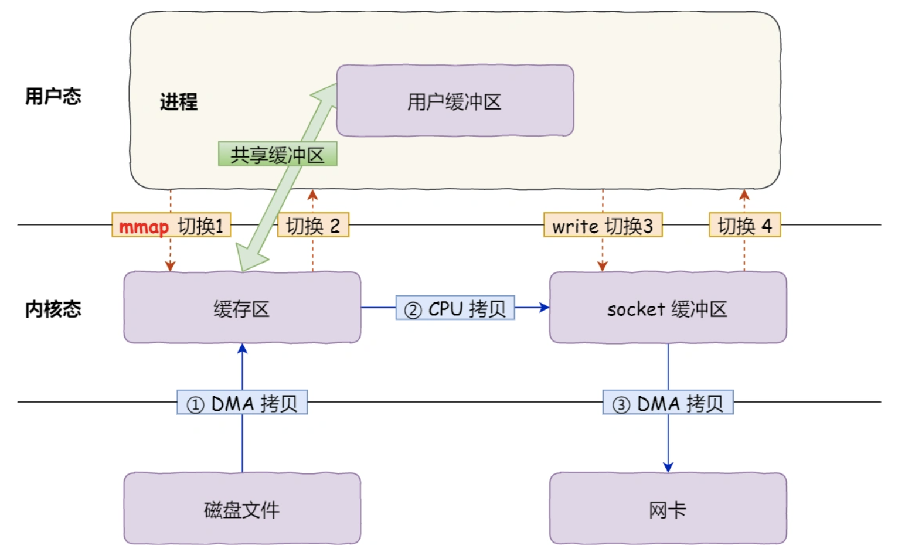
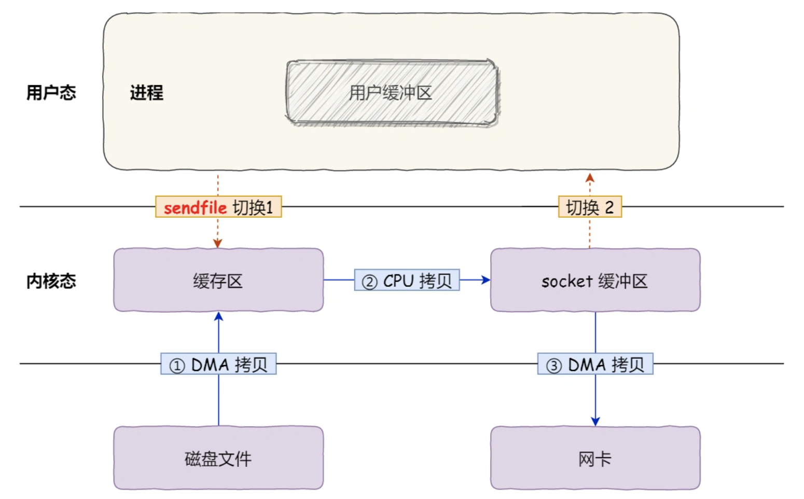
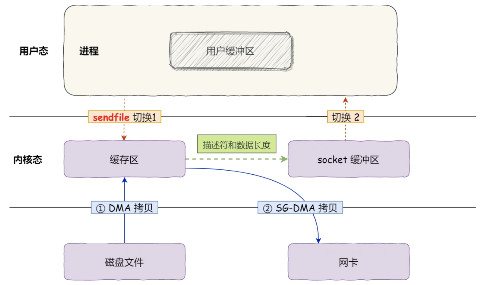
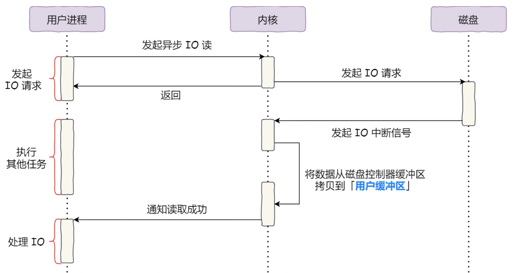

# 网络 IO 基础

## Linux IO 模型

### 同步阻塞 IO（Blocking IO）

同步阻塞 IO 最常用的 IO 模型，也是最简单的 IO 模型。在 linux 中，默认情况下所有的 socket 都是 blocking 的，在这个 IO 模型中，用户空间的应用程序执行系统调用（recvform）触发 IO，这会导致应用程序阻塞，什么也不干，直到数据准备好。准备好的意思是内核态准备好数据并且将数据从内核态复制到用户进程。最后用户进程再处理数据。

在等待数据和内核拷贝数据到用户态的两个阶段，整个应用进程都被阻塞。不能处理别的网络 IO，处于一种不再消耗 CPU 而只是简单等待响应的状态。该过程大致如下图：



### 同步非阻塞 IO （Nonblocking IO）

同步非阻塞 IO 是一种 “每隔一会儿瞄一眼” 的轮询（polling）方式。在这种模型中,  recvform 系统调用会先检查数据是否准备好，进程并没有立马被阻塞，内核会马上返回给进程数据是否准备好，如果数据没准备好，会返回未准备好的信号，此时进程可以干别的事情，然后再次发起 recvform 系统调用。重复以上过程，循环往复的进行 recvform 系统调用，这个过程通常被称之为轮询。轮询检查内核数据，直到数据准备好，再拷贝数据到进程，进行数据处理。需要注意，拷贝数据整个过程，进程仍然是属于阻塞的状态。在linux下，可以通过设置 socket 使其变为 non-blocking，对一个 non-blocking socket 执行读操作的流程如下图所示：


### IO 多路复用（IO multiplexing）

同步非阻塞方式需要不断主动轮询，会消耗大量的CPU时间。如果进行轮询的不是用户进程，而是内核帮忙就好了，而内核可能有多个IO任务同时进行，在这样的条件下，内核就需要循环查询多个任务的完成状态，只要有任何一个任务完成，就去处理它。那么这就是所谓的 “IO 多路复用”。UNIX/Linux 下的 select、poll、epoll 就是干这个的（epoll 比 poll、select 效率高，做的事情是一样的）。

IO多路复用有两个特别的系统调用 select、poll、epoll 函数。select 调用是内核级别的，select 轮询相对同步非阻塞的轮询区别在于前者可以等待多个 socket，能实现同时对多个 IO 端口进行监听，当其中任何一个 socket 的数据准好了，就能返回对应可读的文件描述符，然后进程再进行 recvform 系统调用，将数据由内核拷贝到用户进程，当然**拷贝的过程依然是阻塞**的。

select 或 poll 调用之后，会阻塞进程，与 blocking IO 阻塞不同，select 不是等到 socket 数据全部到达再处理, 而是有了一部分数据就会调用用户进程来处理。但是select也带来了新的问题，就是多个IO之间的顺序变得不确定了，可以针对不同的文件描述符进行不同的操作。该流程如下图所示：



#### select 、poll 和 epoll 的区别

|                  | select                               | poll                                 | epoll                                                        |
| ---------------- | ------------------------------------ | ------------------------------------ | ------------------------------------------------------------ |
| 底层数据结构     | 数组存储 fd                          | 链表存储 fd                          | **红黑树**存储监控的 fd，**双链表**存储就绪的 fd             |
| 获取就绪 fd 方式 | 遍历数组                             | 遍历链表                             | 注册回调函数                                                 |
| 时间复杂度       | O(n)                                 | O(n)                                 | O(1) ，当有就绪事件时，注册的回调函数就会被调用，将就绪的 fd 放入就绪链表中 |
| fd 数据拷贝      | 需要将fd数据从用户空间拷贝到内核空间 | 需要将fd数据从用户空间拷贝到内核空间 | 使用内存映射(mmap)，不需要从用户空间频繁拷贝fd数据到内核空间，也就是**零拷贝** |
| 最大连接数       | 有限制，一般为1024                   | 无限制                               | 无限制                                                       |
| 适用场景         | 连接数较少并且都很活跃               | 连接数较少并且都很活跃               | 连接数较多并且都不很活跃                                     |

### 异步 IO（Asynchronous IO）

异步 IO 模型的调用和真正的 IO 过程是异步执行的，用户进程进行 aio_read 系统调用之后，无论内核数据是否准备好，都会直接返回给用户进程，然后用户态进程可以去做别的事情。等到 socket 数据准备好了，内核直接复制数据到进程空间，然后内核向进程发送通知，IO 两个阶段，进程都是非阻塞的，该流程如下图所示：



## 零拷贝技术

### DMA 技术

DMA 即 Direct Memory Access 直接内存访问技术，在没有 DMA 前 IO 的过程如下：

- CPU 发出对应的指令给磁盘控制器，然后返回；
- 磁盘控制器收到指令后，于是就开始准备数据，会把数据放入到磁盘控制器的内部缓冲区中，然后产生一个**中断**；
- CPU 收到中断信号后，停下手头的工作，接着把磁盘控制器的缓冲区的数据一次一个字节地读进自己的寄存器，然后再把寄存器里的数据写入到内存，而在数据传输的期间 CPU 是无法执行其他任务的。



可以看到，整个数据的传输过程，都要需要 CPU 亲自参与搬运数据的过程，而且这个过程，CPU 是不能做其他事情的。简单的搬运几个字符数据那没问题，但是如果用千兆网卡或者硬盘传输大量数据的时候，都用 CPU 来搬运的话，肯定忙不过来。

什么是 DMA 技术？简单理解就是，**在进行 I/O 设备和内存的数据传输的时候，数据搬运的工作全部交给 DMA 控制器，而 CPU 不再参与任何与数据搬运相关的事情，这样 CPU 就可以去处理别的事务**。



具体过程：

- 用户进程调用 read 方法，向操作系统发出 I/O 请求，请求读取数据到自己的内存缓冲区中，进程进入阻塞状态；
- 操作系统收到请求后，进一步将 I/O 请求发送 DMA，然后让 CPU 执行其他任务；
- DMA 进一步将 I/O 请求发送给磁盘；
- 磁盘收到 DMA 的 I/O 请求，把数据从磁盘读取到磁盘控制器的缓冲区中，当磁盘控制器的缓冲区被读满后，向 DMA 发起中断信号，告知自己缓冲区已满；
- **DMA 收到磁盘的信号，将磁盘控制器缓冲区中的数据拷贝到内核缓冲区中，此时不占用 CPU，CPU 可以执行其他任务**；
- 当 DMA 读取了足够多的数据，就会发送中断信号给 CPU；
- CPU 收到 DMA 的信号，知道数据已经准备好，于是将数据从内核拷贝到用户空间，系统调用返回；

### 缓存 IO

首先介绍一个名词：缓存IO。缓存 IO 又被称作标准 IO，大多数文件系统的默认 IO 操作都是缓存 IO。在 Linux 的缓存 IO 机制中，操作系统会将 IO 的数据缓存在文件系统的页缓存（ page cache ）中，也就是说，数据会先被拷贝到操作系统内核的缓冲区中，然后才会从操作系统内核的缓冲区拷贝到应用程序的地址空间。



**缓存 IO 的缺点：**

首先，标准 IO 期间共**发生了 4 次用户态与内核态的上下文切换**，因为发生了两次系统调用，一次是 `read()` ，一次是 `write()`，每次系统调用都得先从用户态切换到内核态，等内核完成任务后，再从内核态切换回用户态。

上下文切换到成本并不小，一次切换需要耗时几十纳秒到几微秒，虽然时间看上去很短，但是在高并发的场景下，这类时间容易被累积和放大，从而影响系统的性能。

其次，还**发生了 4 次数据拷贝**，其中两次是 DMA 的拷贝，另外两次则是通过 CPU 拷贝的，下面说一下这个过程：

- *第一次拷贝*，把磁盘上的数据拷贝到操作系统内核的缓冲区里，这个拷贝的过程是通过 DMA 搬运的。
- *第二次拷贝*，把内核缓冲区的数据拷贝到用户的缓冲区里，于是我们应用程序就可以使用这部分数据了，这个拷贝到过程是由 CPU 完成的。
- *第三次拷贝*，把刚才拷贝到用户的缓冲区里的数据，再拷贝到内核的 socket 的缓冲区里，这个过程依然还是由 CPU 搬运的。
- *第四次拷贝*，把内核的 socket 缓冲区里的数据，拷贝到网卡的缓冲区里，这个过程又是由 DMA 搬运的。

仔细考量这个 IO 过程，只是搬运一份数据（从磁盘到网卡），结果却搬运了 4 次，过多的数据拷贝无疑会消耗 CPU 资源，大大降低了系统性能。这种简单又传统的文件传输方式，存在冗余的上文切换和数据拷贝，在高并发系统里是非常糟糕的，多了很多不必要的开销，会严重影响系统性能。

所以，**要想提高文件传输的性能，就需要减少「用户态与内核态的上下文切换」和「内存拷贝」的次数**。

1. 如何减少上下文切换的次数呢？

   读取磁盘数据的时候，之所以要发生上下文切换，这是因为用户空间没有权限操作磁盘或网卡，内核的权限最高，这些操作设备的过程都需要交由操作系统内核来完成，所以一般要通过内核去完成某些任务的时候，就需要使用操作系统提供的系统调用函数。而一次系统调用必然会发生 2 次上下文切换：首先从用户态切换到内核态，当内核执行完任务后，再切换回用户态交由进程代码执行。所以，**要想减少上下文切换到次数，就要减少系统调用的次数**。

2. 如何减少内存拷贝的次数呢？

   根据前面的分析，标准 IO 会历经 4 次数据拷贝，而且「从内核的读缓冲区拷贝到用户的缓冲区里，再从用户的缓冲区里拷贝到 socket 的缓冲区里」，这个过程是没有必要的。因为文件传输的应用场景中，在用户空间我们并不会对数据「再加工」，所以数据实际上可以不用搬运到用户空间，因此**用户的缓冲区是没有必要存在的**。

### 零拷贝的实现

零拷贝就是一种减少「上下文切换」和「数据拷贝」的技术。看一下是如何减少的：

#### mmap + write

`read()` 系统调用的过程中会把内核缓冲区的数据拷贝到用户的缓冲区里，于是为了减少这一步开销，我们可以用 `mmap()` 替换 `read()` 系统调用函数

```c
buf = mmap(file, len);
write(sockfd, buf, len);
```

`mmap()` 系统调用函数会直接把内核缓冲区里的数据「**映射**」到用户空间，这样操作系统内核与用户空间就不需要再进行任何的数据拷贝操作。



具体过程如下：

- 应用进程调用了 `mmap()` 后，DMA 会把磁盘的数据拷贝到内核的缓冲区里。接着，应用进程跟操作系统内核「共享」这个缓冲区；
- 应用进程再调用 `write()`，操作系统直接在内核态将缓冲区的数据拷贝到 socket 缓冲区中，由 CPU 来搬运数据；
- 最后，把内核的 socket 缓冲区里的数据，拷贝到网卡的缓冲区里，这个过程是由 DMA 搬运的。

通过使用 `mmap()` 来代替 `read()`， 可以减少一次数据拷贝的过程。但这还不是最理想的零拷贝，因为仍然需要通过 CPU 把内核缓冲区的数据拷贝到 socket 缓冲区里，而且仍然需要 **4 次上下文切换，因为系统调用还是 2 次**。

#### sendfile

在 Linux 内核版本 2.1 中，提供了一个专门发送文件的系统调用函数 `sendfile()`，函数形式如下：

```c
#include <sys/socket.h>
ssize_t sendfile(int out_fd, int in_fd, off_t *offset, size_t count);
```

它的前两个参数分别是目的端和源端的文件描述符，后面两个参数是源端的偏移量和复制数据的长度，返回值是实际复制数据的长度。首先，它可以替代前面的 `read()` 和 `write()` 这两个系统调用，这样就可以减少一次系统调用，也就**减少了 2 次上下文切换的开销**。其次，该系统调用，可以直接把内核缓冲区里的数据拷贝到 socket 缓冲区里，不再拷贝到用户态，这样就只有 2 次上下文切换，和 3 次数据拷贝。如下图：



但是这还不是真正的零拷贝技术，如果网卡支持 SG-DMA（*The Scatter-Gather Direct Memory Access*）技术（和普通的 DMA 有所不同），我们可以进一步减少通过 CPU 把内核缓冲区里的数据拷贝到 socket 缓冲区的过程。可以在 Linux 系统通过下面这个命令，查看网卡是否支持 scatter-gather 特性：

```bash
$ ethtool -k eth0 | grep scatter-gather
scatter-gather: on
```

于是，从 Linux 内核 `2.4` 版本开始起，对于支持网卡支持 SG-DMA 技术的情况下， `sendfile()` 系统调用的过程发生了点变化，具体过程如下：

- 第一步，通过 DMA 将磁盘上的数据拷贝到内核缓冲区里；
- 第二步，缓冲区描述符和数据长度传到 socket 缓冲区，这样网卡的 SG-DMA 控制器就可以直接将内核缓存中的数据拷贝到网卡的缓冲区里，此过程不需要将数据从操作系统内核缓冲区拷贝到 socket 缓冲区中，这样就减少了一次数据拷贝；

所以，这个过程之中，只进行了 2 次数据拷贝，如下图：



这就是所谓的**零拷贝（\*Zero-copy\*）技术，因为没有在内存层面去拷贝数据(内存到内存)，也就是说全程没有通过 CPU 来搬运数据，所有的数据都是通过 DMA 来进行传输的。**

零拷贝技术的文件传输方式相比传统文件传输的方式，减少了 2 次上下文切换和数据拷贝次数，**只需要 2 次上下文切换和数据拷贝次数，就可以完成文件的传输，而且 2 次的数据拷贝过程，都不需要通过 CPU，2 次都是由 DMA 来搬运。**

所以，总体来看，**零拷贝技术可以把文件传输的性能提高至少一倍以上**。

### 直接 IO

#### PageCahe 的作用

内核态内存缓冲区其实就是 PageCache，PageCache 的优点主要是两个，缓存最近被访问的数据和预读取。**但是，在传输大文件（GB 级别的文件）的时候，PageCache 会起副作用，白白浪费 DMA 多做的一次数据拷贝，造成性能的降低，即使使用了 PageCache 的零拷贝也会损失性能**。这是因为如果有很多 GB 级别文件需要传输，每当用户访问这些大文件的时候，内核就会把它们载入 PageCache 中，于是 PageCache 空间很快被这些大文件占满。

另外，由于文件太大，可能某些部分的文件数据被再次访问的概率比较低，这样就会带来 2 个问题：

- PageCache 由于长时间被大文件占据，其他「热点」的小文件可能就无法充分使用到 PageCache，于是这样磁盘读写的性能就会下降了；
- PageCache 中的大文件数据，由于没有享受到缓存带来的好处，但却耗费 DMA 多拷贝到 PageCache 一次；

所以，针对大文件的传输，不应该使用 PageCache，因为可能由于 PageCache 被大文件占据，而导致「热点」小文件无法利用到 PageCache，这样在高并发的环境下，会带来严重的性能问题。

#### 大文件传输用什么方式实现？

缓存 IO 的 PageCache 会对大文件的传输造成负优化，因此需要使用直接 IO，Linux 下的直接 IO 方式只有一种：异步IO，流程如下：



它把读操作分为两部分：

- 前半部分，内核向磁盘发起读请求，但是可以**不等待数据就位就可以返回**，于是进程此时可以处理其他任务；
- 后半部分，当内核将磁盘中的数据拷贝到进程缓冲区后，进程将接收到内核的**通知**，再去处理数据；

### 总结

* 早期 IO 操作，内存与磁盘的数据传输的工作都是由 CPU 完成的，而此时 CPU 不能执行其他任务，会特别浪费 CPU 资源。

* 于是 DMA 技术就出现了，每个 IO 设备都有自己的 DMA 控制器，CPU 只需要告诉 DMA 控制器，要传输什么数据，从哪里来，到哪里去，就可以放心离开了。后续的 DMA 会负责磁盘/网卡数据的传输，CPU 不需要参与磁盘/网卡数据传输的工作。

* 传统 IO 的工作方式，从硬盘读取数据，然后再通过网卡向外发送，需要进行 4 上下文切换，和 4 次数据拷贝，其中 2 次数据拷贝发生在内存里的缓冲区和对应的硬件设备之间，这个是由 DMA 完成，另外 2 次则发生在内核态和用户态之间，这个数据搬移工作是由 CPU 完成的

* 为了提高文件传输的性能，于是就出现了零拷贝技术，它通过一次系统调用（`sendfile` 方法）合并了磁盘读取与网络发送两个操作，降低了上下文切换次数。另外，拷贝数据都是发生在内核中的，降低了数据拷贝的次数

* PageCache 会缓存最近访问的数据，提升访问缓存数据的性能，同时，为了解决机械硬盘寻址慢的问题，它还协助 IO 调度算法实现了 IO 合并与预读，这也是顺序读比随机读性能好的原因。这些优势，进一步提升了零拷贝的性能

* 但是在高并发场景下传输大文件时，不能使用零拷贝，因为可能由于 PageCache 被大文件占据，而导致「热点」小文件无法利用到 PageCache，并且大文件的缓存命中率不高，产生负优化。这时就需要使用「异步/直接 IO 」的方式