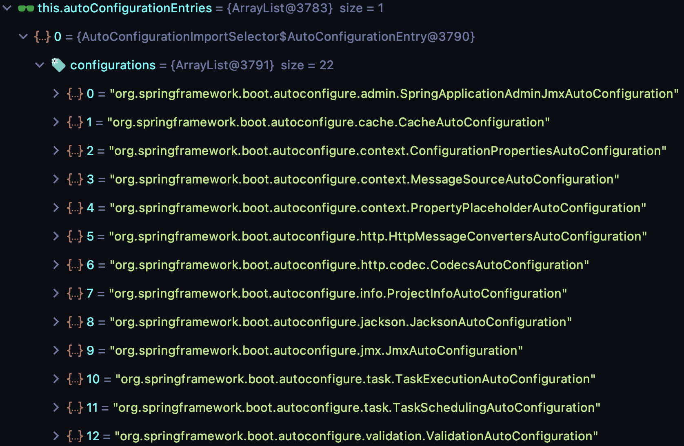

# AOP与依赖注入

## 自动加载配置原理

因为 SpringBoot 也是基于 Spring，这里直接以 SpringBoot 应用为源码梳理的基础，不再去看最原始的 Spring 基于 xml 格式的配置文件搭建的应用了。这里给一个最简单的 demo：

```xml
<?xml version="1.0" encoding="UTF-8"?>
<project xmlns="http://maven.apache.org/POM/4.0.0"
         xmlns:xsi="http://www.w3.org/2001/XMLSchema-instance"
         xsi:schemaLocation="http://maven.apache.org/POM/4.0.0 http://maven.apache.org/xsd/maven-4.0.0.xsd">
    <modelVersion>4.0.0</modelVersion>

    <groupId>org.example</groupId>
    <artifactId>SpringLearning</artifactId>
    <version>1.0-SNAPSHOT</version>

    <parent>
        <groupId>org.springframework.boot</groupId>
        <artifactId>spring-boot-starter-parent</artifactId>
        <version>2.1.4.RELEASE</version>
        <relativePath/> <!-- lookup parent from repository -->
    </parent>
    
    <dependencies>
        <dependency>
            <groupId>org.springframework.boot</groupId>
            <artifactId>spring-boot-starter-web</artifactId>
        </dependency>
    </dependencies>

</project>
```

```java
package realcoder;

import org.springframework.boot.SpringApplication;
import org.springframework.boot.autoconfigure.SpringBootApplication;

@SpringBootApplication
public class App {
    public static void main(String[] args) {
        SpringApplication.run(App.class, args);
    }
}
```

主应用类使用注解@SpringBootApplication后，在main方法中调用SpringApplication.run方法就可以运行了。相对于以前 Spring 基于 xml 的项目搭建方式要简单很多，那么一切的入口肯定都在 SpringApplication.run 方法中了：

```java
// SpringApplication 类
public class SpringApplication {
  // run 方法首先调用到这里，这个方法里面调用了下面的 run 方法
  public static ConfigurableApplicationContext run(Class<?> primarySource, String... args) {
        return run(new Class[]{primarySource}, args);
  }
  // 这个 run 先调用了下面的构造方法，又调用了构造完成的 SpringApplication 实例的 run 方法
  public static ConfigurableApplicationContext run(Class<?>[] primarySources, String[] args) {
        return (new SpringApplication(primarySources)).run(args);
  }
  // run 方法调用的构造方法，实际上又调用的下面
  public SpringApplication(Class<?>... primarySources) {
        this((ResourceLoader)null, primarySources);
  }
  // 构造方法
  public SpringApplication(ResourceLoader resourceLoader, Class<?>... primarySources) {
        this.sources = new LinkedHashSet();
        this.bannerMode = Mode.CONSOLE;
        this.logStartupInfo = true;
        this.addCommandLineProperties = true;
        this.addConversionService = true;
        this.headless = true;
        this.registerShutdownHook = true;
        this.additionalProfiles = new HashSet();
        this.isCustomEnvironment = false;
        this.resourceLoader = resourceLoader;
        Assert.notNull(primarySources, "PrimarySources must not be null");
        this.primarySources = new LinkedHashSet(Arrays.asList(primarySources));
     		// 这里返回的其实是 SEVLET，可以DEBUG看一下
        this.webApplicationType = WebApplicationType.deduceFromClasspath();
    		// 这里设置了 6 个 Initializer
        this.setInitializers(this.getSpringFactoriesInstances(ApplicationContextInitializer.class));
    		// 这里设置了 10 个 Listener
        this.setListeners(this.getSpringFactoriesInstances(ApplicationListener.class));
    		// 这里把 mainApplicationClass 设为 App.class
        this.mainApplicationClass = this.deduceMainApplicationClass();
    }
  	// SpringApplication 实例的 run 方法，返回 ConfigurableApplicationContext 实例子
  	public ConfigurableApplicationContext run(String... args) {
        StopWatch stopWatch = new StopWatch(); 
        stopWatch.start();
        ConfigurableApplicationContext context = null;
        Collection<SpringBootExceptionReporter> exceptionReporters = new ArrayList();
        this.configureHeadlessProperty();
        SpringApplicationRunListeners listeners = this.getRunListeners(args);
        listeners.starting(); // 发出 starting 的事件

        Collection exceptionReporters;
        try {
            ApplicationArguments applicationArguments = new DefaultApplicationArguments(args);
            ConfigurableEnvironment environment = this.prepareEnvironment(listeners, applicationArguments);
            this.configureIgnoreBeanInfo(environment);
            Banner printedBanner = this.printBanner(environment);
            context = this.createApplicationContext(); // 创建应用上下文
            exceptionReporters = this.getSpringFactoriesInstances(SpringBootExceptionReporter.class, new Class[]{ConfigurableApplicationContext.class}, context);
            this.prepareContext(context, environment, listeners, applicationArguments, printedBanner);
            this.refreshContext(context); // 这个方法很重要，因为这里会扫描 @Import 注解把需要的类加载进应用上下文
            this.afterRefresh(context, applicationArguments);
            stopWatch.stop();
            if (this.logStartupInfo) {
                (new StartupInfoLogger(this.mainApplicationClass)).logStarted(this.getApplicationLog(), stopWatch);
            }

            listeners.started(context); // 发出 started 事件
            this.callRunners(context, applicationArguments);
        } catch (Throwable var10) {
            this.handleRunFailure(context, var10, exceptionReporters, listeners);
            throw new IllegalStateException(var10);
        }

        try {
            listeners.running(context); // 发出 running 事件
            return context; // 返回应用上下文
        } catch (Throwable var9) {
            this.handleRunFailure(context, var9, exceptionReporters, (SpringApplicationRunListeners)null);
            throw new IllegalStateException(var9);
        }
    }
}
```

refresh 方法内部的调用链比较长，其中比较关键的步骤是调用 ConfigurationClassParser 类的 getImports 方法，这个方法会递归扫描所有 @Configuration 注解类，并且拿到这些注解类上的 @Import 注解，拿到这些 @Import 注解中标明需要导入的类进行加载，到这里重点就可以看应用程序主类上的 @SpringBootApplication 注解了：

```java
@SpringBootConfiguration
@EnableAutoConfiguration
@ComponentScan(excludeFilters = {
		@Filter(type = FilterType.CUSTOM, classes = TypeExcludeFilter.class),
		@Filter(type = FilterType.CUSTOM,
				classes = AutoConfigurationExcludeFilter.class) })
public @interface SpringBootApplication {
  ...
}

// @SpringBootApplication 其实是 3 个注解的复合注解，一个个看
// @SpringBootConfiguration 注解
@Configuration
public @interface SpringBootConfiguration {...}

@Component
public @interface Configuration {...}

@Indexed
public @interface Component {...}

// @EnableAutoConfiguration 注解
@AutoConfigurationPackage
@Import(AutoConfigurationImportSelector.class) // 这里找到了一个 Import 注解了，继续往下找，因为是递归查找的
public @interface EnableAutoConfiguration {...}

@Import(AutoConfigurationPackages.Registrar.class) // 又找到了一个 Import 注解了
public @interface AutoConfigurationPackage {...}

// @ComponentScan 注解
@Repeatable(ComponentScans.class)
public @interface ComponentScan {...}
```

 到这里可以发现其实 @SpringBootApplication 直接 Import 的类有两个：AutoConfigurationImportSelector 和 AutoConfigurationPackages.Registrar，看一下这两个类，首先看一下 AutoConfigurationImportSelector，这个类比较重要，以前 Spring 中繁琐的配置在 SpringBoot 中自动配置了，这事就是它干的, ConfigurationClassParser 类会调用  AutoConfigurationImportSelector 的 public Iterable<Entry> selectImports() 方法：

```java
public Iterable<Entry> selectImports() {
			if (this.autoConfigurationEntries.isEmpty()) { // 这个 autoConfigurationEntries 里放的其实就是要加载的配置类
				return Collections.emptyList();
			}
			Set<String> allExclusions = this.autoConfigurationEntries.stream()
					.map(AutoConfigurationEntry::getExclusions)  // 过滤一下被排除掉的配置类
					.flatMap(Collection::stream).collect(Collectors.toSet());
			Set<String> processedConfigurations = this.autoConfigurationEntries.stream()
					.map(AutoConfigurationEntry::getConfigurations)
					.flatMap(Collection::stream)
					.collect(Collectors.toCollection(LinkedHashSet::new));
			processedConfigurations.removeAll(allExclusions);

			return sortAutoConfigurations(processedConfigurations,
					getAutoConfigurationMetadata())
							.stream()
							.map((importClassName) -> new Entry(
									this.entries.get(importClassName), importClassName))
							.collect(Collectors.toList());
		}
```

其实进入这个方法前 autoConfigurationEntries 其实就已经有内容了，可以看一下 DEBUG 的图，一共有 22 个类。



那么看一下 autoConfigurationEntries 是什么时候初始化的以及如何初始化的，通过 DEBUG 发现其实是在 process 方法中做的：

```java
@Override
public void process(AnnotationMetadata annotationMetadata,
                    DeferredImportSelector deferredImportSelector) {
  Assert.state(
    deferredImportSelector instanceof AutoConfigurationImportSelector,
    () -> String.format("Only %s implementations are supported, got %s",
                        AutoConfigurationImportSelector.class.getSimpleName(),
                        deferredImportSelector.getClass().getName()));
  AutoConfigurationEntry autoConfigurationEntry = ((AutoConfigurationImportSelector) deferredImportSelector)
    .getAutoConfigurationEntry(getAutoConfigurationMetadata(), // 这里有两个方法 getAutoConfigurationMetadata 和 getAutoConfigurationEntry，关键就在这里了
                               annotationMetadata);
  this.autoConfigurationEntries.add(autoConfigurationEntry);
  for (String importClassName : autoConfigurationEntry.getConfigurations()) {
    this.entries.putIfAbsent(importClassName, annotationMetadata);
  }
}

// getAutoConfigurationMetadata 方法其实是从 META-INF/spring-autoconfigure-metadata.properties 文件下读配置元数据，一共有 681 条，接着把这 681 条交给 getAutoConfigurationEntry 处理
// getAutoConfigurationEntry 中会调用 getCandidateConfigurations 方法进行处理：
protected List<String> getCandidateConfigurations(AnnotationMetadata metadata,
                                                  AnnotationAttributes attributes) {
  List<String> configurations = SpringFactoriesLoader.loadFactoryNames( // 这里就是在读 META-INF/spring.factories 文件中的配置属性了，可以去看一下这个文件
    getSpringFactoriesLoaderFactoryClass(), getBeanClassLoader());
  Assert.notEmpty(configurations,
                  "No auto configuration classes found in META-INF/spring.factories. If you "
                  + "are using a custom packaging, make sure that file is correct.");
  return configurations; // 这里会返回 118 个配置类的全路径类名
}

// getCandidateConfigurations 还会对返回的 118 个配置类进行过滤去除需要排除的配置，最终保留了 22 个配置
protected AutoConfigurationEntry getAutoConfigurationEntry(
			AutoConfigurationMetadata autoConfigurationMetadata, 
			AnnotationMetadata annotationMetadata) {
		if (!isEnabled(annotationMetadata)) {
			return EMPTY_ENTRY;
		}
		AnnotationAttributes attributes = getAttributes(annotationMetadata);
		List<String> configurations = getCandidateConfigurations(annotationMetadata,
				attributes);
		configurations = removeDuplicates(configurations); // 去重，这里一般重复的不多
		Set<String> exclusions = getExclusions(annotationMetadata, attributes); 
		checkExcludedClasses(configurations, exclusions);
		configurations.removeAll(exclusions); // 去除被排除了，这里按照我的 demo 是没有任何配置被去除
		configurations = filter(configurations, autoConfigurationMetadata); // 过滤，这一步去除了很多，由 118 减少到了 22 个
		fireAutoConfigurationImportEvents(configurations, exclusions); // 发出配置导入事件
		return new AutoConfigurationEntry(configurations, exclusions);
	}
```

好了，到这里为止就算初步看完了 SpringBoot 的自动导入配置的原理了。核心就是两个，@Import 注解和 AutoConfigurationImportSelector 这个类。

## AOP

Spring AOP 是基于 JDK 动态代理和 Cglib 提升实现的，两种代理方式都属于运行时实现，没有编译时的处理。AspectJ 自己有一个编译器，在编译时期可以修改 .class 文件，在运行时也会进行处理。JDK 的动态代理对被代理的类有要求，被代理类必须实现接口，而对于一些没有实现接口的类，就需要借助 AspectJ 修改字节码来实现 AOP 了。

## 依赖注入方式

在依赖注入中，编程人员不必使用 new 创建对象，只需描述如何创建它们，剩下的 Bean 的装配由 Spring 框架 IOC 容器来完成。依赖注入的方式有：变量注入、set 注入、构造器注入。一个简单的 demo：

```java
@Service
public class UserServiceImpl implements UserService {
    @Autowired
    private UserMapper userMapper; // 变量注入
}

@Service
public class UserServiceImpl implements UserService {
 
    private final UserMapper userMapper;
 
    @Autowired
    public UserServiceImpl(UserMapper userMapper) { // 构造器注入
        this.userMapper = userMapper;
    }
}

@Service
public class UserServiceImpl implements UserService {
 
    private UserMapper userMapper;
 
    @Autowired
    public void setUserMapper(UserMapper userMapper) { // set 注入
        this.userMapper = userMapper;
    }
}
```

几种注入方式的优缺点：

| 注入方式   | 优点                                                         | 缺点                                                         |
| ---------- | ------------------------------------------------------------ | ------------------------------------------------------------ |
| 变量注入   | 注入方式简单，没有任何多余代码                               | 注入属性不能用 final 修饰<br />可能会导致循环依赖（如果Spring解决循环依赖配置关闭的话），启动的时候不会报错，在使用 bean 的时候才会报错<br />对于 IOC 容器以外的 bean，除了使用反射来提供它需要的依赖之外，无法完成注入，使用  bean 的时候才会报错 |
| 构造器注入 | 注入对象可以使用final修饰<br />非IOC容器环境也可使用new实例化该类的对象<br />避免循环依赖，如果存在循环依赖，spring项目启动的时候就会报错 | 当有很多对象需要注入时，构造函数的代码臃肿                   |
| set 注入   | 依赖可以为 NULL<br />允许类构造完成后重新注入（调用set）     | 注入对象不能使用final修饰                                    |