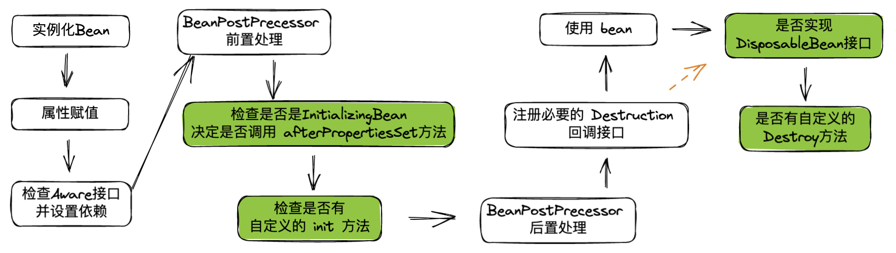
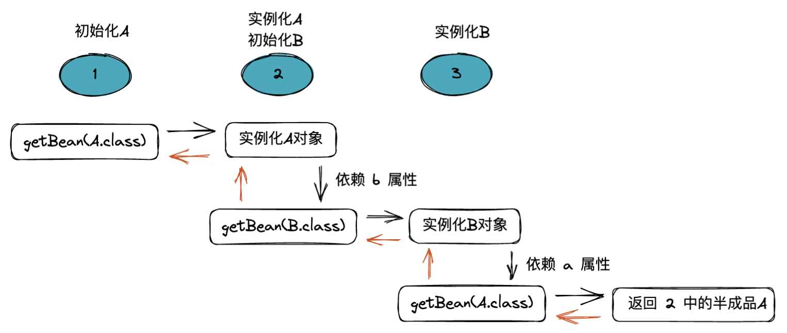

# Bean 相关特性

## bean 生命周期

生命周期即 Spring 中 bean 从创建到销毁的过程，可以简单概括为以下四个步骤：

- 实例化 Instantiation
- 属性赋值 Populate
- 初始化 Initialization
- 销毁 Destruction

上面的这几个过程在 AbstractApplicationContext 的 refresh() 方法的 finishBeanFactoryInitialization(beanFactory) 中可以体现，这里只给出主流程的代码：

```java
protected Object doCreateBean(String beanName, RootBeanDefinition mbd, @Nullable Object[] args) throws BeanCreationException {
    BeanWrapper instanceWrapper = null;
    if (mbd.isSingleton()) {
        instanceWrapper = (BeanWrapper)this.factoryBeanInstanceCache.remove(beanName);
    }
    if (instanceWrapper == null) {
        // 实例化阶段
        instanceWrapper = this.createBeanInstance(beanName, mbd, args);
    }
    ...
    Object exposedObject = bean;

    try {
        // 属性赋值阶段
        this.populateBean(beanName, mbd, instanceWrapper);
        // 初始化阶段
        exposedObject = this.initializeBean(beanName, exposedObject, mbd);
    } catch (Throwable var18) {
        ...
    }
    ...
}
// bean 的销毁是在容器关闭时调用的，可以看 ConfigurableApplicationContext 的 close() 方法
```

## bean 生命周期的扩展点



扩展点提供了 Bean 生命周期的定制化功能，可以看一个 demo：

```java
// 要定制的 Bean
@Component
public class BeanAwareTest implements BeanNameAware, InitializingBean, DisposableBean {

    String value = "value-initial";

    @Override
    public void setBeanName(String s) {
        System.out.println("bean name : "+ s);
    }

    @Override
    public void afterPropertiesSet() throws Exception {
        System.out.println("value before : " + value);
        value = "new-value";
        System.out.println("value now : " + value);
    }

    @Override
    public void destroy() throws Exception {
        System.out.println("destroy exec, bye...");
    }
}

// 自定义 BeanPostProcessor
@Configuration
public class PostProcessProcessor implements BeanPostProcessor {

    // 前置处理，可以不覆写，BeanPostProcessor 中用 @Nullable 注解了
    @Override
    public Object postProcessBeforeInitialization(Object bean, String beanName) throws BeansException {
        if(beanName.equals("beanAwareTest")) {
            System.out.println("postProcessBeforeInitialization : " + bean);
        }
        return bean;
    }

    // 后置处理，可以不覆写，BeanPostProcessor 中用 @Nullable 注解了
    @Override
    public Object postProcessAfterInitialization(Object bean, String beanName) throws BeansException {
        if(beanName.equals("beanAwareTest")) {
            System.out.println("postProcessAfterInitialization : " + bean );
        }
        return bean;
    }
}

// 主应用类
@SpringBootApplication
public class App {
    public static void main(String[] args) {
        ConfigurableApplicationContext context = SpringApplication.run(App.class, args);
        DefaultListableBeanFactory beanFactory = (DefaultListableBeanFactory) context.getBeanFactory();
        if (beanFactory.containsBean("beanAwareTest")) {
            beanFactory.destroySingleton("beanAwareTest"); // 销毁定制的 bean
        }
    }
}

----------------------------------------
bean name : beanAwareTest
postProcessBeforeInitialization : realcoder.configuration.BeanAwareTest@4052274f
value before : value-initial
value now : new-value
postProcessAfterInitialization : realcoder.configuration.BeanAwareTest@4052274f
destroy exec, bye...
```

## 解决循环依赖

一个最简单的包含循环依赖的代码：

```java
@Component
public class A {
  @Autowired
  private B b;
  public void setB(B b) {
    this.b = b;
  }
}

@Component
public class B {
  @Autowired
  private A a;
  public void setA(A a) {
    this.a = a;
  }
}
```

以创建 A 对象为例，Spring 解决循环依赖的过程大致如下图：



简言之，两个池子：一个成品池子，一个半成品池子。能解决循环依赖的前提是：spring 开启了allowCircularReferences，那么一个正在被创建的bean才会被放在半成品池子里。在注入bean，向容器获取 bean 的时候，优先向成品池子要，要不到再去向半成品池子要。

不过出现循环依赖一定是设计有问题。高层和底层职责划分不够清晰，一般业务的依赖方向一定是无环的，有环的业务，在后续的维护和拓展一定非常鸡肋。