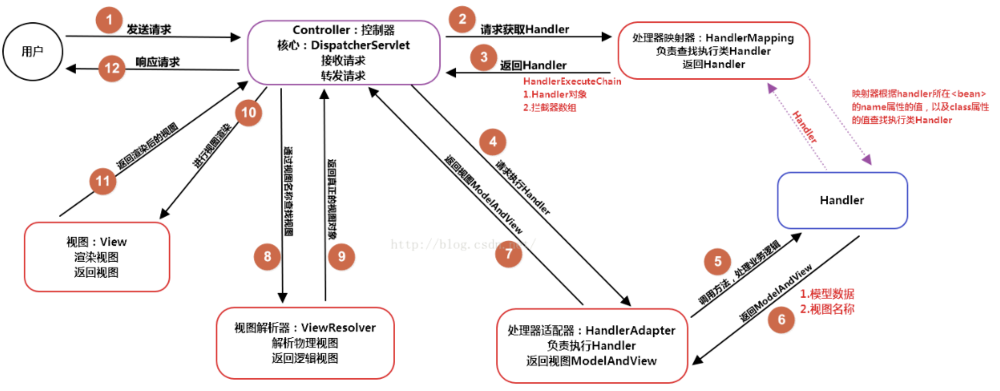

# SpringMVC

> SpringMVC 是一个基于Java 的实现了 MVC 设计模式的请求驱动类型的轻量级Web框架，通过把Model，View，Controller 分离，将 web 层进行职责解耦，把复杂的web应用分成逻辑清晰的几部分，简化开发，减少出错，方便组内开发人员之间的配合.

## SpringMVC请求处理流程

（1）用户发送请求至前端控制器 DispatcherServlet；
（2）DispatcherServlet 收到请求后，调用 HandlerMapping 处理器映射器，请求获取 Handler；
（3）处理器映射器根据请求 url 找到具体的处理器 Handler，生成处理器对象及处理器拦截器(如果有则生成)，一并返回给DispatcherServlet；
（4）DispatcherServlet 调用 HandlerAdapter处理器适配器，请求执行Handler；
（5）HandlerAdapter 经过适配调用 具体处理器进行处理业务逻辑；
（6）Handler执行完成返回ModelAndView；
（7）HandlerAdapter将Handler执行结果ModelAndView返回给DispatcherServlet；
（8）DispatcherServlet将ModelAndView传给ViewResolver视图解析器进行解析；
（9）ViewResolver解析后返回具体View；
（10）DispatcherServlet对View进行渲染视图（即将模型数据填充至视图中）
（11）DispatcherServlet响应用户。

> 前端控制器 DispatcherServlet：接收请求、响应结果，相当于转发器，有了DispatcherServlet 就减少了其它组件之间的耦合度。
> 处理器映射器 HandlerMapping：根据请求的URL来查找Handler
> 处理器适配器 HandlerAdapter：负责执行Handler
> 处理器 Handler：处理器，需要程序员开发
> 视图解析器 ViewResolver：进行视图的解析，根据视图逻辑名将ModelAndView解析成真正的视图（view）
> 视图View：View是一个接口， 它的实现类支持不同的视图类型，如jsp，freemarker，pdf等等

## 过滤器

依赖于 servlet 容器，可以对几乎所有请求进行过滤，缺点是**一个过滤器实例只能在容器初始化时调用一次**。使用过滤器的目的，是用来做一些过滤操作，获取想要的数据，比如对传入的 request、response 提前过滤掉一些信息，或者提前设置一些参数，然后再传入servlet或者Controller进行业务逻辑操作。通常用的场景是：在过滤器中修改字符编码（CharacterEncodingFilter）、修改HttpServletRequest的一些参数（XSSFilter(自定义过滤器)），如：过滤低俗文字、危险字符等。

## 拦截器

依赖于web框架，在SpringMVC中就是依赖于SpringMVC框架。在实现上，基于Java的反射机制，属于面向切面编程（AOP）的一种运用，就是在 service 或者一个方法前，调用一个方法，或者在方法后，调用一个方法，比如动态代理就是拦截器的简单实现方式，在调用方法前打印出字符串（或者做其它业务逻辑的操作），也可以在调用方法后打印出字符串，甚至在抛出异常的时候做业务逻辑的操作。由于拦截器是基于web框架的调用，因此可以使用Spring的依赖注入（DI）进行一些业务操作，同时一个拦截器实例在一个controller生命周期之内可以多次调用。