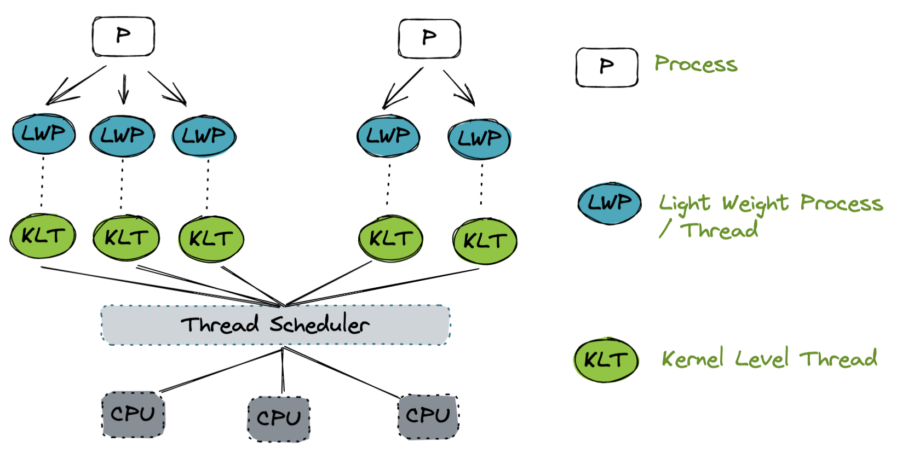
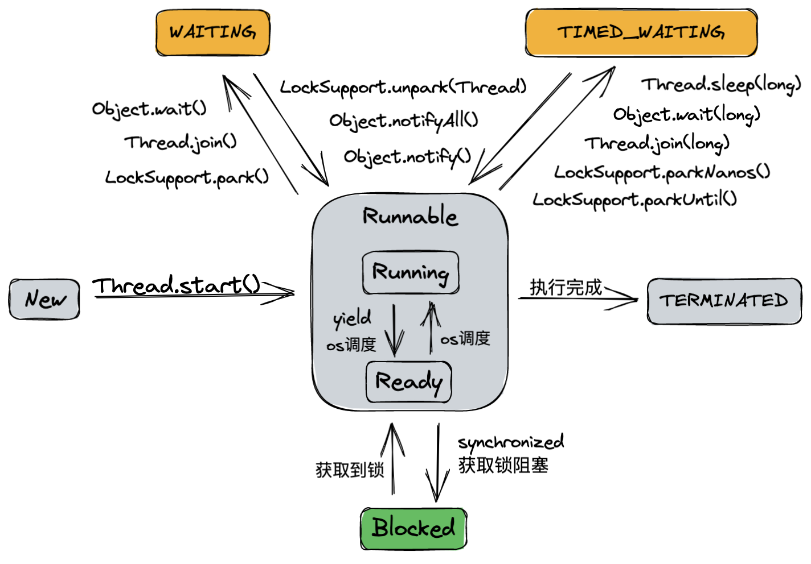
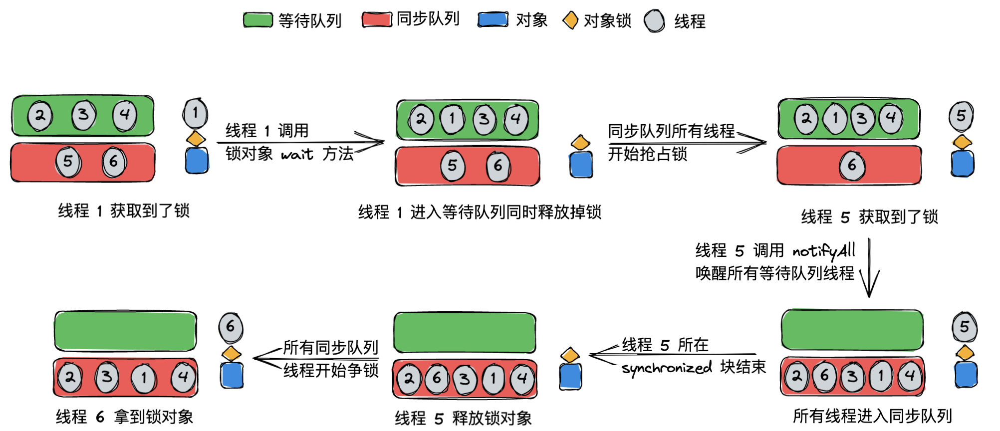
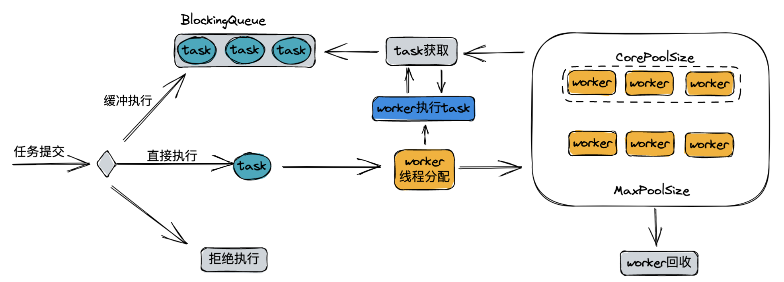

# 多线程

## Java 线程模型

Java 的线程是一对一映射到操作系统的原生线程之上的，JVM 规范没有限定 Java 线程需要使用哪种线程模型来实现，JVM 只是封装了底层操作系统的差异，而不同的操作系统可能使用不同的线程模型，例如 Linux 和 windows 使用了一对一模型。但是企业级应用一般都是部署在Linux中，即一对一模型的。



**优点：**

每个线程都是一个独立的调度单元，使用内核提供的线程调度功能及处理器映射，可以完成线程的切换，并将线程的任务映射到其他处理器上，充分利用多核处理器的优势，实现真正的并行。

**缺点：**

1. 每创建一个用户级线程都需要创建一个内核级线程与其对应，因此需要消耗一定的内核资源，而内核资源是有限的，所以能创建的线程数量也是有限的。
2. 线程的状态转换操作，如创建、挂起、同步以及销毁，都需要进行系统调用在内核中完成，需要频繁的在用户态和内核态之间切换，开销大。

## Java 线程调度

操作系统线程调度主要方式有两种：**协同式（Cooperative Threads-Scheduling）调度**和**抢占式（Preemptive Threads-Scheduling）调度**

- **协同式线程调度**：线程的执行由自己控制，完成任务后主动通知系统切换到另外的线程。
  **优点**：实现简单，切换操作对线程可知，没有线程同步问题。
  **缺点**：线程执行时间不可控制，极端情况下线程可能一直不通知系统进行线程切换，一直占用 cpu 资源。
- **抢占式线程调度**：每个线程由操作系统分配CPU时间片，线程的切换由操作系统完成。
  **优点**：可以主动让出CPU时间片（Java 的 Thread 类的 yield() 方法），线程的执行时间操作系统可控的，不会有某个线程导致整个系统阻塞。
  **缺点**：无法主动获取执行时间

Java 线程采用**抢占式调度**。虽然这种方式的线程调度是操作系统完成的，但是用户可以给操作系统建议，通过设置线程优先级来实现表达调度期望。Java 一共设置了 10 个级别的线程优先级。在两个线程同时处于 Ready 态时，优先级越高的线程被操作系统选择执行的概率越大。

## Java 线程状态

一共 **6** 种状态，定义在 Thread 类的 state 枚举类中。

> 1. 初始态(NEW)：新创建了一个线程对象，但还没有调用start()方法。
> 2. 运行态(RUNNABLE)：Java线程中将就绪（ready）和运行中（running）两种状态笼统的称为“运行”。
> 线程对象创建后，其他线程(比如main线程）调用了该对象的start()方法。该状态的线程位于可运行线程池中，等待被线程调度选中，获取CPU的使用权，此时处于就绪状态（ready）。就绪状态的线程在获得CPU时间片后变为运行中状态（running）。
> 3. 阻塞态(BLOCKED)：表示线程阻塞于锁。
> 4. 等待态(WAITING)：进入该状态的线程需要等待其他线程做出一些特定动作（通知或中断）。
> 5. 超时等待态(TIMED_WAITING)：该状态不同于WAITING，它可以在指定的时间后自行返回。
> 6. 终止态(TERMINATED)：表示该线程已经执行完毕。



Thread.join()/Thread.join(long millis)方法说明：在当前线程调用其它线程 t 的join方法，当前线程进入WAITING/TIMED_WAITING状态，当前线程不会释放已经持有的对象锁。线程 t 执行完毕或者 millis 时间到了，当前线程一般进入RUNNABLE状态，也有可能进入BLOCKED状态（因为 join 是基于 wait 实现的）

## synchronized同步等待队列

调用 object 的 wait(), notify()方法前，必须先获得 object 锁对象，也就是说wait(), notify()方法必须在synchronized(object) 代码段内。JVM 底层使用一个等待队列和同步队列管理正在等待和抢占锁对象的线程，案例：



## volatile关键字

### 可见性问题

一个多线程的应用中，线程在操作非volatile变量时，出于性能考虑会将变量从主存拷贝到CPU缓存中。如果计算机有多个CPU，每个线程可能会在不同的CPU中运行。这意味着，每个线程都有可能会把变量拷贝到各自CPU的缓存中。对于非volatile变量，JVM并不保证会从主存中读取数据到CPU缓存，或者将CPU缓存中的数据写到主存中。这就是“可见性”问题，线程看不到变量最新的值，因为其他线程还没有将变量值从CPU缓存写回到主存。一个线程中的修改对另外的线程是不可见的。

volatile保证变量完整可见性，完整的可见性保证并不是只对于volatile变量本身那么简单。可见性保证遵循以下规则：

* 如果线程A写一个volatile变量，那么线程A会将volatile变量之前的所有变量重新写到主存。
* 如果线程A读一个volatile变量，那么线程A会将volatile变量之后的所有变量重新从主存读取。

> 可以将对volatile变量的读写理解为一个触发刷新的操作，写入volatile变量时，线程中的所有变量也都会触发写入主存。而读取volatile变量时，也同样会触发线程中所有变量从主存中重新读取。因此，应当尽量将volatile的写入操作放在最后，而将volatile的读取放在最前，这样就能连带将其他变量也进行刷新。

### 指令重拍序问题

出于性能考虑，JVM和CPU是允许对程序中的指令进行重排的，只要保证重排后的指令语义一致即可。例如：

```java
int a = 1;
int b = 2;
a++;
b++;
```

这些指令可以按以下顺序重排，而不改变程序的语义：

```java
int a = 1;
a++;
int b = 2;
b++;
```

volatile变量存在的重排序问题：

```java
// 原始代码
public class Demo {
  private int a;
	private volatile int b;
	
  public write() {
    a = 123;
		b = 456;
  }
}
```

如果 JVM 可以对 volatile 变量重排序，那么重排序后 write 方法可能变成这样：

```java
public write() {
		b = 456;
  	a = 123;
}
```

没重排序前写 volatile 变量 b 会同时将 a 也写入到主存，重排序后写 volatile 变量 b 不会将 a 也写入主存。指令重排导致了程序语义的改变。因此事实上 Java 是禁止对 volatile 变量进行指令重排序的，具体如何禁止的请看下面的 happens-before 保证。

### Happens-Before 保证

为了解决指令重排的问题，Java的volatile关键字在可见性之外，又提供了happends-before保证。happens-before原则如下：

> - 如果有读写操作发生在写入volatile变量之前，读写其他变量的指令不能重排到写入volatile变量之后。写入一个volatile变量之前的读写操作，对volatile变量是有happens-before保证的。注意，如果是写入volatile之后，有读写其他变量的操作，那么这些操作指令是有可能被重排到写入volatile操作指令之前的。但反之则不成立。即可以把位于写入volatile操作指令之后的其他指令移到写入volatile操作指令之前，而不能把位于写入volatile操作指令之前的其他指令移到写入volatile操作指令之后。
> - 如果有读写操作发生在读取volatile变量之后，读写其他变量的指令不能重排到读取volatile变量之前。注意，如果是读取volatile之前，有读取其他变量的操作，那么这些操作指令是有可能被重排到读取volatile操作指令之后的。但反之则不成立。即可以把位于读取volatile操作指令之前的指令移到读取volatile操作指令之后，而不能把位于读取volatile操作指令之后的指令移到读取volatile操作指令之前。

### 使用场景

* 如果只有一个线程对volatile进行读写，而其他线程只是读取变量，这时，对于只是读取变量的线程来说，volatile就已经可以保证读取到的是变量的最新值。如果没有把变量声明为volatile，这就无法保证

* 通常结合 synchronized 使用，如果两个线程同时读写一个共享变量，仅仅使用volatile关键字是不够的。应该使用 synchronized 来保证读写变量是原子的。一个线程读写volatile变量时，不会阻塞其他线程进行读写。必须在关键的地方使用 synchronized 关键字来解决这个问题

* 读写volatile变量会导致变量从主存读写。从主存读写比从CPU缓存读写更加“昂贵”。访问一个volatile变量同样会禁止指令重排，而指令重排是一种提升性能的技术。因此，应当只在需要保证变量可见性的情况下，才使用volatile变量

* 经典案例：DCL 单例设计模式：

  ```java
  public class Singleton {
  
    	// volatile 保证 instance 可见性，防止其他线程读不到已经构造完成的实例
      private static volatile Singleton instance = null;
    
  		private Singleton() {
          // 构造方法私有化
      }
    
      public static Singleton getSingleton() {
          if (null == instance) {
              synchronized (Singleton.class) {
                  if (null == instance) {
                      instance = new Singleton();
                  }
              }
          }
          return instance;
      }
  }
  ```

## Java 开线程方式

### 继承Thread类创建线程类

* 定义Thread类的子类，并重写run方法

* 创建已定义的Thread子类实例并调用该实例的 start 方法

### 实现 Runnable 接口

* 定义Runnable接口的实现类，并重写run方法
* 创建已定义的Runnable接口实现类的子类实例并调用该实例的 start 方法

### 通过Callable和Future创建线程

- 定义Callable接口的实现类，并实现call()方法，该call()方法将作为线程执行体，并且有返回值

- 创建Callable实现类的实例，使用FutureTask类实例来包装Callable实例，该FutureTask实例封装了该Callable实例 call()方法的返回值

- 使用FutureTask对象作为Thread对象的构造入参，然后启动线程

- 调用FutureTask对象的get()方法来获得子线程执行结束后的返回值

  ```java
  import java.util.concurrent.Callable;
  import java.util.concurrent.ExecutionException;
  import java.util.concurrent.FutureTask;
  
  public class FutureTest {
      public static void main(String[] args) throws ExecutionException, InterruptedException {
          FutureTask<MyReturn> futureTask = new FutureTask(new MyCallable());
          Thread thread = new Thread(futureTask);
          thread.start();
          System.out.println(futureTask.get().ret);
      }
  
      static class MyReturn {
          String ret = "hello";
      }
  
      static class MyCallable implements Callable<MyReturn> {
  
          @Override
          public MyReturn call() throws Exception {
              return new MyReturn();
          }
      }
  }
  ```

### 通过线程池创建线程

* Java中的线程池核心实现类是**ThreadPoolExecutor**，其他线程池底层还是由**ThreadPoolExecutor**来实现的

* 线程池案例：

  ```java
  import java.util.concurrent.Executor;
  import java.util.concurrent.Executors;
  import java.util.concurrent.ThreadPoolExecutor;
  
  public class ThreadPoolTest {
  
      public static void main(String[] args) {
        	// 创建容量大小为 5 的线程池
          Executor executor = Executors.newFixedThreadPool(5);
          for(int i = 0; i < 10; ++i) {
              executor.execute(()->{ // 提交任务到线程池
                  System.out.println(Thread.currentThread().getName()+ "running.");
                  try {
                      Thread.sleep(1000);
                  } catch (InterruptedException e) {
                      e.printStackTrace();
                  }
              });
          }
          ((ThreadPoolExecutor)executor).shutdown(); // 关闭线程池
      }
  }
  ```

## ThreadLocal 类

ThreadLocal 直译过来即线程局部变量，主要是为了解决多线程中因为数据并发产生不一致的问题。ThreadLocal为每一个线程都提供了变量的副本，使得每一个线程在某一时间访问到的并不是同一个对象，这样就隔离了多个线程对数据的数据共享。特点是会使用更多内存，减少了线程同步的性能消耗，也减少了线程并发控制的复杂度。

一个使用案例：

```java
public class ThreadLocalTest {

    static final ThreadLocal<String> LOCAL = new ThreadLocal<String>() {
        @Override
        protected String initialValue() {
            return "initial value"; // 给个默认值
        }
    };

    public static void main(String[] args) {
        ThreadPoolExecutor executor = (ThreadPoolExecutor) Executors.newFixedThreadPool(3);
        for (int i = 0; i < 3; ++i) {
            executor.execute(() -> {
              	// 打印一下默认值
                System.out.println(Thread.currentThread().getName() + " local : " + LOCAL.get()); 
              	// 各线程单独设置值
                LOCAL.set("new value of " + Thread.currentThread().getName());
              	// 打印各线程最新的值
                System.out.println(Thread.currentThread().getName() + " local : " + LOCAL.get());
            });
        }
        executor.shutdown();
    }
}
-------------------------------------
pool-1-thread-1 local : initial value
pool-1-thread-2 local : initial value
pool-1-thread-2 local : new value of pool-1-thread-2
pool-1-thread-1 local : new value of pool-1-thread-1
pool-1-thread-3 local : initial value
pool-1-thread-3 local : new value of pool-1-thread-3
```

可以看到，各线程设置同一份 ThreadLocal 变量，但是值却可以做到与其他线程隔离开的效果。上面这段代码只用到了简单的 set 和 get 方法，那么就看一下这两个方法的实现。

**set 方法：**

```java
public void set(T value) {
  Thread t = Thread.currentThread();
  ThreadLocalMap map = getMap(t);
  if (map != null)
    map.set(this, value);
  else
    createMap(t, value);
}
```

**get 方法：**

```java
public T get() {
    Thread t = Thread.currentThread();
    ThreadLocalMap map = getMap(t);
    if (map != null) {
        ThreadLocalMap.Entry e = map.getEntry(this);
        if (e != null) {
            @SuppressWarnings("unchecked")
            T result = (T)e.value;
            return result;
        }
    }
    return setInitialValue();
}
```

## JUC 包

### CAS

CAS 全称是 compare and swap，即比较并交换，是一种原子操作，同时 CAS 是一种乐观机制。CAS 是 java.util.concurrent 包的基础。CAS 的思想：三个参数，一个当前内存值 V、旧的预期值 A、即将更新的值 B，当且仅当预期值 A 和内存值 V 相同时，将内存值修改为 B 并返回 true，否则什么都不做，并返回 false，Java中主要借助 Unsafe 包来实现。

**CAS 的问题：**

1. 只能用于一个变量的原子操作，如果要保证多个变量则需要用到锁
2. ABA 问题，解决 ABA 的常用方法有加唯一递增版本号
3. CAS通常都是结合自旋一起使用，当无限自旋时会空耗 CPU，比如 AtomicInteger 类的 getAndAdd 方法：

```java
public final int getAndAdd(int delta) {
  return unsafe.getAndAddInt(this, valueOffset, delta);
}
// Unsafe 类的 getAndAddInt 方法
public final int getAndAddInt(Object var1, long var2, int var4) {
  int var5;
  do {
    var5 = this.getIntVolatile(var1, var2);
  } while(!this.compareAndSwapInt(var1, var2, var5, var5 + var4)); // 无限自旋直到更新成功
  return var5;
}
```

### Atomic原子类

jdk中保证原子更新操作的类，包括 AtomicInteger、AtomicLong、AtomicBoolean等，以 AtomicInteger 为例，看一下 AtomicInteger 类的设计：

```java
public class AtomicInteger extends Number implements java.io.Serializable {
		private static final Unsafe unsafe = Unsafe.getUnsafe();
    private static final long valueOffset;
  	static {
        try {
            valueOffset = unsafe.objectFieldOffset
                (AtomicInteger.class.getDeclaredField("value"));
        } catch (Exception ex) { throw new Error(ex); }
    }
    private volatile int value; // 保存真正 int 值的变量，注意是 valatile 修饰的，保证可见性的
  
  	public final int getAndAdd(int delta) { // CAS+自旋的方式更新
        return unsafe.getAndAddInt(this, valueOffset, delta);
    }
}
```

### AQS

著名的 AbstractQueuedSynchronizer（AQS），是 juc 里很多工具类的基础。提供了实现和扩展并发编程同步器的基础框架。话不多说，看一下这个类的设计：

```java
public abstract class AbstractQueuedSynchronizer extends AbstractOwnableSynchronizer {
  protected AbstractQueuedSynchronizer() { }
  // 内部类 Node，用于封装线程
  static final class Node {
    // 标识共享锁
    static final Node SHARED = new Node();
    // 标识独占锁
    static final Node EXCLUSIVE = null;

    // 已取消态
    static final int CANCELLED =  1;
    // 后继节点在等待当前节点唤醒
    static final int SIGNAL    = -1;
    // 等待在 condition 上
    static final int CONDITION = -2;
    // 共享模式下，唤醒后继节点
    static final int PROPAGATE = -3;
    // 状态，默认 0
    volatile int waitStatus;
    // 前驱节点
    volatile Node prev;
    // 后继节点
    volatile Node next;
    // 封装的线程对象
    volatile Thread thread;

    Node nextWaiter;
  }
  
  // 从 AQS 的名字也可以看出来队列是功能实现的核心，这里的 head 和 tail 其实就是队列的头和尾了
  private transient volatile Node head; 
  private transient volatile Node tail;
  private volatile int state; // state 变量用于标识当前资源的争用状态
  
  // 这里选取几个比较重要的方法列出来，注意下面这些 public final 修饰的方法，意味着会继承到子类，但是不允许子类覆写
  // 独占式获取锁
  public final void acquire(int arg) {
  	...
  }
  // 共享式获取锁
  public final void acquireShared(int arg) {
    ...
  }
  // 独占式释放锁
  public final boolean release(int arg) {
		...
  }
  // 共享式释放锁
  public final boolean releaseShared(int arg) {
		...
  }
  
  // tryAcquire 方法
	protected boolean tryAcquire(int arg) {
    throw new UnsupportedOperationException();
	}
  // tryAcquireShared 方法
  protected int tryAcquireShared(int arg) {
    throw new UnsupportedOperationException();
  }
	// tryRelease 方法
	protected boolean tryRelease(int arg) {
    throw new UnsupportedOperationException();
	}
}
```

可以看到 AQS 中很多 public final 的和 private 的方法，这些方法是子类不能再覆写和修改逻辑的，这就体现了AQS作为框架的约束性了。而很多 protected 方法默认实现只是简单抛出了一个异常，这些方法是要子类去实现的。后面结合 ReentrantLock 再来细看这些方法。

#### ReentrantLock

ReentrantLock 是基于 AQS 实现的一个经典锁。实际生产中使用其独占式非共平锁比较多，默认创建的也是独占式非共平锁。这里就看一下非公平锁独占式加锁和释放锁过程。

首先是加锁，调用 lock 方法：

```java
final void lock() {
  if (compareAndSetState(0, 1)) // state 是 AQS 中的 state 变量，CAS 更新，成功了就直接将独占线程设为当前线程
    setExclusiveOwnerThread(Thread.currentThread());
  else // CAS 更新失败了，代表其他线程更新成功了拿到了锁，进入acquire方法
    acquire(1);
}

// 这个 acquire 方法其实是 AQS 里定义的
// 先不用急着往下看，如果让我们自己实现，这个方法里要做的一个非常重要的事情就是挂起当前没抢到锁的线程
public final void acquire(int arg) {
  if (!tryAcquire(arg) && // 这里又尝试拿了一下锁，调用的是 NonfairSync 的 nonfairTryAcquire 方法（下面有分析）
      acquireQueued(addWaiter(Node.EXCLUSIVE), arg)) // 拿锁不成功后就挂起当前线程，分两步 addWaiter，acquireQueued
    selfInterrupt(); // 这个方法其实就是 Thread.currentThread().interrupt(); 自己中断自己
}

// tryAcquire 方法的最终调用的是这个方法
// 这个方法是 ReentrantLock 中定义的，这里是模版方法设计模式的体现，父类写死关键方法流程，流程中的方法留给子类覆写实现
final boolean nonfairTryAcquire(int acquires) {
  final Thread current = Thread.currentThread();
  int c = getState();
  if (c == 0) { // state == 0 表示可抢占
    if (compareAndSetState(0, acquires)) { // 跟 lock 方法刚开始的逻辑一样
      setExclusiveOwnerThread(current); // 拿到锁了就把独占线程设为当前线程
      return true; // 返回 true，抢占成功
    }
  } else if (current == getExclusiveOwnerThread()) { // state != 0,不可抢占，但是当前线程已经拿到锁了，也就是重入了
    int nextc = c + acquires;
    if (nextc < 0) // 重入次数溢出了，直接抛个 Error，有兴趣可以玩一下 while 死循环里一直 lock，会抛出这个 Error
      throw new Error("Maximum lock count exceeded");
    setState(nextc); // 更新锁的 state 值，每重入一次就+1
    return true; // 返回 true，抢占成功
  }
  return false; // 不可抢占，且锁没有被当前线程占有，返回 false，抢占失败
}

// addWaiter 方法也是 AQS 里的
private Node addWaiter(Node mode) {
  Node node = new Node(Thread.currentThread(), mode); // 构建 Node 封装当前 Thread，并标识为独占模式
  Node pred = tail;
  if (pred != null) {
    node.prev = pred;
    if (compareAndSetTail(pred, node)) { // CAS 修改尾指针，修改成功直接调整前置节点的 next 指针为新构建的 node 并返回
      pred.next = node;
      return node;
    }
  }
  // 走到这里说明 CAS 修改尾指针失败了，有其他线程争锁失败在并发 addWaiter
  // enq 中一直循环 CAS 入队，直到成功入队
  enq(node); 
  return node;
}

// 有一个问题，到这里我们还没有看到挂起当前没抢占到锁的线程操作，那么肯定是在 acquireQueued 方法里干的，一起来看下吧
// acquireQueued 方法
final boolean acquireQueued(final Node node, int arg) {
  boolean failed = true;
  try {
    boolean interrupted = false;
    for (;;) {
      final Node p = node.predecessor(); // 拿到当前入队 node 的前节点
      if (p == head && tryAcquire(arg)) { // 如果前节点是 head 节点，则再尝试一次争锁
        setHead(node); // 争锁成功后，将当前节点设置为投头节点
        p.next = null; 
        failed = false;
        return interrupted;
      }
      // 走到这里说明前节点不是 head 节点或者争锁失败，判断是否需要挂起当前线程，具体逻辑下面会写
      if (shouldParkAfterFailedAcquire(p, node) && 
          parkAndCheckInterrupt()) // 这个方法调用 LockSupport.park(this) 挂起当前线程
        interrupted = true;
    }
  } finally {
    if (failed)
      cancelAcquire(node);
  }
}

// shouldParkAfterFailedAcquire 方法
private static boolean shouldParkAfterFailedAcquire(Node pred, Node node) {
  int ws = pred.waitStatus; // 拿到前节点的 waitStatus 值
  if (ws == Node.SIGNAL) // 前节点的 waitStatus 为 SIGNAL，即等待唤醒，则当前线程也应挂起，返回 true
    return true;
  if (ws > 0) { // 走到这里说明前节点的 waitStatus > 0,即 CANCELLED 取消争锁（看一下Node中定义的几个状态常量就知道了）
    do {
      node.prev = pred = pred.prev;
    } while (pred.waitStatus > 0); // 一直往前找，直到找到一个不是 CANCELLED 取消争锁态的节点，把当前 node 放到其后
    pred.next = node;
  } else {
    // 走到这里说明前节点的 waitStatus <= 0, 直接将前节点 waitStatus 设为 SIGNAL 等待唤醒
    compareAndSetWaitStatus(pred, ws, Node.SIGNAL); 
  }
  return false; // 返回 false，当前线程不挂起
}
```

释放锁的方法，调用 unlock 方法，unlock 方法最终调用的其实是 release 方法，直接看这个方法：

```java
public void unlock() {
  sync.release(1);
}
// release 方法是 AQS 定义的
public final boolean release(int arg) {
  if (tryRelease(arg)) { // 尝试释放锁，这个方法下面会说
    Node h = head; // 尝试释放锁成功的话就会走到这里
     // 尝试判断头节点是不是空以及 waitStatus 是不是 0，这里留个 todo，什么时候会是 0 呢？
    if (h != null && h.waitStatus != 0)
      unparkSuccessor(h); //唤醒后面的线程
    return true;
  }
  return false; //尝试释放锁失败就返回 false 了
}
// release 中两个重要的步骤就是 tryRelease 释放锁和 unparkSuccessor 唤醒后面的线程了，一个个来看
protected final boolean tryRelease(int releases) {
  int c = getState() - releases;
  if (Thread.currentThread() != getExclusiveOwnerThread()) // 没拿到锁的线程来释放锁，直接抛个异常，防止有人捣蛋
    throw new IllegalMonitorStateException();
  boolean free = false;
  if (c == 0) { // 独占式释放锁的话，state 的值只有 0 和 1，这里 c == 0 是一定成立的
    free = true;
    setExclusiveOwnerThread(null); // 恢复独占线程为 null，表明当前锁是可抢占的
  }
  setState(c); // 恢复 state 为 0，表明当前锁是可抢占的
  return free; // 返回 true，释放锁成功
}
// 这个方法也是 AQS 里定义的，用于唤醒队列中的线程
private void unparkSuccessor(Node node) {
  int ws = node.waitStatus;
  if (ws < 0) // 如果头节点的 waitStatus < 0 ，CAS 更新为 0
    compareAndSetWaitStatus(node, ws, 0);

  Node s = node.next; // 从头节点后面的第一个节点开始找
  if (s == null || s.waitStatus > 0) { // 如果节点为空或者是 CANCELLED 取消态
    s = null; 
    for (Node t = tail; t != null && t != node; t = t.prev) // 从后往前找
      if (t.waitStatus <= 0) // 最终找到的还是头节点后第一个满足 waitStatus <= 0 的节点
        s = t;
  }
  if (s != null)
    LockSupport.unpark(s.thread); // 唤醒 s 节点包装的线程
}
```

到这里，ReentrantLock 最简单常用的非共平独占锁的加锁和释放锁的流程就大概分析完了，这里也留个 todo，源码中多处在调用Thread类的 interrupt 方法，作用是什么呢？

这里也能总结出 AQS 的设计思想：

1. 不通过系统调用进行加锁，在应用层使用 CAS 和 LockSupport 实现并发控制，较少了用户态内核态的切换开销
2. 只关注资源访问最核心的控制实现，是独占式还是共享式，阻塞式还是非阻塞式

### 其他并发类

#### CountDownLatch

CountDownLatch 直译过来是倒计数门拴，初始状态下是关闭的，线程经过要等待倒计数完成才能继续执行。使用案例：

```java
// 使用 CountDownLatch 进行线程同步：主线程等待所有的子线程完成
public class CountDownLatchDemo {
    static class TaskThread extends Thread {
        CountDownLatch latch;
        public TaskThread(CountDownLatch latch) {
            this.latch = latch;
        }
        @Override
        public void run() {     
            try {
                Thread.sleep(1000);
            } catch (InterruptedException e) {
                e.printStackTrace();
            } finally {
                System.out.println(getName() + " Task is Done");
                latch.countDown(); // 结束时让 latch 计数减 1
            }   
        }
    }
    
    public static void main(String[] args) throws InterruptedException {
        int threadNum = 10;
        CountDownLatch latch = new CountDownLatch(threadNum);
        for(int i = 0; i < threadNum; i++) {
            TaskThread task = new TaskThread(latch);
            task.start();
        }
        System.out.println("Task Start!");
        latch.await(); // 等待 latch 计数器减到 0   
        System.out.println("All Task is Done!");
    }
}
---------------------
Task Start!
Thread-1 Task is Done
Thread-5 Task is Done
Thread-8 Task is Done
Thread-9 Task is Done
Thread-2 Task is Done
Thread-7 Task is Done
Thread-6 Task is Done
Thread-4 Task is Done
Thread-3 Task is Done
Thread-0 Task is Done
All Task is Done!
```

#### CyclicBarrier

CyclicBarrier直译过来是回环栅栏，可以实现让一组线程等待至某个状态之后再全部同时执行。回环体现在所有线程被释放后 CyclicBarrier 还可以重用。栅栏体现在可以将所有线程挡住。

构造方法：

```java
// parties:一起执行的线程个数
public CyclicBarrier(int parties)
// parties:一起执行的线程个数，barrierAction：一起执行之前，可以先执行的一个线程  
public CyclicBarrier(int parties, Runnable barrierAction) 
```

让线程处于被拦截态：

```java
// 调用 await 的线程被拦截
public int await()
// 指定了超时时间，当所有线程没有都处于被拦截状态，且到了指定的时间，所在的线程直接执行了
public int await(long timeout, TimeUnit unit)
```

使用案例：

```java
static class Task extends Thread {

  private CyclicBarrier barrier;

  public Task(String name, CyclicBarrier barrier) {
    super(name);
    this.barrier = barrier;
  }

  @Override
  public void run() {
    try {
      int seconds = new Random().nextInt(10)+1;
      Thread.sleep(seconds);
      System.out.println("task " + getName() + " arrived at " + seconds + " s.");
      barrier.await(); // 调用 barrier 的 await 方法拦截当前线程
      System.out.println("task " + getName() + " start.");
    } catch (Exception e) {
      e.printStackTrace();
    }
  }
}

static class preAction extends Thread {
  @Override
  public void run() {
    System.out.println("all task ready, begin execute.");
  }
}

public static void main(String[] args) {
  CyclicBarrier barrier = new CyclicBarrier(3, new preAction()); // 构造可以拦截 3 个线程的回环栅栏
  ThreadPoolExecutor executor = (ThreadPoolExecutor) Executors.newFixedThreadPool(3);
  executor.execute(new Task("A", barrier));
  executor.execute(new Task("B", barrier));
  executor.execute(new Task("C", barrier));
  executor.execute(new Task("AA", barrier));
  executor.execute(new Task("BB", barrier));
  executor.execute(new Task("CC", barrier));
  executor.shutdown(); // 一共提交了 6 个任务，3 个一组同时放行
}
-----------------------------
task A arrived at 2 s.
task C arrived at 3 s.
task B arrived at 5 s.
all task ready, begin execute. // 第一批放行
task B start.
task A start.
task C start.
task AA arrived at 4 s.
task BB arrived at 7 s.
task CC arrived at 10 s.
all task ready, begin execute. // 第二批放行
task CC start.
task AA start.
task BB start.
```

简单总结一下，CountDownLatch 可以用来让几个线程一起结束，CyclicBarrier 可以让几个线程同时开始。这里只作简单使用上的介绍，暂不深入底层实现。

#### Semaphore

用来控制同时访问特定资源的线程数量，这个用法比较简单。案例如下：

```java
public class SemaphoreTest {

    private static Executor executor = Executors.newFixedThreadPool(1000);
    private static Semaphore semaphore = new Semaphore(10);
  
    public static void main(String[] args) {
        for (int i=0; i< 1000; i++) {
            executor.execute(new SemaphoreTest.Task());
        }
    }

    static class Task implements Runnable {
        @Override
        public void run() {
            try {
                semaphore.acquire();
                // 访问共享资源
                semaphore.release();
            } catch (Exception e) {
                e.printStackTrace();
            }
        }
    }
}
```

## 线程池工作流程

首先看一下 **ThreadPoolExecutor** 类的核心构造方法，包含了线程池的 **7** 个核心参数：

```java
public ThreadPoolExecutor(int corePoolSize, // 核心线程数
                          int maximumPoolSize, // 最大线程数
                          long keepAliveTime, // 非核心线程空闲保活时间
                          TimeUnit unit, // keepAliveTime 参数的时间单位
                          BlockingQueue<Runnable> workQueue, // 保存待执行任务的阻塞队列
                          ThreadFactory threadFactory, // 线程工厂，用于创建线程
                          RejectedExecutionHandler handler) { // 线程池繁忙时的拒绝策略
  ...
```

**jdk中可选的阻塞队列类型（除了 jdk 中的阻塞队列，还可以自定义）：**

| 类型                  | 描述                                                         |
| --------------------- | ------------------------------------------------------------ |
| ArrayBlockingQueue    | 由数组构成的有界阻塞队列                                     |
| LinkedBlockingQueue   | 由链表构成的无界阻塞队列                                     |
| LinkedBlockingDeque   | 由链表构成的双向阻塞队列                                     |
| PriorityBlockingQueue | 支持优先级排序的无界阻塞队列                                 |
| DelayQueue            | 使用优先级队列实现的无界阻塞队列，只有在延迟期满时才能从中提取元素 |
| SynchronousQueue      | 不存储元素的阻塞队列，可以简单理解为只做同步使用             |
| LinkedTransferQueue   | 由链表组成的无界阻塞队列，与SynchronousQueue类似，还含有非阻塞方法 |

**threadFactory 参数：**用于创建线程的工厂类，默认是 DefaultThreadFactory 类，可以自定义，对线程的名称进行设置、设置优先级、设置是否为守护线程等。

**jdk中拒绝策略类型（定义在ThreadPoolExecutor中，除了 jdk 中的拒绝策略，还可以自定义）：**

| 类型                | 描述                                                    |
| ------------------- | ------------------------------------------------------- |
| DiscardPolicy       | 直接丢弃当前任务                                        |
| AbortPolicy         | 拒绝并抛出异常                                          |
| DiscardOldestPolicy | 丢弃队列头部（最旧的）一个任务，执行当前任务            |
| CallerRunsPolicy    | 重试提交当前的任务，即再次调用运行该任务的execute()方法 |

**核心工作流程：**



1. 首先检测线程池运行状态，如果不是RUNNING，则直接拒绝，线程池要保证在RUNNING的状态下执行任务。
2. 如果workerCount < corePoolSize，则创建并启动一个线程来执行新提交的任务。
3. 如果workerCount >= corePoolSize，且线程池内的阻塞队列未满，则将任务添加到该阻塞队列中。
4. 如果workerCount >= corePoolSize && workerCount < maximumPoolSize，且线程池内的阻塞队列已满，则创建并启动一个线程来执行新提交的任务。
5. 如果workerCount >= maximumPoolSize，并且线程池内的阻塞队列已满, 则根据拒绝策略来处理该任务, 默认的处理方式是直接抛异常。

**线程池自身状态维护**

线程池自身状态是用几个 final 整型值和一个原子变量 ctl 来维护的，这几个变量的初始值如下：

```java
final int COUNT_BITS = Integer.SIZE - 3; // 29
final int CAPACITY = (1 << COUNT_BITS) - 1; // 00011111 11111111 11111111 11111111
																 ~CAPACITY; // 11100000 00000000 00000000 00000000

final int RUNNING    = -1 << COUNT_BITS; // 11100000 00000000 00000000 00000000
final int SHUTDOWN   =  0 << COUNT_BITS; // 00000000 00000000 00000000 00000000
final int STOP       =  1 << COUNT_BITS; // 00100000 00000000 00000000 00000000
final int TIDYING    =  2 << COUNT_BITS; // 01000000 00000000 00000000 00000000
final int TERMINATED =  3 << COUNT_BITS; // 01100000 00000000 00000000 00000000

final AtomicInteger ctl = new AtomicInteger(RUNNING); // ctl 初始态就是 RUNNING
```

线程池状态包括线程池的工作状态（RUNNING、SHUTDOWN、STOP、TIDYING、TERMINATED）、worker数。这两个状态值保存在同一个变量 ctl 中，用不同的二进制位区分，有几个重要的拆分和合并 ctl 变量的方法：

```java
private static int runStateOf(int c)     { return c & ~CAPACITY; } // 高 3 位保存线程池工作状态
private static int workerCountOf(int c)  { return c & CAPACITY; } // 低 29 位保存 woker 数量
private static int ctlOf(int rs, int wc) { return rs | wc; } // 合并高 3 位和低 29 位
```

除此以外，线程池中还有一些比较重要的成员变量：

```java
// 这几个变量熟悉吧？就是线程池构造的入参，时间单位在构造的时候就完成了统一转换了，因此这里只有 6 个成员了
private final BlockingQueue<Runnable> workQueue;
private volatile ThreadFactory threadFactory;
private volatile RejectedExecutionHandler handler;
private volatile long keepAliveTime; 
private volatile int corePoolSize;
private volatile int maximumPoolSize;

private volatile boolean allowCoreThreadTimeOut;
private final ReentrantLock mainLock = new ReentrantLock();
private final HashSet<Worker> workers = new HashSet<Worker>();
private final Condition termination = mainLock.newCondition();
```

重点关注一下**woker** 类的设计：

```java
private final class Worker extends AbstractQueuedSynchronizer implements Runnable {
  final Thread thread; // woker 持有的线程，一个小细节，是个 final 的
  Runnable firstTask;
  volatile long completedTasks;
  
  Worker(Runnable firstTask) {
  	setState(-1); // 这个方法是 AQS 里的
    this.firstTask = firstTask;
    this.thread = getThreadFactory().newThread(this);
  }
  
  public void run() {
    runWorker(this); // runWorker 方法是线程池的
  }
  
  // 下面这几个方法也都是 AQS 里的 
  protected boolean isHeldExclusively() {return getState() != 0;}
  public void lock() { acquire(1); }
  public boolean tryLock() { return tryAcquire(1); }
  public void unlock() { release(1); }
  public boolean isLocked() { return isHeldExclusively(); }
  
  protected boolean tryAcquire(int unused) {
  	if (compareAndSetState(0, 1)) {
  		setExclusiveOwnerThread(Thread.currentThread());
      return true;
    }
    return false;
  }
  
  protected boolean tryRelease(int unused) {
  	setExclusiveOwnerThread(null);
    setState(0);
    return true;
  }
  
  void interruptIfStarted() {
  	Thread t;
    if (getState() >= 0 && (t = thread) != null && !t.isInterrupted()) {
    	try {
      	t.interrupt();
      } catch (SecurityException ignore) {}
    }
  }
}
```

线程池有两个比较关键的方法：**addWorker** 方法和 **runWorker** 方法

**addWorker** 方法：

```java
private boolean addWorker(Runnable firstTask, boolean core) {
  retry:
  for (;;) {
    int c = ctl.get();
    int rs = runStateOf(c);

    /* 有几种情况不再 addWorker
    * 1. 线程池已经是 SHUTDOWN 状态了
    * 2. 任务队列里没有任务了
    */
    if (rs >= SHUTDOWN &&
        ! (rs == SHUTDOWN &&
           firstTask == null &&
           ! workQueue.isEmpty()))
      return false;

    for (;;) {
      int wc = workerCountOf(c);
      // 3. 线程数超过了 CAPACITY 或者 maximumPoolSize 也不再 addWorker
      if (wc >= CAPACITY ||
          wc >= (core ? corePoolSize : maximumPoolSize)) 
        return false;
      if (compareAndIncrementWorkerCount(c))
        break retry;
      c = ctl.get(); 
      if (runStateOf(c) != rs)
        continue retry;
    }
  }

  boolean workerStarted = false;
  boolean workerAdded = false;
  Worker w = null;
  try {
    w = new Worker(firstTask);
    final Thread t = w.thread;
    if (t != null) {
      final ReentrantLock mainLock = this.mainLock;
      mainLock.lock();
      try {
        int rs = runStateOf(ctl.get());

        if (rs < SHUTDOWN ||
            (rs == SHUTDOWN && firstTask == null)) {
          if (t.isAlive()) 
            throw new IllegalThreadStateException();
          workers.add(w); // 把 Worker 放到 HashSet 中，以维护一个引用
          int s = workers.size();
          if (s > largestPoolSize)
            largestPoolSize = s;
          workerAdded = true;
        }
      } finally {
        mainLock.unlock();
      }
      if (workerAdded) {
        t.start(); // 调用 Worker 的 start 方法，最终调用到 Worker 的 run 方法，run 方法中调用 runWorker 方法
        workerStarted = true;
      }
    }
  } finally {
    if (! workerStarted)
      addWorkerFailed(w);
  }
  return workerStarted;
}
```

 **runWorker** 方法：

```java
final void runWorker(Worker w) {
  Thread wt = Thread.currentThread();
  Runnable task = w.firstTask;
  w.firstTask = null;
  w.unlock();
  boolean completedAbruptly = true;
  try {
    // getTask 方法从任务阻塞队列获取任务，只要一直有任务，while 循环就不退出，一直在跑
    while (task != null || (task = getTask()) != null) { 
      w.lock();
      if ((runStateAtLeast(ctl.get(), STOP) ||
          (Thread.interrupted() && runStateAtLeast(ctl.get(), STOP))) &&
          !wt.isInterrupted())
        wt.interrupt();
      try {
        beforeExecute(wt, task);
        Throwable thrown = null;
        try {
          task.run(); // 直接调用 task 的 run 方法跑任务
        } catch (RuntimeException x) {
          thrown = x; throw x;
        } catch (Error x) {
          thrown = x; throw x;
        } catch (Throwable x) {
          thrown = x; throw new Error(x);
        } finally {
          afterExecute(task, thrown);
        }
      } finally {
        task = null;
        w.completedTasks++;
        w.unlock();
      }
    }
    completedAbruptly = false;
  } finally {
    processWorkerExit(w, completedAbruptly); // 退出 while 循环，释放 worker 线程
  }
}
```

**Worker** 释放：

```java
private void processWorkerExit(Worker w, boolean completedAbruptly) {
  if (completedAbruptly) 
    decrementWorkerCount();

  final ReentrantLock mainLock = this.mainLock;
  mainLock.lock();
  try {
    completedTaskCount += w.completedTasks;
    workers.remove(w); // 将 Worker 从 HashSet 中移除，消除引用，利用 JVM 在 GC 的时候进行回收
  } finally {
    mainLock.unlock();
  }

  tryTerminate();

  int c = ctl.get();
  if (runStateLessThan(c, STOP)) {
    if (!completedAbruptly) {
      int min = allowCoreThreadTimeOut ? 0 : corePoolSize;
      if (min == 0 && ! workQueue.isEmpty())
        min = 1;
      if (workerCountOf(c) >= min)
        return; // 线程池中的线程数 >= corePoolSize 就直接返回，不再 addWorker 了
    }
    addWorker(null, false); // 走到这里说明线程池中的线程数 < corePoolSize，进行 addWorker 保证核心线程数
  }
}
```

推荐一篇有关线程池的博客：https://tech.meituan.com/2020/04/02/java-pooling-pratice-in-meituan.html