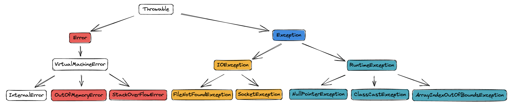

# 语言基础

## 泛型

泛型的本质是为了将类型参数化，通过泛型指定的不同类型来控制形参具体限制的类型，仅在编译时有效，编译后会进行泛型擦除。

```java
List<String> stringList = new ArrayList<String>();
List<Integer> integerList = new ArrayList<Integer>();

Class stringListClass = stringArrayList.getClass();
Class integerListClass = integerArrayList.getClass();

System.out.println(stringListClass.equals(integerListClass));
————————————————
true  
```

### 泛型类

定义泛型类语法：class ClassName <泛型标识符> {...}

案例：

```java
public class Generic<T>{ 
    //成员变量 key 的类型为T, 由外部指定  
    private T key;

    public Generic(T key) { // 泛型构造方法形参 key 的类型也为T
        this.key = key;
    }

    public T getKey(){ // 泛型方法getKey的返回值类型为T
        return key;
    }
}
```

### 泛型接口

泛型接口与泛型类的定义及使用基本相同，案例：

```java
public interface Generator<T> {
    public T next();
}

class FruitGenerator<T> implements Generator<String>{
    @Override
    public String next() {
        return "apple";
    }
}
```

### 泛型方法

泛型方法的定义需要在方法上声明泛型标识，直接看例子：

```java
// 在访问权限修饰符后面，返回类型前面加上 <泛型标识符>
public <T> T genericMethod(Class<T> tClass)throws InstantiationException,IllegalAccessException{
  T instance = tClass.newInstance();
  return instance;
}

// 定义变长参数泛型方法 
public <T> void printMsg( T... args){
    for(T t : args){
       System.out.println("t is " + t);
    }
}
```

## 异常体系



### Error 

Error 是 Throwable 的子类，用于指示合理的应用程序**不应该试图捕获的严重问题**。

Java 程序通常不捕获错误。错误一般发生在严重故障时，它们在Java程序处理的范畴之外，通常是 JVM 层面的错误。

### Exception

Exception 异常主要分为两类

- 一类是 IOException（I/O 输入输出异常），其中 IOException 及其子类异常又被称作「受查异常」
- 另一类是 RuntimeException（运行时异常），RuntimeException 被称作「非受查异常」。

受查异常指在编译期间必须得到处理的异常，依赖编译器检查。

## 动态代理

首先看一个静态代理的案例：

```java
public class UserDaoProxy implements IUserDao{

    private IUserDao target; // 真正的目标对象
    public UserDaoProxy(IUserDao target) {
        this.target = target; // 通过构造方法传进来
    }
    
    @Override
    public void save() {
        System.out.println("开启事务"); // 预处理
        target.save(); // 调用真正的目标对象的save
        System.out.println("提交事务"); // 后置处理
    }
}
```

接着来看动态代理：

> 动态代理是在程序运行时动态生成的，即编译完成后没有实际的 class 文件，而是在运行时动态生成类字节码，并加载到JVM中。这点要区别于静态代理，静态代理类在编译完成后就会生成对应的 class 文件。
>
> 动态代理对象不需要实现接口，但是要求目标对象必须实现接口，否则不能使用动态代理。

静态代理改造成动态代理：

```java
// 注意这里变成了 ProxyFactory，可以在运行时动态构造 Proxy 实例
public class ProxyFactory {

    private Object target; // 同样维护一个目标对象

    public ProxyFactory(Object target) {
        this.target = target;
    }

    // 为目标对象生成代理对象的核心方法
    public Object getProxyInstance() {
      	// Proxy 是 java.lang.reflect 包中提供的反射工具类，入参主要有：
      	// 1. 一个用于加载代理类的 classLoader
      	// 2. 被代理类所实现的接口列表，以 Class[] 的形式传入
      	// 3. InvocationHandler，对代理类的调用最终会传递到其 invoke 方法，这个方法是核心，代理的过程就在其中定义
        return Proxy.newProxyInstance(target.getClass().getClassLoader(), target.getClass().getInterfaces(),
                new InvocationHandler() { // 覆写 InvocationHandler 的 invoke 方法

                    @Override
                    public Object invoke(Object proxy, Method method, Object[] args) throws Throwable {
                        System.out.println("开启事务"); // 预处理
                        Object returnValue = method.invoke(target, args); // 执行目标对象方法
                        System.out.println("提交事务"); // 后置处理
                        return null;
                    }
                });
    }
}
```

所以可以看到，动态代理的实现其实是通过反射实现的。