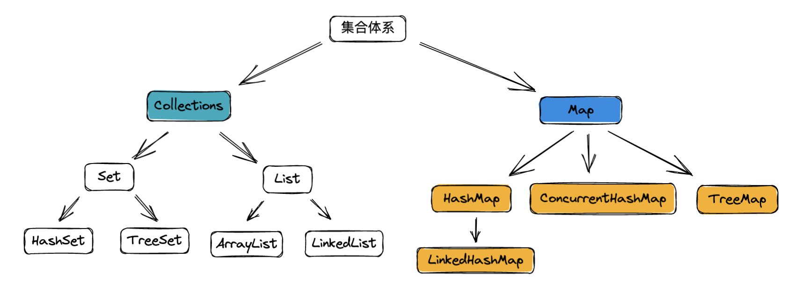

# 集合类

## 集合体系

Java 的集合框架可以分为Collections 和 Map，这里只列出最常用的几个集合类的类间关系。这篇文档也仅仅对这些集合类展开梳理。有关集合类的博客，推荐一位大佬的博客https://blog.csdn.net/zxt0601



## Collections

### ArrayList

#### 概要

ArrayList 底层存储结构是一个动态数组，是线程不安全的，允许元素为null。
实现了 RandomAccess 接口（这其实是一个标记接口），代表了其拥有随机快速访问的能力，可以在 O(1) 的时间复杂度访问元素。

当集合中的元素将要超出数组容量时，会进行扩容操作。扩容操作是 ArrayList 性能消耗比较大的地方，所以若可以提前预知数据的规模，应该通过指定容量构造方法去构造 ArrayList 实例，以减少扩容次数，提高效率。

面试中还有可能会问到和 Vector 的区别，Vector 内部也是数组，区别在于 Vector 在 API 上都加了synchronized 关键字，所以是线程安全的。另外 Vector 扩容时，是翻倍size，而 ArrayList 是扩容 50%。

#### 构造

```java
// 预先准备的一个空数组，默认构造函数里会用到
private static final Object[] DEFAULTCAPACITY_EMPTY_ELEMENTDATA = {};

// 真正存放元素的数组
transient Object[] elementData; 

// 当前元素数量
private int size;

// 默认构造方法
public ArrayList() {
  // 默认构造方法只是简单的将 空数组赋值给了elementData，也就是说默认构造完成后，底层数组长度是 0
  this.elementData = DEFAULTCAPACITY_EMPTY_ELEMENTDATA;
}

// 这里又准备了一个空数组，在带容量的构造函数里会用到
private static final Object[] EMPTY_ELEMENTDATA = {};

// 带初始容量的构造方法
public ArrayList(int initialCapacity) {
  // 如果初始容量大于0，则新建一个长度为 initialCapacity 的 Object 数组.
  if (initialCapacity > 0) {
    this.elementData = new Object[initialCapacity]; // 存放元素的数组指向构建的 Object 数组
  } else if (initialCapacity == 0) { // 如果容量为0，直接将 EMPTY_ELEMENTDATA 赋值给 elementData
    this.elementData = EMPTY_ELEMENTDATA;
  } else { // 容量小于0 就抛出异常
    throw new IllegalArgumentException("Illegal Capacity: "+initialCapacity);
  }
}

// 利用其他集合来构建 ArrayList
public ArrayList(Collection<? extends E> c) {
  // 直接调用 Collection.toArray() 方法得到一个对象数组，并赋值给 elementData 
  elementData = c.toArray();
  // 因为size代表的是集合元素数量，所以通过别的集合来构造ArrayList时，更新 size
  if ((size = elementData.length) != 0) {
    // 当 c.toArray出错，没有返回 Object[] 时，利用 Arrays.copyOf 来复制集合 c 中的元素到 elementData 数组中
    if (elementData.getClass() != Object[].class) 
      elementData = Arrays.copyOf(elementData, size, Object[].class);
  } else {
    // 如果集合c元素数量为0，则将空数组EMPTY_ELEMENTDATA赋值给elementData 
    this.elementData = EMPTY_ELEMENTDATA;
  }
}
```

#### 添加元素

```java
public boolean add(E e) {
    ensureCapacityInternal(size + 1);  // 容量担保，执行完保证 elementData 数组容量一定够用
    elementData[size++] = e;//在数组末尾追加一个元素，并修改size
    return true;
}

private static final int DEFAULT_CAPACITY = 10; // 默认扩容容量 10

// 容量担保方法，执行完保证 elementData 数组容量一定够用
private void ensureCapacityInternal(int minCapacity) {
  // 利用 == 判断数组是否刚使用默认构造函数完成，还没存放元素
  if (elementData == DEFAULTCAPACITY_EMPTY_ELEMENTDATA) {
    minCapacity = Math.max(DEFAULT_CAPACITY, minCapacity); // 看看需要多少容量，取 10 和 minCapcity 的较大值
  }
  ensureExplicitCapacity(minCapacity); // 真正的容量担保方法
}

// 真正的容量担保
private void ensureExplicitCapacity(int minCapacity) {
    modCount++; // 先让 modCount 自加 
    if (minCapacity - elementData.length > 0)
        grow(minCapacity); // 调用 grow 进行扩容
}

// 需要扩容的话，默认扩容一半
private void grow(int minCapacity) {
    int oldCapacity = elementData.length;
    int newCapacity = oldCapacity + (oldCapacity >> 1); // 默认扩容旧容量的 1.5 倍
    if (newCapacity - minCapacity < 0) // 如果还不够，那么直接加大到恰好够用的容量
        newCapacity = minCapacity;
    if (newCapacity - MAX_ARRAY_SIZE > 0)
        newCapacity = hugeCapacity(minCapacity);
    elementData = Arrays.copyOf(elementData, newCapacity); // 以新的长度拷贝构建一个新 elementData 数组
}
```

#### 移除元素

```java
public E remove(int index) {
    rangeCheck(index); // 判断是否越界
    modCount++; // 修改modeCount 因为结构改变了
    E oldValue = elementData(index); // 拿到要删除的值
    int numMoved = size - index - 1; // 计算出需要移动的元素数量
    if (numMoved > 0)
        System.arraycopy(elementData, index+1, elementData, index, numMoved); // 用复制的方式覆盖数组数据
    elementData[--size] = null; // 置空原尾部数据不再强引用， 可以 GC 掉
    return oldValue;
}

// 根据下标从数组取值
E elementData(int index) {
  	return (E) elementData[index];
}

```

### LinkedList

#### 概要

LinkedList 是线程不安全的，底层数据结构是允许元素为 null 的双向链表。它实现了Deque<E>, 所以也可以作为一个双端队列。和ArrayList 比，没有实现 RandomAccess ，无法随机访问元素。

因其底层数据结构是链表，所以增删只需要移动指针即可，故时间效率较高。不需要批量扩容，也不需要预留空间，所以空间效率比ArrayList 高。

缺点就是需要随机访问元素时，时间效率很低，虽然底层在根据下标查询 Node 的时候，会根据 index 判断目标 Node 在前半段还是后半段，然后决定是顺序还是逆序查询，以提升时间效率。不过随着元素数量的增大，总体时间效率依然很低。

### HashSet

#### 概要

HashSet 底层是一个 HashMap，map 的 key 就是存放的元素，map 的 value 都是同一个虚拟对象，因此 HashSet 的核心实现还是要看 HashMap，这个下面会说。

### TreeSet

#### 概要

TreeSet 底层也是一个 Map，通常来说就是 TreeMap，map 的 key 就是存放的元素，map 的 value 也都是同一个虚拟对象，因此 TreeSet 的核心实现还是要看 TreeMap，这个下面也会说。

## Map

### HashMap

#### 概要

重头戏来了，这个是被问的最多的。HashMap 是一个关联数组、哈希表，是线程不安全的，允许 key 为 null, value 为 null。遍历时无序。

其底层数据结构是数组称之为哈希桶，每个桶里面放的是链表，链表中的每个节点，就是哈希表中的每个元素。在JDK8中，**当链表长度达到8且当前桶长超过64时会转化成红黑树**，以提升它的查询、插入效率。

因其底层哈希桶的数据结构是数组，所以也会涉及到扩容的问题。

当 HashMap 的容量达到 threshold 阈值时，会触发扩容。扩容前后，哈希桶的长度一定会是2的整数次方。这样在根据 key 的 hash 值寻找对应的哈希桶时，可以用位运算替代取余操作，更加高效。

key 的 hash 值，并不仅仅只是 key 对象的 hashCode() 方法的返回值，还会经过扰动函数的扰动，以使 hash 值更加均衡。因为hashCode() 是int类型，取值范围是40多亿，只要哈希函数映射的比较均匀松散，碰撞几率是很小的。

hash 桶的默认长度是 16，哈希碰撞是无法避免的，但就算原本的 hashCode() 取得很好，每个 key 的 hashCode() 不同，但是由于HashMap 的哈希桶的长度远比 hash 取值范围小，所以当对 hash 值以桶的长度取余，以找到存放该key的桶的下标时，由于取余是通过与操作完成的，会忽略hash值的高位。因此只有hashCode()的低位参加运算，发生不同的hash值，但是得到的 index 相同的情况的几率会大大增加， 即哈希碰撞率会增大。扰动函数就是为了降低 hash 碰撞率的。它会综合hash值高位和低位的特征，并存放在低位，因此在与运算时，相当于高低位一起参与了运算，以减少hash碰撞的概率。（在JDK8之前，扰动函数会扰动四次，JDK8简化了这个操作）

扩容时，会 new 一个新的 Node 数组作为哈希桶，然后将原哈希表中的所有数据(Node节点)移动到新的哈希桶中，相当于对原哈希表中所有的数据重新做了一个put操作。所以性能消耗很大，可想而知，在哈希表的容量越大时，扩容性能消耗越明显。

扩容时，如果发生过哈希碰撞，节点数小于8个。则要根据链表上每个节点的哈希值，依次放入新哈希桶对应下标位置。因为扩容是容量翻倍，所以原链表上的每个节点，现在可能存放在原来的下标，即 low 位， 或者扩容后的下标，即 high 位。 high位= low位+原哈希桶容量。

#### Node 节点

```java
// Node 节点就是用来包装 k-v 对的
static class Node<K,V> implements Map.Entry<K,V> {
        final int hash; // key 的哈希值
        final K key; // key
        V value; // value
        Node<K,V> next; // 链表后置节点，同一个 hash 桶中的 Node 是用链表或者红黑树连接的

        Node(int hash, K key, V value, Node<K,V> next) {
            this.hash = hash;
            this.key = key;
            this.value = value;
            this.next = next;
        }

        public final K getKey()        { return key; }
        public final V getValue()      { return value; }
        public final String toString() { return key + "=" + value; }

        // Node 的 hash 值，是将 key 的 hashCode 和 value 的 hashCode 亦或得到的。
        public final int hashCode() {
            return Objects.hashCode(key) ^ Objects.hashCode(value);
        }
  
        // 设置新的 value 同时返回旧 value
        public final V setValue(V newValue) {
            V oldValue = value;
            value = newValue;
            return oldValue;
        }
				
        public final boolean equals(Object o) {
            if (o == this)
                return true;
            if (o instanceof Map.Entry) {
                Map.Entry<?,?> e = (Map.Entry<?,?>)o;
                if (Objects.equals(key, e.getKey()) &&
                    Objects.equals(value, e.getValue()))
                    return true;
            }
            return false;
        }
    }
```

#### 构造方法

```java
// 最大容量 2 的 30 次方
static final int MAXIMUM_CAPACITY = 1 << 30;
// 默认的装载因子
static final float DEFAULT_LOAD_FACTOR = 0.75f;
//哈希桶，存放链表。 长度是始终是 2 的整数次方或者 0
transient Node<K,V>[] table;
// 装载因子，用于计算哈希表元素数量的阈值。threshold = 哈希桶.length * loadFactor;
final float loadFactor;
// 哈希表内元素数量的阈值，当哈希表内元素数量超过阈值时，会发生扩容resize()。
int threshold;

// 默认构造函数
public HashMap() {
  // 赋值加载因子为默认的0.75f，其他什么事都没干，也就是说第一次 put 元素的时候肯定会做很多事
  this.loadFactor = DEFAULT_LOAD_FACTOR; 
}

// 指定初始化容量的构造函数
public HashMap(int initialCapacity) {
  this(initialCapacity, DEFAULT_LOAD_FACTOR); // 其实就是调下面的构造方法
}

// 同时指定初始化容量和装载因子， 这个构造方法用的很少，一般不会修改 loadFactor
public HashMap(int initialCapacity, float loadFactor) {
  // 紧跟着 3 个 if 先校验入参合法性
  if (initialCapacity < 0)
    throw new IllegalArgumentException("Illegal initial capacity: " +
                                       initialCapacity);
  if (initialCapacity > MAXIMUM_CAPACITY)
    initialCapacity = MAXIMUM_CAPACITY;
  if (loadFactor <= 0 || Float.isNaN(loadFactor))
    throw new IllegalArgumentException("Illegal load factor: " +
                                       loadFactor);
  this.loadFactor = loadFactor;
  
  // 设置阈值，这个 tableSize 下面也会看
  this.threshold = tableSizeFor(initialCapacity);
}

// 通过已有 map 构造
public HashMap(Map<? extends K, ? extends V> m) {
  this.loadFactor = DEFAULT_LOAD_FACTOR;
  putMapEntries(m, false); // 这里其实就是 put 一遍已有 map 中的所有 k-v
}

// tableSizeFor
// 根据期望容量 cap，返回 2 的整数次方的哈希桶的实际容量 length，length >= cap
static final int tableSizeFor(int cap) {
  // 经过下面的|和>>>运算，n 最终各位都是1
  int n = cap - 1;
  n |= n >>> 1;
  n |= n >>> 2;
  n |= n >>> 4;
  n |= n >>> 8;
  n |= n >>> 16;
  // 判断 n 是否越界，返回 2 的 n 次方作为 table（哈希桶）的阈值，正常会返回 n+1
  return (n < 0) ? 1 : (n >= MAXIMUM_CAPACITY) ? MAXIMUM_CAPACITY : n + 1;
}
```

#### putMapEntries 方法

```java
// 将已有 Map m 的所有 k-v 放到当前 map 中，参数 evict 初始化时为false，其他情况为 true
final void putMapEntries(Map<? extends K, ? extends V> m, boolean evict) {
  // 拿到 m 的元素数量
  int s = m.size();
  // 数量大于 0 才会进行下面的操作，否则一个空 Map 就啥也不干了
  if (s > 0) {
    // 如果当前表是空的，走这个 if 分支
    // 上面已经看过了，刚构造完的 Map 其实只是对装载因子和长度阈值赋值，table 数组还是空的
    if (table == null) {
      // 根据 m 的元素数量和当前表的加载因子，计算出阈值，这 ft 的其实是 float threshold 的缩写
      float ft = ((float)s / loadFactor) + 1.0F; // 这里加 1.0F 的目的是为了保证后面强转 int 容量不会不够
      // 修正阈值边界，不能超过 MAXIMUM_CAPACITY
      int t = ((ft < (float)MAXIMUM_CAPACITY) ? (int)ft : MAXIMUM_CAPACITY);
      // 如果新的阈值大于当前阈值，则用 tableSizeFor 算出最新的阈值
      if (t > threshold) 
        threshold = tableSizeFor(t);
    } else if (s > threshold) 
      // 走到这里说明 table 不为空，并且 m 的元素数量大于阈值，说明要扩容
      resize();
    // 遍历 m 依次将元素加入当前表中。
    for (Map.Entry<? extends K, ? extends V> e : m.entrySet()) {
      K key = e.getKey();
      V value = e.getValue();
      putVal(hash(key), key, value, false, evict); // putVal 方法其实也就是 put 方法的底层实现，后面会说
    }
  }
}
```

#### resize 方法

```java
// resize扩容方法是重点方法，也比较硬核
final Node<K,V>[] resize() {
        // 用 oldTab 保存当前哈希桶
        Node<K,V>[] oldTab = table;
        // 用 oldCap 保存当前哈希桶 length
        int oldCap = (oldTab == null) ? 0 : oldTab.length;
        // 用 oldThr 保存当前的阈值
        int oldThr = threshold;
        // 初始化新的容量和阈值为 0
        int newCap, newThr = 0;
        // 如果当前容量大于0
        if (oldCap > 0) {
            if (oldCap >= MAXIMUM_CAPACITY) { // 当前容量已经到达上限
                // 则设置阈值是2的31次方-1
                threshold = Integer.MAX_VALUE;
                // 同时返回当前的哈希桶，不再扩容，注意这里有个小细节，容量达到最大值就不会再扩容了
                return oldTab;
            } else if ( // 当前容量还没达到上限
              (newCap = oldCap << 1) < MAXIMUM_CAPACITY && // 新容量扩为旧容量的两倍，同时判断新容量有没有达到上限
              oldCap >= DEFAULT_INITIAL_CAPACITY) // 判断旧容量是否 >= 默认初始容量 16
                newThr = oldThr << 1; // 以上两个条件都满足时，新阈值扩为旧阈值的 2 倍
        } else if (oldThr > 0) // 走到这里说明当前 table 是空的，但是有阈值，也就是初始化时指定了容量的情况
            newCap = oldThr; // 新容量赋值为旧的阈值
        else { // 走到这里说明当前表是空的，而且也没有阈值，也就是是无参初始化的情况
            newCap = DEFAULT_INITIAL_CAPACITY; // 新容量设为默认的容量 16
            newThr = (int)(DEFAULT_LOAD_FACTOR * DEFAULT_INITIAL_CAPACITY); // 新阈值设为16 * 0.75 = 12
        }
  
  			// 如果新阈值是 0，对应的是当前表是空的，但是有阈值的情况
  			// 这种情况就是上面的 else if (oldThr > 0) 那个分支，但是那个分支只设置了新容量 newCap，还没有设置新阈值 newThr
        if (newThr == 0) {
            float ft = (float)newCap * loadFactor; // 根据新表容量 和 加载因子 求出新的阈值
            // 边界修整
            newThr = (newCap < MAXIMUM_CAPACITY && ft < (float)MAXIMUM_CAPACITY ?
                      (int)ft : Integer.MAX_VALUE);
        }
  
        // 更新阈值，到这里 newCap 和 newThr 都设置完毕了
        threshold = newThr;
        @SuppressWarnings({"rawtypes","unchecked"})
        // 根据新的容量 构建新的哈希桶
        Node<K,V>[] newTab = (Node<K,V>[])new Node[newCap];
        // 更新哈希桶引用
        table = newTab;
        // 旧的哈希桶中有元素时，就将旧哈希桶中的所有节点转移到新的哈希桶中
        if (oldTab != null) {
            for (int j = 0; j < oldCap; ++j) { // 遍历旧哈希桶
                Node<K,V> e; // 取出当前的节点 e
                if ((e = oldTab[j]) != null) {
                    // 将原哈希桶置空以便GC
                    oldTab[j] = null;
                    if (e.next == null) // 如果当前链表中就一个元素，没有发生哈希碰撞
                        // 直接将这个元素放到新哈希桶里，因为桶长时 2 的整数次方，可以通过 & 运算代替 / 运算，效率更高
                        newTab[e.hash & (newCap - 1)] = e;
                    else if (e instanceof TreeNode) // 如果发生过哈希碰撞，且转化成了红黑树
                        ((TreeNode<K,V>)e).split(this, newTab, j, oldCap);
                    else { // 如果发生过哈希碰撞，但还是链表
                        // 因为扩容是容量翻倍，所以原链表上的每个节点，现在可能存放的位置只有两种
                      	// 1. 原来的下标，称为 low 位
                      	// 2. 原来的下标+原来的桶长，称为 high 位
                      	// 这里理解不了可以举几个例子验一下
                        
                        Node<K,V> loHead = null, loTail = null; // low 位链表的头结点、尾节点
                        Node<K,V> hiHead = null, hiTail = null; // high 位链表的头节点、尾节点
                        Node<K,V> next; // 临时节点 存放e的下一个节点
                        do {
                            next = e.next;
                            // 利用 key 的哈希值 & 旧的容量，可以得到哈希值去模后，是大于等于 oldCap 还是小于oldCap
                            // 等于 0 代表小于 oldCap，应该存放在 low 位，否则存放在 high 位
                            if ((e.hash & oldCap) == 0) { // 放在 low 位
                                if (loTail == null) // 这里其实是个尾插构建链表
                                    loHead = e;
                                else
                                    loTail.next = e;
                                loTail = e;
                            } else { // 放在 high 位，同样是尾插构建链表
                                if (hiTail == null)
                                    hiHead = e;
                                else
                                    hiTail.next = e;
                                hiTail = e;
                            } 
                        } while ((e = next) != null); // 循环直到桶中所有Node都遍历完成
                        
                      	//将低位链表存放在原index处，
                        if (loTail != null) {
                            loTail.next = null;
                            newTab[j] = loHead;
                        }
                      
                        //将高位链表存放在新index处
                        if (hiTail != null) {
                            hiTail.next = null;
                            newTab[j + oldCap] = hiHead;
                        }
                      
                      	// 这个过程其实是先把原来同一个桶中的所有节点都拿出来，尾插到两个链表中，再把这两个链表挂到新桶中
                    }
                }
            }
        }
        return newTab;
    }
```

#### putVal 方法

```java
// putVal 其实就是 put 方法真正干活的方法
final V putVal(int hash, K key, V value, boolean onlyIfAbsent, boolean evict) {
  // tab 存放当前的哈希桶， p 用作临时链表节点  
  Node<K,V>[] tab; Node<K,V> p; int n, i;
  // 如果当前哈希表是空的，即构建完还没 put 过 k-v
  if ((tab = table) == null || (n = tab.length) == 0)
    // 直接扩容，并将扩容后的哈希桶长度赋值给 n
    n = (tab = resize()).length;
  // 如果当前 index 的节点是空的，即没有发生哈希冲突，直接构建一个新节点Node，挂到 index 处。
  if ((p = tab[i = (n - 1) & hash]) == null)
    tab[i] = newNode(hash, key, value, null);
  else { // 走到这里说明发生了哈希冲突。
    Node<K,V> e; K k;
    // 如果哈希值相等，key 也相等，则是覆盖 value 操作
    if (p.hash == hash && // 这里判相等是两步走，第一步先判断 hash 值是否相等
        ((k = p.key) == key || (key != null && key.equals(k)))) // 第二步再用 == 或者 equals 判断 key 是否相等
      e = p; // 将当前节点引用赋值给e
    else if (p instanceof TreeNode) // 对应红黑树的情况，这里就不研究了
      e = ((TreeNode<K,V>)p).putTreeVal(this, tab, hash, key, value);
    else { // 走到这里说明是插入一个普通链表节点
      // 遍历链表
      for (int binCount = 0; ; ++binCount) {
        if ((e = p.next) == null) { // 遍历到尾部，追加新节点到尾部
          p.next = newNode(hash, key, value, null);
          // 如果追加节点后，链表节点数量 >= 8，调用 treeifyBin，注意 treeifyBin 不一定会将链表红黑树化！
          // 
          if (binCount >= TREEIFY_THRESHOLD - 1) 
            treeifyBin(tab, hash);
          break;
        }
        // 如果找到了要覆盖的节点
        if (e.hash == hash &&
            ((k = e.key) == key || (key != null && key.equals(k))))
          break;
        p = e;
      }
    }
    // 如果e不是null，说明有需要覆盖的节点
    if (e != null) {
      //则覆盖节点值，并返回原oldValue
      V oldValue = e.value;
      if (!onlyIfAbsent || oldValue == null)
        e.value = value;
      afterNodeAccess(e); // 这是一个空实现的函数，用作 LinkedHashMap 重写使用。
      return oldValue;
    }
  }
  //如果执行到了这里，说明插入了一个新的节点，所以会修改modCount，以及返回null。

  //修改modCount
  ++modCount;
  //更新size，并判断是否需要扩容。
  if (++size > threshold)
    resize();
  //这是一个空实现的函数，用作LinkedHashMap重写使用。
  afterNodeInsertion(evict);
  return null;
}
```

#### treeifyBin 方法

```java
final void treeifyBin(Node<K,V>[] tab, int hash) {
    int n, index; Node<K,V> e;
    // 这里会先判断一下，如果哈希桶为空或者桶长 < 64 (MIN_TREEIFY_CAPACITY) 即使链表长度超过了 8，也会先扩容，不去红黑树化
    if (tab == null || (n = tab.length) < MIN_TREEIFY_CAPACITY)
        resize(); // 调用 resize 扩容
    else if ((e = tab[index = (n - 1) & hash]) != null) { // 真正红黑树化的逻辑在这里
        TreeNode<K,V> hd = null, tl = null;
        do {
            TreeNode<K,V> p = replacementTreeNode(e, null);
            if (tl == null)
                hd = p;
            else {
                p.prev = tl;
                tl.next = p;
            }
            tl = p;
        } while ((e = e.next) != null);
        if ((tab[index] = hd) != null)
            hd.treeify(tab);
    }
}
```

**get 方法**

```java
public V get(Object key) {
  Node<K,V> e;
  // 调用 getNode 方法，传入扰动后 key 的哈希值和key ，找目标节点 Node
  return (e = getNode(hash(key), key)) == null ? null : e.value;
}

// 传入扰动后的 key 的哈希值 和 key 找目标节点 Node
final Node<K,V> getNode(int hash, Object key) {
  Node<K,V>[] tab; Node<K,V> first, e; int n; K k;
  // Node 若存在，三个条件肯定要先满足：
  // 1. 表不为空
  // 2. 表里有元素
  // 3. 根据 key 的 hash 算的哈希桶位置下挂有 Node
  if ((tab = table) != null && (n = tab.length) > 0 &&
      (first = tab[(n - 1) & hash]) != null) { 
    if (first.hash == hash &&
        ((k = first.key) == key || (key != null && key.equals(k)))) // 如果第一个节点就找到了，那么直接返回就行
      return first; 
    if ((e = first.next) != null) { // 第一个 Node 不是要找的 Node
      if (first instanceof TreeNode) // 如果当前桶下的节点是红黑树 Node，则从红黑树中找到对应节点
        return ((TreeNode<K,V>)first).getTreeNode(hash, key); 
      do { // 如果是普通链表 Node，直接走链表查找的逻辑就行
        if (e.hash == hash &&
            ((k = e.key) == key || (key != null && key.equals(k))))
          return e;
      } while ((e = e.next) != null);
    }
  }
  return null;
}
```

### LinkedHashMap

#### 概要

LinkedHashMap 是一个关联数组、哈希表，是线程不安全的，允许 key 为 null, value 为 null。

继承自HashMap，所以 HashMap 的特点，除了输出无序，其他LinkedHashMap都有，比如扩容的策略，哈希桶长度一定是 2 的 整数次方等等。另外 LinkedHashMap 内部维护了一个双向链表，在每次插入数据，或者访问、修改数据时，会增加节点、或调整链表的节点顺序。以决定迭代时输出的顺序。

默认情况下，遍历的顺序是按照插入节点的顺序。这也是其与HashMap最大的区别。也可以在构造时传入 accessOrder 参数，使得其遍历顺序按照访问的顺序输出。

LinkedHashMap在实现时，就是重写了几个方法。以满足其输出序列有序的需求。还记得 HashMap 里有个空方法 accessOrder 吗？这个方法就是一个重要的被重写的方法。

#### 使用案例

```java
Map<String, String> map = new LinkedHashMap<>();
map.put("1", "a");
map.put("2", "b");
map.put("3", "c");

Iterator<Map.Entry<String, String>> iterator = map.entrySet().iterator();
while (iterator.hasNext()) {
  System.out.println(iterator.next());
}

System.out.println("以下是 accessOrder = true 的情况:");

map = new LinkedHashMap<String, String>(10, 0.75f, true);
map.put("1", "a");
map.put("2", "b");
map.put("3", "c");
map.get("2"); 
map.put("4", "d");

iterator = map.entrySet().iterator();
while (iterator.hasNext()) {
  System.out.println(iterator.next());
}
--------------------------------------
1=a
2=b
3=c
以下是 accessOrder = true 的情况:
1=a
3=c
2=b
4=d
```

#### 节点

```java
static class Entry<K,V> extends HashMap.Node<K,V> {
  Entry<K,V> before, after; // 扩展了两个成员，构成双向链表的前后指针
  Entry(int hash, K key, V value, Node<K,V> next) {
    super(hash, key, value, next);
  }
}

// 同时，LinkedHashMap 里还有两个成员变量
// 双向链表的头结点
transient LinkedHashMap.Entry<K,V> head;
// 双向链表的尾节点
transient LinkedHashMap.Entry<K,V> tail;
```

#### 构造方法

```java
// 用于控制迭代的顺序，默认是 false，按照 k-v 插入顺序；如果为 true，则按照 k-v 访问顺序迭代
// 为 true 时，这个 LinkedHashMap 就是个 LRU
final boolean accessOrder;

// 无参构造
public LinkedHashMap() {
  super();
  accessOrder = false; // 默认为 false
}
// 指定初始容量构造
public LinkedHashMap(int initialCapacity) {
  super(initialCapacity);
  accessOrder = false;
}
// 指定初始容量和装载因子构造
public LinkedHashMap(int initialCapacity, float loadFactor) {
  super(initialCapacity, loadFactor);
  accessOrder = false;
}
// 指定初始容量、装载因子和迭代顺序构造
public LinkedHashMap(int initialCapacity, float loadFactor, boolean accessOrder) {
  super(initialCapacity, loadFactor);
  this.accessOrder = accessOrder;
}
// 根据已有 Map 构建
public LinkedHashMap(Map<? extends K, ? extends V> m) {
  super();
  accessOrder = false;
  putMapEntries(m, false); // 这个是不是很熟悉，没错！就是 HashMap 里的
}
```

#### 增加 k-v

```java
// LinkedHashMap 并没有重写任何 put 方法，但是重写了构建新节点的 newNode() 方法
// newNode() 会在 putVal() 方法里被调用，这里就看一下 newNode() 方法
//在构建新节点时，构建的是 LinkedHashMap.Entry 不再是 Node
Node<K,V> newNode(int hash, K key, V value, Node<K,V> e) {
  LinkedHashMap.Entry<K,V> p = new LinkedHashMap.Entry<K,V>(hash, key, value, e);
  linkNodeLast(p); // 新构建出来的节点尾插到链表
  return p;
}

// 新构建出来的节点尾插到链表
private void linkNodeLast(LinkedHashMap.Entry<K,V> p) {
  LinkedHashMap.Entry<K,V> last = tail;
  tail = p;
  // 链表之前是空的
  if (last == null)
    head = p;
  else { // 将新节点连接在链表的尾部
    p.before = last;
    last.after = p;
  }
}
```

#### 删除 k-v

```java
// LinkedHashMap 也没有重写 remove()方法，但重写了 afterNodeRemoval() 方法
// afterNodeRemoval() 方法会在 removeNode 方法中调用，removeNode 会在所有涉及到删除节点的方法中被调用
// 在删除节点 e 时，同步将 e 从双向链表上删除
void afterNodeRemoval(Node<K,V> e) {
  LinkedHashMap.Entry<K,V> p = (LinkedHashMap.Entry<K,V>)e, b = p.before, a = p.after;
  // 待删除节点 p 的前置后置节点都置空
  p.before = p.after = null;
  // 如果前置节点是 null，则现在的头结点应该是后置节点 a
  if (b == null)
    head = a;
  else // 否则将前置节点b的后置节点指向 a
    b.after = a;
  // 同理如果后置节点时 null ，则尾节点应是 b
  if (a == null)
    tail = b;
  else // 否则更新后置节点a的前置节点为b
    a.before = b;
}
```

#### 查找 k-v

```java
// LinkedHashMap 重写了 get 方法
public V get(Object key) {
  Node<K,V> e;
  if ((e = getNode(hash(key), key)) == null)
    return null;
  if (accessOrder) // 如若设置了按照访问顺序遍历，则执行 afterNodeAccess 方法
    afterNodeAccess(e);
  return e.value;
}

// afterNodeAccess 方法，主要就是将当前访问的节点移动到双端队列的队尾
void afterNodeAccess(Node<K,V> e) { // 这里入参 e 就是正在访问的 k-v 节点
  LinkedHashMap.Entry<K,V> last; 
  // 如果 accessOrder 是 true，且 e 不是尾节点
  if (accessOrder && (last = tail) != e) {
    // 节点 e 强转成双向链表节点 p
    LinkedHashMap.Entry<K,V> p = (LinkedHashMap.Entry<K,V>)e, b = p.before, a = p.after;
    // p 现在是尾节点， 后置节点一定是 null
    p.after = null;
    // 如果 p 的前置节点是 null，则 p 以前是头结点，所以更新现在的头结点是p的后置节点 a
    if (b == null)
      head = a;
    else // 否则更新 p 的前直接点b的后置节点为 a
      b.after = a;
    // 如果 p 的后置节点不是 null，则更新后置节点 a 的前置节点为 b
    if (a != null)
      a.before = b;
    else // 如果原本 p 的后置节点是 null，则p就是尾节点。 此时 更新 last 的引用为 p 的前置节点 b
      last = b;
    if (last == null) // 原本尾节点是 null  则，链表中就一个节点
      head = p;
    else { // 否则更新当前节点 p 的前置节点为原尾节点 last，last 的后置节点是 p
      p.before = last;
      last.after = p;
    }
    // 尾节点的引用赋值成 p
    tail = p;
    // 修改modCount。
    ++modCount;
  }
}
```

### TreeMap

TreeMap 底层存储结构是红黑树，使用时传入自定义的 Comparator，底层即可按照 Comparator 对 k-v 节点进行排序存储，具体源码就先不介绍了。

### ConcurrentHashMap

#### 概要

JDK7 中为了提高并发性能采用了分段的设计。由一个 Segment 数组管理哈希桶，每个 Segment 管理若干个哈希桶，Segment 继承自 ReentrantLock，可以当作锁来用。基于分段锁的设计相对 HashTable 来说大大提高了并发性能。也就是说多个线程可以并发的操作多个Segment，而 HashTable 是通过给每个方法加 Synchronized 即将多线程串行而实现的，所以在一定程度上提高了并发性能。但是这种性能的提升表现相对JDK8来说显得不值一提。

JDK8 中 ConcurrentHashMap 采用的是 CAS+Synchronized 锁并且锁粒度是每一个桶。简单来说 JDK7 中锁的粒度是 Segment，JDK8锁粒度细化到了桶级别。锁粒度又细了，并发效率又进一步提高了。

#### putVal 方法

```java
// 读不加锁，因此主要关注下 putVal 方法
final V putVal(K key, V value, boolean onlyIfAbsent) {
  if (key == null || value == null) throw new NullPointerException();
  int hash = spread(key.hashCode()); // 对 key 的 hash 值进行再散列
  int binCount = 0;
  for (Node<K,V>[] tab = table;;) {
    Node<K,V> f; int n, i, fh;
    if (tab == null || (n = tab.length) == 0) // 懒加载，没初始化的话就初始化一下
      tab = initTable(); 
    else if ((f = tabAt(tab, i = (n - 1) & hash)) == null) {
      // 往空桶中添加 k-v 时不加锁，采用 CAS 的方式添加 k-v 更新
      if (casTabAt(tab, i, null, new Node<K,V>(hash, key, value, null))) 
        break;
    }
    else if ((fh = f.hash) == MOVED) // 如果正在扩容就协助扩容
      tab = helpTransfer(tab, f); 
    else {  // 走到这里说明对应的桶位置有节点
      V oldVal = null;
      synchronized (f) { // synchronized 锁住桶中第一个 k-v 节点
        // 上面的分支条件 (f = tabAt(tab, i = (n - 1) & hash) 已经让 tabAt(tab, i) == f 了
        // 这里又判了一次 tabAt(tab, i) == f，防止其他线程在当前线程进入同步代码块之前已经修改了 f
        // 没错，这个写法正是传说中 DCL 单例模式的核心思想，双重校验，惊喜吧！
        if (tabAt(tab, i) == f) { 
          if (fh >= 0) { // 下面的逻辑跟 HashMap put 操作的逻辑差不多，走这个 if 说明是链表节点
            binCount = 1;
            for (Node<K,V> e = f;; ++binCount) {
              K ek;
              if (e.hash == hash &&
                  ((ek = e.key) == key || (ek != null && key.equals(ek)))) {
                oldVal = e.val;
                if (!onlyIfAbsent)
                  e.val = value;
                break;
              }
              Node<K,V> pred = e;
              if ((e = e.next) == null) {
                pred.next = new Node<K,V>(hash, key, value, null);
                break;
              }
            }
          }
          else if (f instanceof TreeBin) { // 走这个 if 说明是红黑树节点
            Node<K,V> p;
            binCount = 2;
            if ((p = ((TreeBin<K,V>)f).putTreeVal(hash, key, value)) != null) {
              oldVal = p.val;
              if (!onlyIfAbsent)
                p.val = value;
            }
          }
        }
      }
      if (binCount != 0) {
        if (binCount >= TREEIFY_THRESHOLD)
          treeifyBin(tab, i);
        if (oldVal != null)
          return oldVal;
        break;
      }
    }
  }
  addCount(1L, binCount);
  return null;
}
```

#### helpTransfer 方法

```java
// 辅助扩容，入参数有两个：
// 1. 当前哈希桶 tab
// 2. 触发辅助扩容的哈希桶入口节点 f
final Node<K,V>[] helpTransfer(Node<K,V>[] tab, Node<K,V> f) {
  Node<K,V>[] nextTab; int sc;
  if (tab != null && (f instanceof ForwardingNode) &&
      (nextTab = ((ForwardingNode<K,V>)f).nextTable) != null) {
    int rs = resizeStamp(tab.length); 
    while (nextTab == nextTable && table == tab && (sc = sizeCtl) < 0) {
      if ((sc >>> RESIZE_STAMP_SHIFT) != rs || sc == rs + 1 || sc == rs + MAX_RESIZERS || transferIndex <= 0)
        break;
      // 修改sizeCtl = sizeCtl + 1，表示多了一个线程参与扩容，扩容方法 transfer 对扩容线程数量是有限制的
      if (U.compareAndSwapInt(this, SIZECTL, sc, sc + 1)) { 
        transfer(tab, nextTab); // transfer 扩容，这里不再叫 resize 了
        break;
      }
    }
    return nextTab;
  }
  return table;
}
```

#### transfer 方法

```java
// 入参数有两个
// 1. 旧哈希桶 tab
// 2. 新哈希桶 nextTab
private final void transfer(Node<K,V>[] tab, Node<K,V>[] nextTab) {
  int n = tab.length, stride;
  // 控制并发数，控制 CPU 的资源
  if ((stride = (NCPU > 1) ? (n >>> 3) / NCPU : n) < MIN_TRANSFER_STRIDE)
    stride = MIN_TRANSFER_STRIDE;
  if (nextTab == null) { // 如果新数组为空就初始化新数组
    try {
      @SuppressWarnings("unchecked")
      // 扩容为原来的两倍 n << 1
      Node<K,V>[] nt = (Node<K,V>[])new Node<?,?>[n << 1];
      nextTab = nt;
    } catch (Throwable ex) { // 抛异常，可能分配不出 n << 1 容量的数组了 发生 OOM
      sizeCtl = Integer.MAX_VALUE;
      return;
    }
    nextTable = nextTab;
    transferIndex = n; // n 就是旧哈希桶的长度
  }
  int nextn = nextTab.length; // nextn 就是新哈希桶的长度
  // 这个里面会先 new Node 将 node.hash 置为 -1，表示该桶正在进行移动
  // 这里很重要的一点是，只锁表头，所以只需要将链表（或者红黑树）头结点.hash置为-1即可
  ForwardingNode<K,V> fwd = new ForwardingNode<K,V>(nextTab);
  
  // advance 是控制是否继续进行移动的条件，当 advance == false，表示正在移动一个桶。
  // true 表示可以继续进行下一个桶的移动
  boolean advance = true;
  boolean finishing = false;
  for (int i = 0, bound = 0;;) { // 自旋扩容
    Node<K,V> f; int fh;
    while (advance) {
      int nextIndex, nextBound;
      if (--i >= bound || finishing)
        advance = false;
      else if ((nextIndex = transferIndex) <= 0) {
        i = -1;
        advance = false;
      }
      else if (U.compareAndSwapInt(this, TRANSFERINDEX, nextIndex,
                nextBound = (nextIndex > stride ?
                             nextIndex - stride : 0))) {
        bound = nextBound;
        i = nextIndex - 1;
        advance = false;
      }
    }
    if (i < 0 || i >= n || i + n >= nextn) {
      int sc;
      if (finishing) {
        nextTable = null;
        table = nextTab;
        sizeCtl = (n << 1) - (n >>> 1);
        return;
      }
      if (U.compareAndSwapInt(this, SIZECTL, sc = sizeCtl, sc - 1)) {
        if ((sc - 2) != resizeStamp(n) << RESIZE_STAMP_SHIFT)
          return;
        finishing = advance = true;
        i = n;
      }
    }
    // 该桶没数据
    else if ((f = tabAt(tab, i)) == null)
      // 将 oldtab 中的该桶设置为 fwd 节点，hash=-1
      advance = casTabAt(tab, i, null, fwd);
    // 已经移动过的桶其 hash=-1
    else if ((fh = f.hash) == MOVED)
      advance = true;
    else {
      synchronized (f) { // 上锁
        if (tabAt(tab, i) == f) {
          // ln 新链表，不需要移动的节点重新组组织成的链表
          // hn 新链表，需要移动的节点重新组织成的链表
          Node<K,V> ln, hn;
          if (fh >= 0) { // 链表
            int runBit = fh & n;
            Node<K,V> lastRun = f;
            for (Node<K,V> p = f.next; p != null; p = p.next) {
              int b = p.hash & n;
              if (b != runBit) {
                runBit = b;
                lastRun = p;
              }
            }
            if (runBit == 0) { // runBit == 0 表示该节点不需要移动
              ln = lastRun;
              hn = null;
            }
            else {
              hn = lastRun;
              ln = null;
            }
            for (Node<K,V> p = f; p != lastRun; p = p.next) {
              int ph = p.hash; K pk = p.key; V pv = p.val;
              if ((ph & n) == 0)
                ln = new Node<K,V>(ph, pk, pv, ln);
              else
                hn = new Node<K,V>(ph, pk, pv, hn);
            }
            setTabAt(nextTab, i, ln);
            setTabAt(nextTab, i + n, hn);
            setTabAt(tab, i, fwd);
            advance = true;
          }
          else if (f instanceof TreeBin) { // 红黑树
            TreeBin<K,V> t = (TreeBin<K,V>)f;
            TreeNode<K,V> lo = null, loTail = null;
            TreeNode<K,V> hi = null, hiTail = null;
            int lc = 0, hc = 0;
            for (Node<K,V> e = t.first; e != null; e = e.next) {
              int h = e.hash;
              TreeNode<K,V> p = new TreeNode<K,V>
                (h, e.key, e.val, null, null);
              if ((h & n) == 0) {
                if ((p.prev = loTail) == null)
                  lo = p;
                else
                  loTail.next = p;
                loTail = p;
                ++lc;
              }
              else {
                if ((p.prev = hiTail) == null)
                  hi = p;
                else
                  hiTail.next = p;
                hiTail = p;
                ++hc;
              }
            }
            ln = (lc <= UNTREEIFY_THRESHOLD) ? untreeify(lo) :
            (hc != 0) ? new TreeBin<K,V>(lo) : t;
            hn = (hc <= UNTREEIFY_THRESHOLD) ? untreeify(hi) :
            (lc != 0) ? new TreeBin<K,V>(hi) : t;
            setTabAt(nextTab, i, ln);
            setTabAt(nextTab, i + n, hn);
            setTabAt(tab, i, fwd);
            advance = true;
          }
        }
      }
    }
  }
}
```