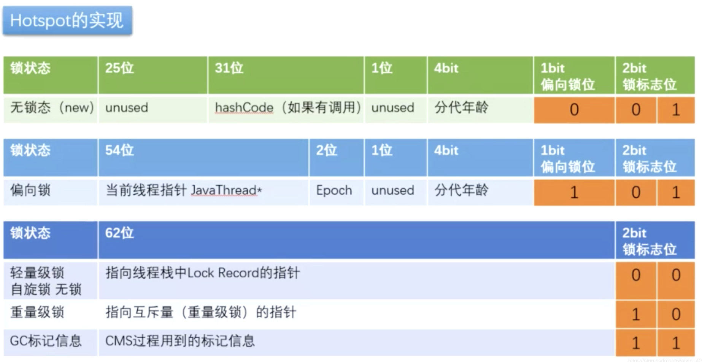

# synchronized锁升级

首先需要先看一下对象头的 MarkWord，如上图所示，对象头的 MarkWord 的各 bit 位都有对应的状态含义。

## 无锁态

偏向锁位、锁标志位的值为：**0 01**，此时对象是没有做任何同步限制的。

## 偏向锁

偏向锁位、锁标志位的值为：**1 01**，在大部分场景都不会发生锁资源竞争，并且锁资源往往都是由一个线程获得的。如果这种情况下，同一个线程获取这个锁都需要进行一系列操作，比如说CAS自旋，那这个操作很明显是多余的。偏向锁就解决了这个问题。其核心思想就是：**一个线程获取到了锁，那么锁就会进入偏向模式，当同一个线程再次请求该锁的时候，无需做任何同步，直接进行同步区域执行。**这样就省去了大量有关锁申请的操作。所以，对于没有锁竞争的场合，偏向锁有很好的优化效果。

## 轻量级锁（自旋锁）

当有另外一个线程竞争获取这个锁时，由于该锁已经是偏向锁，当发现对象头 Mark Word 中的线程 ID 不是自己的线程 ID，销偏向锁状态，将锁对象markWord中62位修改成指向自己线程栈中 Lock Record 的指针（CAS抢）执行在用户态，消耗CPU的资源（自旋锁不适合锁定时间长的场景、等待线程特别多的场景），此时锁标志位为：00。如果在循环结束之前CAS操作成功, 那么线程就获取到锁, 如果循环结束依然获取不到锁, 则获取锁失败, 对象的MarkWord中的记录会被修改为指向互斥量（重量级锁）的指针，锁标志的状态值变为10，线程被挂起，后面来的线程也会直接被挂起。

## 重量级锁

此时锁标志位为：10。前面我们提到的markWord，若是重量锁，对象头中还会存在一个监视器对象，也就是Monitor对象。这个Monitor对象就是实现synchronized的一个关键。

在Java虚拟机(HotSpot)中，Monitor对象其实就是ObjectMonitor对象，这个对象是一个C++对象，定义在虚拟机源码中。

ObjectMonitor有比较多的属性，但是比较重要的属性有四个：

* count：计数器。用来记录获取锁的次数。该属性主要用来实现重入锁机制。
* owner：记录着当前锁对象的持有者线程。
*  WaitSet：队列。当一个线程调用了wait方法后，它会释放锁资源，进入WaitSet队列等待被唤醒。
* EntryList：队列。里面存放着所有申请该锁对象的线程。

## JVM 对 synchronized 锁的优化

### 锁消除

在一段程序里用了锁，但是 jvm 检测到这段程序里不存在共享数据竞争问题，也就是变量没有逃逸出方法外，这个时候jvm就会把这个锁消除掉

### 锁粗化

大部分情况下要让锁的粒度最小化，锁的粗化则是要增大锁的粒度; 假如有一个循环，循环内的操作需要加锁，我们应该把锁放到循环外面，否则每次进出循环，都进出一次临界区，效率是非常差的