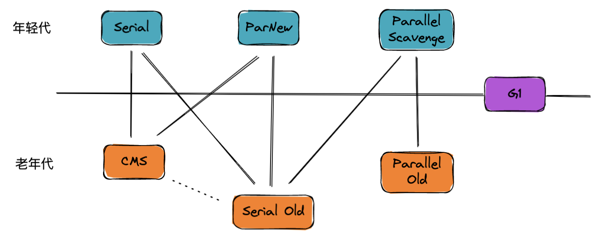
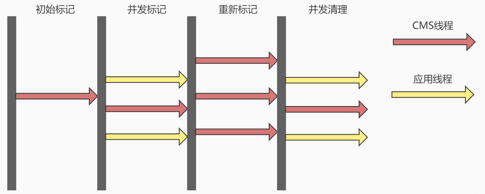

# 垃圾回收

## 运行时数据区

### 线程共享区

#### 堆区

* 存放对象实例，JVM 内存管理的核心区域，堆区没有足够内存来存储实例会报 OOM

#### 方法区

* 存放已加载的类型信息，常量，静态变量（HotSpot虚拟机把方法区叫“永久代”），运行时常量池属于方法区，编译器生成的各种字面量和符号引用存放在这里，可以运行时往常量池加常量，如 String 的 intern（）方法

### 线程私有区

#### 虚拟机栈

* 线程执行每个方法都会创建一个栈桢，存储局部变量表，操作数，动态链接，方法出口等信息，方法执行完栈桢出栈，线程请求的栈深度大于允许深度会报 StackOverflowError，如果虚拟机栈可以动态扩展（HotSpot 不允许动态扩展），当栈扩展至无法申请到足够内存会报 OOM

#### 本地方法栈

* 跟虚拟机栈类似，主要是在调用本地 native 方法时用到

#### 程序计数器

* 用来标记当前线程执行的字节码行号，即常说的 pc 指针

## 垃圾回收算法

### 判断对象是否存活

- **引用计数法：**为每个对象维护一个引用计数器，有地方引用了，计数器就+1，有引用失效了就-1，计数器值为0代表对象已死。**存在问题：无法解决循环引用**

- **可达性分析（ HotSpot 虚拟机采用的算法）**：通过 GC Roots 的根对象作为起始点集，从这些节点开始根据引用关系向下搜索，某个对象到 GC Roots 间没有引用链则为不可达，此对象就是不可再被使用的

- **可以作为 GC Roots 的对象：**

  - 虚拟机栈（栈桢中的本地变量表）中引用的对象，如各线程被调用的方法的堆栈中使用到的参数，局部变量，临时变量等

  - 方法区中的静态属性引用的对象，如 java 类的引用类型静态变量

  - 方法区中常量引用的对象，如字符串常量池里的引用

  - 被同步锁（synchronized关键字）持有的对象

  - 本地方法栈中 JNI （即通常所说的 Native 方法）引用对象

  - 虚拟机内部的引用，如基本数据类型对应的 Class 对象，常驻的异常对象，系统类加载器等

    **OopMap**

    - 一旦类加载完成，HotSpot 就会把对象内什么偏移量上是什么类型的数据计算出来，在即时编译过程中，也会在特定的位置记录下栈里和寄存器里哪些位置是引用。这样在扫描时就不需要一个不漏地遍历 GC Roots 对象的所有成员去看该成员是否是对象引用

    **GC Roots 扫描时对象引用关系发生改变怎么办？**

    - 原始快照（SATB）：扫描开始时拍摄一张对象图快照，并发扫描过中如果有对象删除引用关系，等扫描结束后就把这些对象作为根再扫一次
    - 增量更新：并发扫描过中如果有对象新增引用关系，等扫描结束后就把这些对象作为根再扫一次

### 标记-清除算法

- 分为标记和清除两个阶段，标记阶段判断对象是否存活，为不存活的对象打上标记，清除阶段将不存活的对象进行回收

- 缺点：效率不稳定，如果包含大量对象需要 GC 已不存活，需要进行大量的标记和清除动作，导致回收效率随对象增长而增长；此外最重要的会产生内存碎片，这就会导致后续无法为大对象分配足够大的练习内存而引发另一次 GC

  

### 标记-复制算法

- 将内存一分为二，其中一块为空白区 A，每次只使用另外一块 B，B 这块内存用完了，就把 B 上还存活的对象复制到另一块空白区 A，然后对 B 进行一次性清理

- 优点：解决了标记-清除算法的效率不稳定问题，当大部分对象都是为不存活状态时，回收很方便

- 缺点：当大部分对象都是存活状态时，复制开销就会比较大，每次只有一半区域真正用于存储对象，造成了一定的内存浪费

  

### 标记-整理算法

* 结合标记-清除和标记-复制算法的优缺点的一种算法。分为标记和整理两个阶段，标记阶段标判断对象是否存活，为不存活的对象打上标记，整理阶段让所有的存活对象往一端移动，最后回收存活对象边界外的内存空间

  

标记-复制算法的特点当大部分对象都是不存活状态时回收很快，再结合 IBM 的新生代理论—“98%对象活不过第一轮收集”，因此在分代收集器中主要的年轻代垃圾收集主要就是基于标记-复制算法的实现。老年代垃圾收集则主要是基于标记-整理算法的实现，唯独 CMS 收集器是基于标记-清除实现的。

## 垃圾收集

### 分代收集

- 新生代分为 Eden 区域，和两个 Survivor 区域，根据 IBM 的新生代理论—“98%对象活不过第一轮收集”，Hotspot 虚拟机中其比例默认为 8:1:1，每次只使用 Eden + 一块 Survivor
- 每次垃圾收集时，将 Eden 和已使用的 Survivor 上还存活的对象复制到另一块 Survivor 上，然后统一清理 Eden 和已使用的 Survivor
- 特殊情况下如果 Survivor 大小不足以容纳存活的对象，会借助老年代分配直接进入老年代（晋升担保）

### 晋升担保

- 在发生 Young GC 之前，虚拟机先检查老年代最大可用的连续空间是否大于新生代**所有对象总空间**
  - 如果这个条件成立，那这一次 Young GC可以确保是安全的，直接 Young GC
  - 如果不成立，则虚拟机会先查看- XX:HandlePromotionFailure 参数的设置值是否允许担保失败
    - 如果允许，那会继续检查老年代最大可用的连续空间是否大于历次晋升到老年代对象的平均大小
      - 如果大于，将尝试进行一次 Young GC （尽管这次 Young GC 是有风险的）
      - 如果小于，或者-XX: HandlePromotionFailure设置不允许冒险，那这时直接进行 Full GC
- 如果另外一块 Survivor 空间没有足够空间存放上一次新生代收集下来的存活对象，这些对象便将通过分配担保机制直接进入老年代

### 几种垃圾收集器及其特点

#### 年轻代收集器

##### Serial 收集器

Serial（串行）收集器是一个单线程收集器，基于复制算法的实现，是最基本、最老的收集器。在进行垃圾收集时，必须暂停其他所有的工作线程（“Stop The World”），直到收集结束为止。

##### ParNew 收集器

Serial 收集器的多线程版本，除了使用多线程进行垃圾收集外，其余可用的所有控制参数、收集算法（复制算法）、Stop The World、对象分配规则、回收策略等与Serial收集器完全相同，两者共用了很多代码。

##### Parallel Scavenge 收集器

Parallel Scavenge 收集器是一个并行的多线程新生代收集器，也基于复制算法实现。Parallel Scavenge 收集器的目标是达到一个可控制的吞吐量（Throughput），除了提供可以精确控制吞吐量的参数，还提供了一个参数-XX:+UseAdaptiveSizePolicy，打开该参数后，就不需要手工指定新生代的大小（-Xmn）、Eden和Survivor区的比例（-XX:SurvivorRatio）、晋升老年代对象年龄（-XX:PretenureSizeThreshold）等细节参数了

#### 老年代收集器

##### Serial Old 收集器

### Serial Old收集器

Serial Old 是 Serial 收集器的老年代版本，同样是一个单线程收集器，基于标记-整理算法实现。主要用于 Client 模式下的虚拟机。如果在Server 模式下，还有两大用途：

1. 在JDK1.5 以及之前版本（Parallel Old 诞生以前）中与 Parallel Scavenge 收集器搭配使用
2. 作为 CMS 收集器的后备预案，在并发收集发生 Concurrent Mode Failure 时使用

##### Parallel Old 收集器

Parallel Old 收集器是 Parallel Scavenge 收集器的老年代版本，使用多线程回收，基于标记-整理算法实现。这个收集器从 JDK 1.6 开始提供的，在此之前，如果新生代选择了 Parallel Scavenge 收集器，老年代除了 Serial Old 以外别无选择。在 Parallel Old 诞生以后，“吞吐量优先” 收集器才有了比较名副其实的应用组合，在注重吞吐量以及CPU资源敏感的场合，都可以优先考虑Parallel Scavenge加Parallel Old收集器

##### CMS 收集器

CMS（Concurrent Mark Sweep）收集器是一种以获取最短回收停顿时间为目标的收集器，非常适合互联网或者B/S系统的服务端上的 Java 应用，这些应用都非常重视服务的响应速度。基于标记-清除算法实现（这个比较特殊，不是基于标记-整理算法的，因为要达到最小的停顿时间的目的，标记-整理会比标记清楚算法耗时长一些），其回收过程大致如下：

- 初始标记（CMS initial mark）：仅仅只是标记一下 GC Roots 能直接关联到的对象，速度很快，需要 STW
- 并发标记（CMS concurrent mark）：进行 GC Roots Tracing 的过程，在整个过程中耗时最长
- 重新标记（CMS remark）：为了修正并发标记期间因用户程序继续运作而导致标记产生变动的那一部分对象的标记记录，这个阶段的停顿时间一般会比初始标记阶段稍长一些，但远比并发标记的时间短。此阶段也需要 STW
- 并发清除（CMS concurrent sweep）

特点：

- 对 CPU 资源敏感（其实，面向并发设计的程序都对CPU资源比较敏感）。在初始标记阶段，虽然不会STW，但会占用一部分线程（或者说CPU资源）而导致应用程序变慢，总吞吐量会降低
- CMS 默认启动的回收线程数是（CPU数量+3）/4，也就是当CPU在4个以上时，并发回收时垃圾收集线程不少于25%的CPU资源，并且随着CPU数量的增加而下降。但是当CPU不足4个时（比如2个），CMS对用户程序的影响就可能变得很大，如果本来CPU负载就比较大，还要分出一半的运算能力去执行收集器线程，就可能导致用户程序的执行速度忽然降低了50%，其实也让人无法接受
- 无法处理浮动垃圾（Floating Garbage） 可能出现“Concurrent Mode Failure”失败而导致另一次Full GC的产生，并且这次 Full GC 会退化为 Serial Old 垃圾收集，效率比较低。Concurrent Mode Failure 指的是在执行 CMS GC 的过程中同时业务线程将对象放入老年代，而此时老年代空间不足
- 由于CMS并发清理阶段用户线程还在运行着，伴随程序运行自然就还会有新的垃圾不断产生。这一部分垃圾出现在标记过程之后，CMS无法再当次收集中处理掉它们，只好留待下一次GC时再清理掉
- 基于标记-清除算法实现必然会导致空间碎片，空间碎片过多时，将会给大对象分配带来很大麻烦，往往出现老年代空间剩余，但无法找到足够大连续空间来分配当前对象

#### G1 收集器

G1把 Java 堆分为多个 Region，保留新生代和老年代的概念，但新生代和老年代不再是物理隔离的了，而都是一部分Region（不需要连续）的集合。G1从空间整合整体来看是基于“标记-整理”算法实现的收集器，从局部（两个Region之间）上来看是基于“复制”算法实现的。这意味着G1运行期间不会产生内存空间碎片，收集后能提供规整的可用内存。

G1 收集器之所以能建立可预测的停顿时间模型，是因为它可以有计划地避免在整个Java堆中进行全区域的垃圾收集。G1 跟踪各个Region 里面的垃圾堆积的价值大小（回收所获得的空间大小以及回收所需时间的经验值），在后台维护一个优先列表，每次根据允许的收集时间，优先回收价值最大的Region（这也就是Garbage-First名称的来由）。

一个对象分配在某个Region中，可以与整个Java堆任意的对象发生引用关系。在做可达性分析确定对象是否存活的时候，需要扫描整个 Java 堆才能保证准确性，这显然会拉低 GC 效率。为了避免全堆扫描的发生，虚拟机为G1中每个Region维护了一个与之对应的 Remembered Set。

G1 的回收过程大致如下（跟CMS其实差不多）：

* 初始标记（initial mark），标记了从 GC Root开始直接关联可达的对象。需要 STW

* 并发标记（concurrent marking），并发标记初始标记的对象，不需要 STW

* 最终标记（Remark），标记并发标记过程中产生的垃圾，需要 STW

* 筛选回收（Live Data Counting And Evacuation），评估标记垃圾，根据 GC 模式回收垃圾。需要 STW