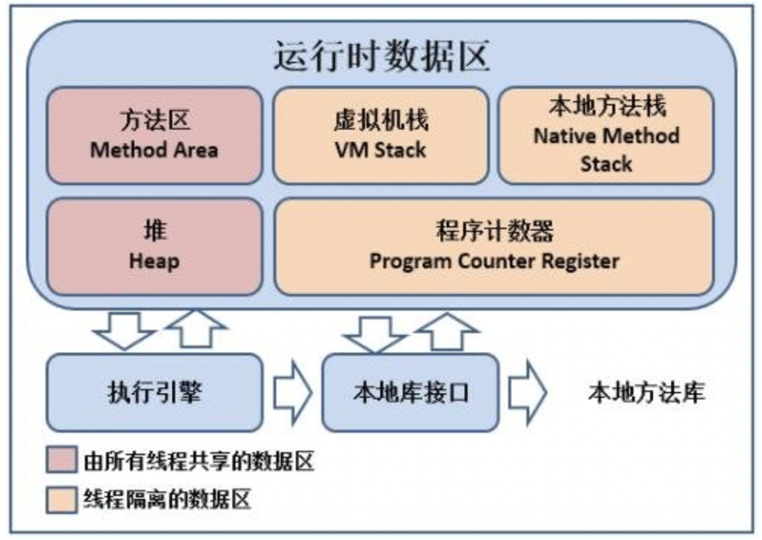
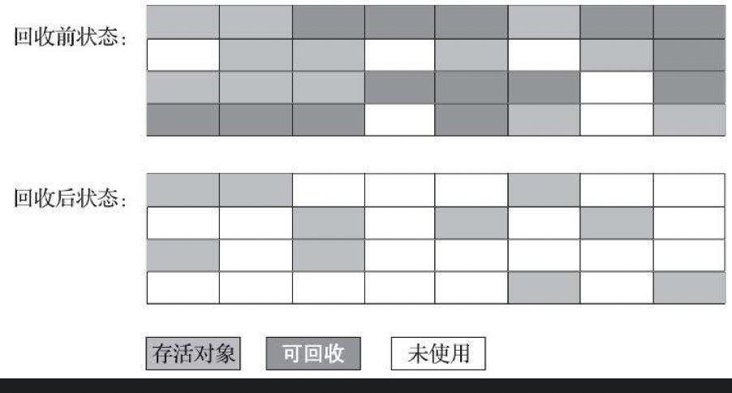
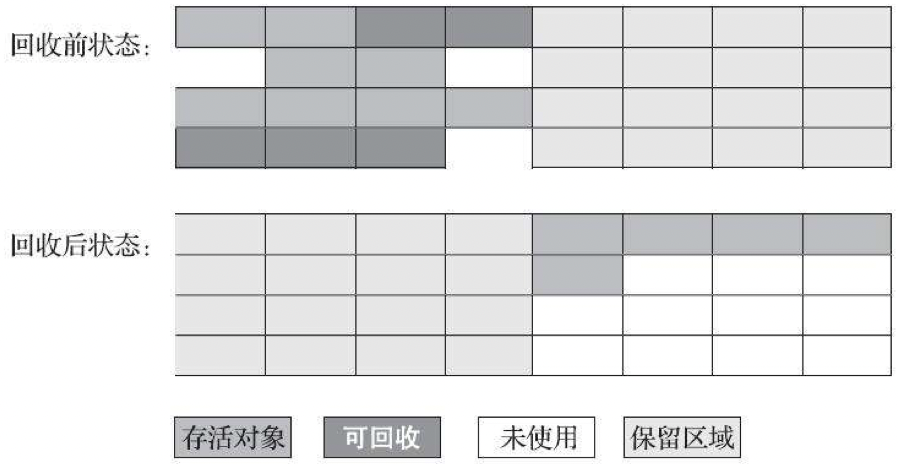
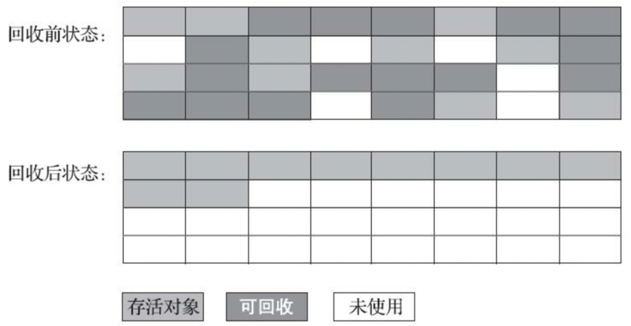

# 垃圾回收

## 运行时数据区

### 线程共享区

#### 堆区

* 存放对象实例，JVM 内存管理的核心区域，堆区没有足够内存来存储实例会报 OOM

#### 方法区

* 存放已加载的类型信息，常量，静态变量（HotSpot虚拟机把方法区叫“永久代”），运行时常量池属于方法区，编译器生成的各种字面量和符号引用存放在这里，可以运行时往常量池加常量，如 String 的 intern（）方法

### 线程私有区

#### 虚拟机栈

* 线程执行每个方法都会创建一个栈桢，存储局部变量表，操作数，动态链接，方法出口等信息，方法执行完栈桢出栈，线程请求的栈深度大于允许深度会报 StackOverflowError，如果虚拟机栈可以动态扩展（HotSpot 不允许动态扩展），当栈扩展至无法申请到足够内存会报 OOM

#### 本地方法栈

* 跟虚拟机栈类似，主要是在调用本地 native 方法时用到

#### 程序计数器

* 用来标记当前线程执行的字节码行号，即常说的 pc 指针

## 垃圾回收算法

### 判断对象是否存活

- **引用计数法：**为每个对象维护一个引用计数器，有地方引用了，计数器就+1，有引用失效了就-1，计数器值为0代表对象已死。**存在问题：无法解决循环引用**

- **可达性分析（ HotSpot 虚拟机采用的算法）**：通过 GC Roots 的根对象作为起始点集，从这些节点开始根据引用关系向下搜索，某个对象到 GC Roots 间没有引用链则为不可达，此对象就是不可再被使用的

- **可以作为 GC Roots 的对象：**

  - 虚拟机栈（栈桢中的本地变量表）中引用的对象，如各线程被调用的方法的堆栈中使用到的参数，局部变量，临时变量等

  - 方法区中的静态属性引用的对象，如 java 类的引用类型静态变量

  - 方法区中常量引用的对象，如字符串常量池里的引用

  - 被同步锁（synchronized关键字）持有的对象

  - 本地方法栈中 JNI （即通常所说的 Native 方法）引用对象

  - 虚拟机内部的引用，如基本数据类型对应的 Class 对象，常驻的异常对象，系统类加载器等

    **OopMap**

    - 一旦类加载完成，HotSpot 就会把对象内什么偏移量上是什么类型的数据计算出来，在即时编译过程中，也会在特定的位置记录下栈里和寄存器里哪些位置是引用。这样在扫描时就不需要一个不漏地遍历 GC Roots 对象的所有成员去看该成员是否是对象引用

    **GC Roots 扫描时对象引用关系发生改变怎么办？**

    - 原始快照（SATB）：扫描开始时拍摄一张对象图快照，并发扫描过中如果有对象删除引用关系，等扫描结束后就把这些对象作为根再扫一次
    - 增量更新：并发扫描过中如果有对象新增引用关系，等扫描结束后就把这些对象作为根再扫一次

### 标记-清除算法

- 分为标记和清除两个阶段，标记阶段判断对象是否存活，为不存活的对象打上标记，清除阶段将不存活的对象进行回收

- 缺点：效率不稳定，如果包含大量对象需要 GC 已不存活，需要进行大量的标记和清除动作，导致回收效率随对象增长而增长；此外最重要的会产生内存碎片，这就会导致后续无法为大对象分配足够大的练习内存而引发另一次 GC

  

### 标记-复制算法

- 将内存一分为二，其中一块为空白区 A，每次只使用另外一块 B，B 这块内存用完了，就把 B 上还存活的对象复制到另一块空白区 A，然后对 B 进行一次性清理

- 优点：解决了标记-清除算法的效率不稳定问题，当大部分对象都是为不存活状态时，回收很方便

- 缺点：当大部分对象都是存活状态时，复制开销就会比较大，每次只有一半区域真正用于存储对象，造成了一定的内存浪费

  

### 标记-整理算法

* 结合标记-清除和标记-复制算法的优缺点的一种算法。分为标记和整理两个阶段，标记阶段标判断对象是否存活，为不存活的对象打上标记，整理阶段让所有的存活对象往一端移动，最后回收存活对象边界外的内存空间

  

标记-复制算法的特点当大部分对象都是不存活状态时回收很快，再结合 IBM 的新生代理论—“98%对象活不过第一轮收集”，因此在分代收集器中主要的年轻代垃圾收集就是基于标记-复制算法的实现。老年代垃圾收集则是基于标记-整理算法的实现，几乎所有的垃圾收集器都不会基于标记-清除实现。

## 垃圾收集器

### 分代收集

- 新生代分为 Eden 区域，和两个 Survivor 区域，根据 IBM 的新生代理论—“98%对象活不过第一轮收集”，Hotspot 虚拟机中其比例默认为 8:1:1，每次只使用 Eden + 一块 Survivor
- 每次垃圾收集时，将 Eden 和已使用的 Survivor 上还存活的对象复制到另一块 Survivor 上，然后统一清理 Eden 和已使用的 Survivor
- 特殊情况下如果 Survivor 大小不足以容纳存活的对象，会借助老年代分配直接进入老年代（晋升担保）

### 晋升担保

- 在发生 Young GC 之前，虚拟机先检查老年代最大可用的连续空间是否大于新生代**所有对象总空间**
  - 如果这个条件成立，那这一次 Young GC可以确保是安全的，直接 Young GC
  - 如果不成立，则虚拟机会先查看- XX:HandlePromotionFailure 参数的设置值是否允许担保失败
    - 如果允许，那会继续检查老年代最大可用的连续空间是否大于历次晋升到老年代对象的平均大小
      - 如果大于，将尝试进行一次 Young GC （尽管这次 Young GC 是有风险的）
      - 如果小于，或者-XX: HandlePromotionFailure设置不允许冒险，那这时直接进行 Full GC
- 如果另外一块 Survivor 空间没有足够空间存放上一次新生代收集下来的存活对象，这些对象便将通过分配担保机制直接进入老年代

### 几种垃圾收集器特点

