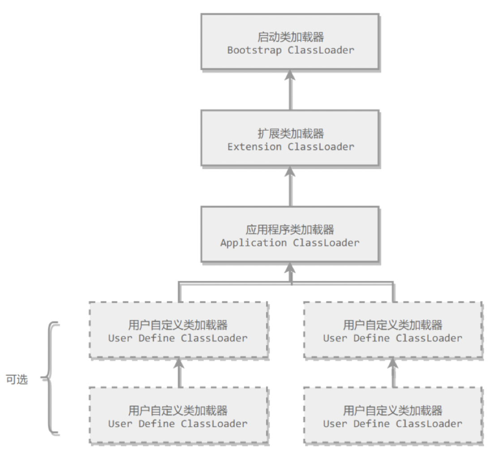

# 类和对象相关

## 类文件结构

Class 文件结构采用类似 C 语言的结构体来存储数据的，主要有两类数据项，无符号数和表，无符号数用来表述数字，索引引用以及字符串等，比如 u1，u2，u4，u8 分别代表 1 个字节，2 个字节，4 个字节，8 个字节的无符号数，而表是有多个无符号数以及其它的表组成的复合结构，习惯地以 _info 结尾。表用于描述有层次关系的符合结构的数据，整个 Class 文件本质上就是一张表。

```java
ClassFile {
    u4             magic; // 魔数，0xCAFEBABE
    u2             minor_version; // 支持的 jvm 最低版本
    u2             major_version; // 支持的 jvm 最高版本
    u2             constant_pool_count; // 常量池数量
    cp_info        constant_pool[constant_pool_count-1]; // 常量池
    u2             access_flags; // 当前接口或类的访问类型
    u2             this_class; // 当前类
    u2             super_class; // 父类
    u2             interfaces_count; // 实现的接口数量
    u2             interfaces[interfaces_count]; // 实现的接口信息
    u2             fields_count; // 成员数量
    field_info     fields[fields_count]; // 成员信息 
    u2             methods_count; // 方法数量
    method_info    methods[methods_count]; // 方法信息
    u2             attributes_count; // 属性数量
    attribute_info attributes[attributes_count]; // 属性信息，在 Class文件、字段表、方法表、Code表都可以携带自己的属性表集合，用于描述场景专有的信息，只要不与现有属性名重复，任何人实现的编译器都可以向属性表中写入自己定义的属性信息，Java虚拟集运行时会忽略不认识的属性
}
```

## 类加载器

### 启动类加载器（Bootstrap ClassLoader）

使用 C++ 编写，属于 jvm 的一部分，负责加载 <JRE_HOME>\lib 目录中的类库，仅按照文件名识别，如 rt.jar，名字不符合的类库即使放在 lib 目录中也不会被加载。启动类加载器无法被 Java 程序直接引用，用户在编写自定义类加载器时，如果需要把加载请求委派给启动类加载器，直接使用 null 代替即可

### 扩展类加载器（Extension ClassLoader）

由 ExtClassLoader（sun.misc.Launcher$ExtClassLoader）实现。负责将 <JAVA_HOME>/lib/ext 或者被 java.ext.dir 系统变量所指定路径中的类库加载到内存中，开发者可以直接使用扩展类加载器

### 应用程序类加载器（Application ClassLoader）

由 AppClassLoader（sun.misc.Launcher$AppClassLoader）实现。由于这个类加载器是 ClassLoader 中的 getSystemClassLoader() 方法的返回值，因此一般称为**系统类加载器**。负责加载用户类路径（ClassPath）上所指定的类库，开发者可以直接使用这个类加载器，如果应用程序中没有自定义过自己的类加载器，一般情况下这个就是程序中默认的类加载器

**一个自定义类加载器的demo：**

```java
public class MyClassLoader extends ClassLoader {

    @Override
    public Class<?> loadClass(String name) throws ClassNotFoundException {
        if(!name.startsWith("hello")) { // 如果全路径类名以 hello 开头，则交给双亲类加载器
            return super.loadClass(name);
        }
        return findClass(name); // 否则打破双亲委派，直接在当前类加载器中加载
    }

    @Override
    protected Class<?> findClass(String name) {

        InputStream is = null;
        ByteArrayOutputStream baos = null;
        try {
            byte[] buffer = new byte[1024];
            int len = -1;
            baos = new ByteArrayOutputStream();
            URL url = new URL("file:///Users/xuping/code/Java/test-demo/target/classes/hello/A.class");
            is = url.openStream();
            while ((len = is.read(buffer)) != -1) { // 从 class 文件读入 jvm
                baos.write(buffer, 0, len);
            }
        } catch (FileNotFoundException e) {
            e.printStackTrace();
        } catch (IOException e) {
            e.printStackTrace();
        }
      	// 真正定义类,把字节码转化为 Class 对象
        return defineClass(name, baos.toByteArray(), 0, baos.toByteArray().length); 
    }
}
```

## 双亲委派模型



通常情况下（使用 AppClassLoader加载），jvm 加载一个类之前会委托给上层的 Extension ClassLoader加载，Extension ClassLoader 会委托给 Bootstrap ClassLoader 加载，若顶层等类加载器加载不了，则会再退回到下层的类加载器加载，这就是双亲委派模型，类加载是调用 ClassLoader 的 loadClass 方法触发的，双亲委派模型的实现自然就是再 loadClass 方法中了。可以看一下 ClassLoader 源码：

```java
protected Class<?> loadClass(String name, boolean resolve) throws ClassNotFoundException {
    synchronized (getClassLoadingLock(name)) {
      Class<?> c = findLoadedClass(name); // 先找一下当前类是不是已经加载过了
      if (c == null) { // 没有加载过
        long t0 = System.nanoTime();
        try {
          if (parent != null) {
            c = parent.loadClass(name, false); // 双亲委派开始，让 parent 加载
          } else {
            c = findBootstrapClassOrNull(name);
          }
        } catch (ClassNotFoundException e) {
          // ClassNotFoundException thrown if class not found
          // from the non-null parent class loader
        }

        if (c == null) { // 双亲无法加载，当前类加载器再加载
          long t1 = System.nanoTime();
          c = findClass(name); // 当前类加载器开始加载,注意调用的是 findClass 方法

          // this is the defining class loader; record the stats
          sun.misc.PerfCounter.getParentDelegationTime().addTime(t1 - t0);
          sun.misc.PerfCounter.getFindClassTime().addElapsedTimeFrom(t1);
          sun.misc.PerfCounter.getFindClasses().increment();
        }
      }
      if (resolve) {
        resolveClass(c);
      }
      return c;
    }
}
// findClass 默认实现，一般是子类去覆写
protected Class<?> findClass(String name) throws ClassNotFoundException {
    throw new ClassNotFoundException(name);
}
// 一个定义 findClass 方法的 demo
@Override
protected Class<?> findClass(String name) {

  InputStream is = null;
  ByteArrayOutputStream baos = null;
  try {
    byte[] buffer = new byte[1024];
    int len = -1;
    baos = new ByteArrayOutputStream();
    URL url = new URL("file:///Users/xuping/code/Java/test-demo/target/classes/hello/A.class");
    is = url.openStream();
    while ((len = is.read(buffer)) != -1) {
      baos.write(buffer, 0, len);
    }
  } catch (FileNotFoundException e) {
    e.printStackTrace();
  } catch (IOException e) {
    e.printStackTrace();
  }
  // 关键是 defineClass 方法，将字节码转换为 Class 对象
  return defineClass(name, baos.toByteArray(), 0, baos.toByteArray().length);
}

```

### 如何打破双亲委派？

自定义类加载器，覆写 loadClass 方法和 findClass 方法，在 loadClass 方法中直接调用自己的 findClass 方法。

## 类加载过程

**加载**

- 通过类的完全限定名称获取定义该类的二进制字节流，将该字节流表示的静态存储结构转换为方法区的运行时存储结构，在内存中生成一个代表该类的 Class 对象，作为方法区中该类各种数据的访问入口类的二进制字节流来源。加载阶段是开发人员可控性最强的阶段。可以使用Java虚拟机内置的**引导类加载器**来完成，也可以由用户自定义的类加载器去完成，开发人员通过定义自己的类加载器去控制字节流的获取方式(**重写一个类加载器的findClass()或loadClass()方法**)，实现根据自己的想法来赋予应用程序获取运行代码的动态性

**验证**

- 确保 Class 文件的字节流中包含的信息符合当前虚拟机的要求，并且不会危害虚拟机自身的安全

**准备**

- 准备阶段为类变量分配内存并设置初始值(**零值**)，使用的是方法区的内存，类变量是被 static 修饰的变量。在JDK 7及之前，HotSpot使用永久代来实现方法区时，实现是完全符合这种逻辑概念的，而在JDK8及之后，类变量则会随着Class对象一起存放在Java堆中

**解析**

- 将常量池的符号引用替换为直接引用

**初始化**

- 真正开始执行类中定义的 Java 程序代码，虚拟机执行类构造器 <clinit>() 方法
- <clinit>() 是由编译器自动收集类中所有类变量的赋值动作和静态语句块中的语句合并产生的
- 在准备阶段，类变量已经赋过一次系统要求的初始值，而在初始化阶段，根据程序员通过程序制定的主观计划去初始化类变量和其它资源

## 对象结构

- HotSpot 虚拟机里对象在堆内存中的存储布局分为 3 个部分：对象头（Header），实例数据（Instance Data）和对齐填充部分
- 对象头包括两部分：
  1. 自身运行时数据，也叫 **Mark Word**，包括哈希码，GC分代年龄，锁状态标志，线程持有的锁，偏向线程ID，偏向时间戳等
  2. 类型指针，指向其类型元数据，可以通过这个指针确定该对象时哪个类的实例，但并不一定所有的虚拟机实现都必须保留类型指针，也就是说查询对象的元数据不一定要经过对象本身
- 实例数据：真正存储的有效信息，代码里写的各种类型字段内容，无论是父类的还是自己的都有
- 对齐填充部分：不是必然存在，只起占位作用，用来保证对象所占空间一定是 8 字节的整数倍

## 对象 4 种引用

### 强引用

* 就是传统引用的定义，Object A = new Object（）；只要强引用存在，对象就永远不会被 GC

### 软引用

* jdk1.2 后提供了 SoftReference 类来实现软引用，系统要发生 OOM 前，会把软引用的对象列进回收范围进行第二次回收，如果第二次回收后还没足够内存，才会报 OOM

### 弱引用

* jdk1.2 后提供了 WeakReference 类来实现弱引用，被弱引用关联的对象，只能生存到下一次 GC，下一次 GC 一定会回收弱引用对象，无论内存够不够

### 虚引用

* jdk1.2 后提供了 PhantomReference 类来实现虚引用，对象是否存在虚引用不影响其生存时间，也无法通过虚引用获取对象实例，设置虚引用的唯一目的就是为了能在对象被回收时收到一个系统通知