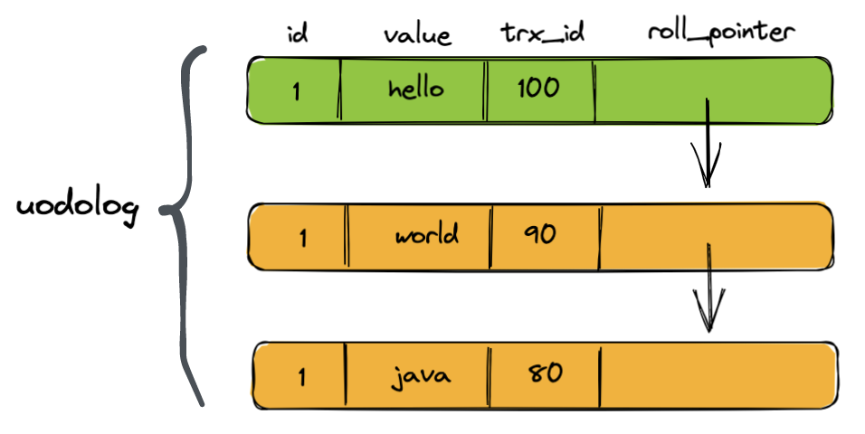
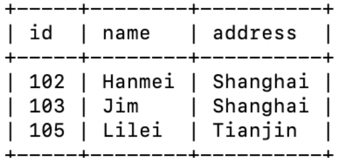
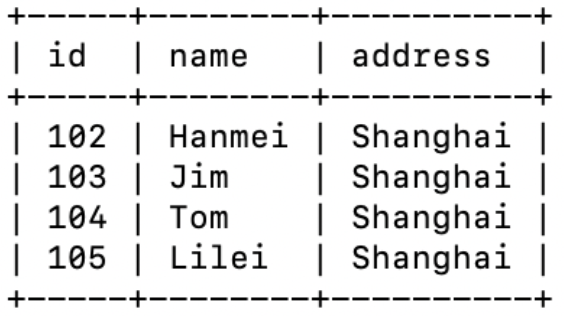

# 事务

## 事务 4 大特性

### 原子性

* 同一个事物里的所有操作，要么全都执行，要么全部不执行，不存在部分执行的中间态
* 事务的所有修改操作(增、删、改)的相反操作都会写入undolog，这个在日志那篇文章里有介绍。比如事务执行了一条insert语句，那么undolog就会记录一条相反的delete语句。undolog是一个逻辑文件，记录的是相应的SQL语句，一旦由于故障导致事务无法成功提交，或者回滚，MySQL则会执行undolog中相应的撤销操作，达到事务回滚的目的

### 一致性

* 事务执行完成后，所有数据的状态都是一致的，不存在 A 事务更新完了，A 之后开启的事务 B 读取到的数据还是未更新的

### 隔离性

* 事务与事务间的操作相互隔离，互不影响
* MySQL 对应有 4 种隔离级别，下面会写

### 持久性

* 事务完成后，对数据库数据的修改被持久化存储，即使发生宕机也可以恢复
* 事务的所有修改操作(增、删、改)，都会生成一条redolog记录，区别于undolog记录SQL语句，redolog记录了事务对数据页做的修改，属于物理日志。redolog应用场景：数据库系统直接崩溃，需要进行恢复，一般数据库都会使用按时间点备份的策略，首先将数据库恢复到最近备份的时间点状态，之后读取该时间点之后的redolog记录，重新执行相应记录，达到最终恢复的目的

## 事务隔离级别

| 隔离级别                     | 脏读 | 不可重复读 | 幻读 |
| ---------------------------- | ---- | ---------- | ---- |
| 读未提交（Read Uncommitted） | ✅    | ✅          | ✅    |
| 读已提交（Read Committed）   | ❌    | ✅          | ✅    |
| 可重复读（Repeatable Read）  | ❌    | ❌          | ✅    |
| 串行化（Serializable）       | ❌    | ❌          | ❌    |

脏读：事务A中可以读到事务B中还未提交的修改

不可重复读：事务A中读不到事务B中还未提交的修改，但是可以读到事务B提交了的修改

幻读：事务A中读某条记录 R 的值始终都是一致的，无论其他事务有没有提交修改。但是读取某个范围记录会发生不一致

### 读已提交和可重复读实现

先说结论，MySQL InnoDB 使用多版本并发控制 （MVCC） 实现读已提交和可重复读。MVCC 并不是一种具体的算法，而是一系列策略的组合。 

#### 策略一：隐藏列

InnoDB存储引擎的每行数据都会有两个隐藏列（其实准确来说是三个，还有一个叫隐藏 id，因为 Innodb 必须有主键，如果建表时没有显式指定的话，就会以隐藏 id 作为主键，当然这个隐藏 id 和 mvcc 没有关系，真正和mvcc有关系的其实是两个隐藏列），分别是 trx_id, 创建版本号；和 roll_pointer，回滚指针。其中创建版本号其实就是创建该行数据的事务 id，是一个随时间戳递增的独一无二的数字。

#### 策略二：undolog 版本链

当事务对数据行进行一次更新操作时，会把旧数据行记录在 undolog 中，undolog 除了记录数据行，首先会记录下该行数据的对应的创建版本号，也就是生成这行数据的事务id，接着将原来数据行中的回滚指针指向 undolog 记录的这行数据，然后再在原来数据表中进行一次更新操作。如果这次更新操作回滚了，那么就可以根据回滚指针去 undolog 中查找之前的数据进行复原。如果后续还有更新操作的话，就会在 undolog 中和之前的数据行形成一条链表，链表头就是最新的数据，这条链表就叫做版本链。

#### 策略三：ReadView

ReadView 是一个事务快照，准确来说是当前时间点系统内活跃的事务列表，也就是说系统内所有未提交的事务，都会记录在这个Readview 内，事务就根据它来判断哪些数据是可见的，哪些是不可见的。当进行查询操作时，事务会生成一个ReadView，根据这个ReadView 去 undolog 中进行判断哪些是可以版本是可以读的。判断的逻辑大致如下：

从版本链最新的一条开始往前找，如果数据行的版本号小于 ReadView 记录的活跃事务 id 最小值，就说明这条数据对当前数据库是可见的，可以直接作为结果集返回。若数据行版本号大于 ReadView 记录的活跃事务 id 最大值，说明这条数据是由一个新的事务修改的，对当前事务不可见，那么就顺着版本链继续往下找。若数据行版本号在ReadView 记录的活跃事物 id 最小值和最大值之间，那么就需要遍历 ReadView 了，如果数据行版本号等于 ReadView 集合中的某个值，说说明该行数据仍然处于活跃状态，那么对当前事务不可见，否则说明对应事务已经结束了，可以直接将该结果返回。

那么上面三种策略是怎样分别实现读已提交和可重复读的呢？其实很简单，就是生成 ReadView 的时机不同。

对于读已提交来说，事务中的每次读操作都会生成一个新的 ReadView，也就是说，如果这期间某个事务提交了，那么它就会从 ReadView 中移除，再次根据 ReadView 判断事务状态时对应数据就是可读的了。

对于可重复读来说，事务只有在第一次进行读操作时才会生成一个 ReadView，后续的读操作都会重复使用这个ReadView。也就是说，如果在此期间有其他事务提交了，那么对于可重复读来说也是不可见的，因为对它来说，事务活跃状态在第一次进行读操作时就已经确定下来，后面不会修改了。
## 可重读隔离级别下的幻读问题

首先有几个概念需要先理清楚：快照读、当前读、记录锁、GAP锁、Next-Key锁

> 快照读：快照就是 undolog，快照读就是从 undolog 中读数据。默认隔离级别下的简单 select 就是快照读。 
>
> 当前读：直接读物理数据文件中的数据。当前读的语句有 select... in share mode、select...for update、update、delete、insert
>
> 记录锁：只锁记录，给特定数据行上锁
>
> GAP 锁：只锁间隙，前后开区间(a, b)，对索引的间隙加锁，防止其他事务插入数据
>
> Next-key锁：同时锁住记录和间隙，闭区间[a, b]，可以理解为 记录锁+GAP锁

先说结论，可重复度隔离级别下解决了部分幻读问题，但是没有完全解决。不出现幻读的条件是在单个事务中没有快照读和当前读的混合。要么都是快照读，要么都是当前读，否则就会发生幻读，案例：

| 事务A                                                        | 事物B                                                    |
| ------------------------------------------------------------ | -------------------------------------------------------- |
| mysql> begin;                                                |                                                          |
|                                                              | mysql> begin;                                            |
| mysql> select * from teacher where id>=102 and id <= 105;  |                                                          |
|                                                              | mysql> insert into teacher values(104,"Tom","Shanghai"); |
|                                                              | mysql> commit;                                           |
| mysql> select * from teacher where id>=102 and id <= 105;   // 这里没有发生幻读，因为事务A到目前为止一直都是快照读 |                                                          |
| mysql> update teacher set address='Shanghai' where id>=102 and id<=105;  // update 操作，当前读 |                                                          |
| mysql> select * from teacher where id>=102 and id <= 105;   // 发生了幻读，多了一条 id = 104 的记录 |                                                          |
| mysql> commit;                                               |                                                          |

可重复读隔离级别下可以使用 for update 给目标区间加上 Next-key 锁防止幻读。比如上面例子中的事务A为了防止幻读，可以在一开始使用 select * from teacher where id>=102 and id <= 105 for update 锁住区间 [102,105]，其他事务要往这个区间插入记录都会被阻塞。