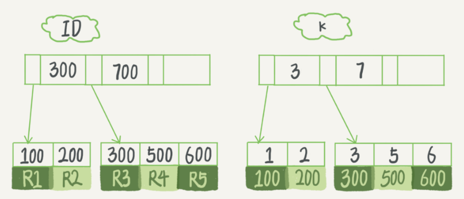

# 索引

主要梳理 InnoDB 存储引擎的索引，其他存储引擎用的不多，就先不梳理了。首先就是索引的叫法，包括以下几种：**聚簇索引**、**非聚集索引**、**单列索引**、**组合索引**、**唯一索引**、**普通索引**。这些索引类型并不是按照同一维度进行区分的，按照索引数据完整度，可以分为聚簇索引和非聚簇索引，聚簇索引保存所有记录字段，非聚簇索引仅仅保存索引字段；按照索引字段数量，可以分为单列索引和组合索引；按照索引定义方式，可以分为普通索引和其他索引（包括唯一索引等）。

**聚簇索引和非聚簇索引**

InnoDB 存储引擎的表会存在主键（唯一非null），如果建表的时候没有指定主键，则会使用第一个非空的唯一索引作为聚簇索引，否则InnoDB会自动帮你创建一个不可见的、长度为6字节的row_id用来作为聚簇索引，聚簇索引保存了记录的所有字段，一张表只有一个聚簇索引。除了聚簇索引外的其他索引都可以称作非聚簇索引。

**主键索引和唯一索引**

InnoDB 存储引擎的表的主键构建的索引叫作主键索引，主键不允许为空且不能重复。唯一索引跟主键索引稍有不同，索引列的值同样必须唯一，但允许有空值。主键索引是一种特殊的唯一索引，不允许有空值。

**普通索引**

主键索引和唯一索引是 mysql 内部为约束字段构建的索引，除此以外用户自定义的索引就是普通索引。普通索引可以自由组合字段，允许在定义索引的列中插入重复值和空值

**单列索引和组合索引**

索引由一个字段组成就叫作单列索引，由多个字段组成就叫作组合索引。组合索引是实际开发中建的比较多的，也是优化的主要对象。

## 索引优化

### 建索引的原则

1. 为常作为查询条件的字段建立索引，走覆盖索引，避免回表
2. 对于修改比较多的表，尽量少建索引，因为修改的同时进行索引的维护，索引的维护其实就是对索引文件 B+ 树进行节点分裂合并
3. 选取区分度高的字段建索引

### 最左前缀匹配原则

最左前缀匹配原则针对的是组合索引，如以 User 表的 name 和 city 建组合索引（name,city），**最左前缀匹配原则指的是，如果查询的时候查询过滤条件精确匹配索引的左边连续一列或几列，则查询就会走这些索引列**：

```sql
select * from user where name=xx and city=xx ; // 可以命中索引, name 和 city 都走索引
select * from user where name=xx ; // 可以命中索引，name 走索引
select * from user where city=xx ; // 无法命中索引(这里其实不完全是无法命中索引，下面会说)    
```

最左前缀匹配的过程其实就是 B+ 树的查找过程，例如，一个组合索引（a,b）的存储结构大致如下图，B+ 树节点按照索引顺序依次排序构建，也就是说先按 a 排序，在 a 相同的情况下再按 b 排序。在 a 不相同的情况下，b 的大小没有关系，因此不能直接跳过 a 从索引去找 b，因为这样还是必须扫描整个 B+ 树，理解这一特点也就好理解索引的失效和生效情况了。


#### 索引失效的情况

```SQL
-- 前提条件假设 (user_id,age) 是组合索引
-- 1. where 过滤条件包含 or 时，可能会导致索引失效
-- 因此尽量避免使用or语句，可以根据情况使用 union all 或者 in 来代替
select * from user where user_id = 1 or age = 20;

-- 2. where 过滤条件使用了否定谓词查询，可能会导致索引失效，如 NOT、!=、<>、!<、!>、NOT IN、NOT LIKE 等
select * from user where user_id != 12;

-- 3. where 过滤条件使用 is null 或 is not null，可能会导致索引失效
select * from user where user_id is not null;

-- 4. where 过滤条件在索引列上使用函数或者计算，一定会导致索引失效
select * from user where user_id+1 = 2;

-- 5. where 过滤条件使用 like 模糊查询，可能导致索引失效
select * from user where user_id = 1 and age like '%0'; -- 这个会走 user_id 索引，但是不会走 age 索引
select * from user where user_id = 1 and age like '2%'; -- 这个会走 user_id 索引，也会走 age 索引 

-- 6. 组合索引中违背最左前缀匹配原则的查询，也就是说只要遇到第一个无法走索引的字段，后面的字段过滤都不走索引了
select * from user where user_id = 1 and age = 20; -- 走 user_id索引，走 age 索引
select * from user where user_id = 1 and age > 20; -- 走 user_id索引，但是不走 age 索引
select * from user where user_id > 1 and age = 20; -- 不走索引
```

#### 索引生效的情况

```sql
-- 除了上述索引失效的情况外，其他情况基本都可以走索引，这里几个特殊的也可以走索引的情况
-- 前提条件（a,b,c）组合索引
-- 1. 如果 where 使用索引的最左前缀定义为常量，则 order by 能使用索引
where a=const order by b,c
where a=const and b=const order by c
where a=const and b > const order by b,c

-- 2. 不能使用索引进行排 order by 排序的情况
order by a, b desc, c desc  -- 排序不一致
where d=const order by b,c   -- a丢失
where a=const order by c     -- b丢失
where a=const order by b,d   -- d不是索引的一部分
where a in(...) order by b,c -- a属于范围查询
```

需要注意的是，查询的时候如果两个条件都用上了，但是顺序不同，如 `city=xx and name＝xx`，那么高版本的**查询引擎会自动优化为匹配联合索引的顺序，这样其实也是能够命中索引的**。这里就涉及高版本 MySQL 的优化了，具体 SQL 还需借助 explain 进行分析，例如：

### 高版本 InnoDB 对查询的优化

考虑如下场景，有这样的一张表，建表语句如下：

```sql
CREATE TABLE test (
    id         INT NOT NULL,
    last_name  CHAR(30) NOT NULL,
    first_name CHAR(30) NOT NULL,
    PRIMARY KEY (id),
    INDEX name (last_name,first_name)
);
```

name 是一个包含了 last_name 和 first_name 列的组合索引。该索引可以用于 last_name 和 first_name 指定的一个范围的查询，也可以只用于只指定了 last_name  列的查询，因为这个列是索引的一个 **最左前缀**，因此索引 name 的几种生效情况如下：

```sql
-- name 索引生效
SELECT * FROM test WHERE last_name='Jones';
SELECT * FROM test WHERE last_name='Jones' AND first_name='John';
SELECT * FROM test WHERE last_name='Jones' AND (first_name='John' OR first_name='Jon');
SELECT * FROM test WHERE last_name='Jones' AND first_name >='M' AND first_name < 'N';

-- name 索引不生效
SELECT * FROM test WHERE first_name='John';
SELECT * FROM test WHERE last_name='Jones' OR first_name='John';
```

接着来看一下两个 explain 语句：

```sql
explain select * from test where last_name='Jones';
```


```sql
explain select * from test where first_name='Cris';
```


从结果可以看到，这两条 SQL 都会走 name 索引，不符合最左前缀原则吗？其实这里是 InnoDB 的进一步优化，上述的两条 explain 的执行结果中， type 是不一样的，一个是 ref ，一个是 index 。当查询的列是一个索引的最左前缀或者是一个普通索引（不是主键索引或唯一索引）会使用 ref，ref 只会读取匹配的行，因此走 ref 通常返回的结果集会比较小；index 是扫描索引树，如果查询的索引是覆盖索引，并且满足要从该表中查询的数据需求时，则仅扫描索引树。在这种情况下，Extra 列为 Using index。**索引扫描会比 ALL 快，因为索引树通常小于整个表**。

### 唯一索引和非唯一索引的区别

考虑一种场景：一张用户信息表，每个人都有一个唯一的身份证号，而且业务代码已经保证了不会写入两个重复的身份证号。如果系统需要按照身份证号查姓名，就会执行类似这样的 SQL 语句：

```sql
select name from User where id_card = 'xxxxxxxxxxxxxxxxxxx';
```

通常有两个选择，要么给 id_card 字段创建唯一索引，要么创建一个普通索引。如果业务代码已经保证了不会写入重复的身份证号，那么这两个选择逻辑上都是正确的。通常的 InnoDB 的索引组织结构如下：



#### 查找

* 对于普通索引来说，查找到满足条件的第一个记录 (5, 500) 后，需要查找下一个记录，直到碰到第一个不满足 k=5 条件的记录
* 对于唯一索引来说，由于索引定义了唯一性，查找到第一个满足条件的记录后，就会停止继续检索

那么，这个不同带来的性能差距会有多少呢？答案是微乎其微。

InnoDB 的数据是按数据页为单位来读写的。也就是说，当需要读一条记录的时候，并不是将这个记录本身从磁盘读出来，而是以页为单位，将其整体读入内存。在 InnoDB 中，每个数据页的大小默认是 16KB。因为引擎是按页读写的，所以说，当找到 k=5 的记录的时候，它所在的数据页就都在内存里了。那么，对于普通索引来说，要多做的那一次“查找和判断下一条记录”的操作，就只需要一次指针寻找和一次计算。

当然，如果 k=5 这个记录刚好是这个数据页的最后一个记录，那么要取下一个记录，必须读取下一个数据页，这个操作会稍微复杂一些。对于上面的这个案例，整型字段，一个数据页可以放近千个 key，因此出现这种情况的概率会很低。所以评估平均性能差异时，仍可以认为这个操作成本对于现在的 CPU 来说可以忽略不计。

#### 更新

**change buffer**

当需要更新一个数据页时，如果数据页在内存中那么就直接更新，而如果这个数据页还没有在内存中的话，在不影响数据一致性的前提下，InooDB 会将这些更新操作缓存在 change buffer 中，这样就不需要从磁盘中读入这个数据页了。在下次查询需要访问这个数据页的时候，将数据页读入内存，然后执行 change buffer 中与这个页有关的操作。通过这种方式就能保证这个数据逻辑的正确性。虽然名字叫作 change buffer，实际上它是可以持久化的数据。也就是说，change buffer 在内存中有拷贝，也会被写入到磁盘上。

将 change buffer 中的操作应用到原数据页，得到最新结果的过程称为 merge。除了读这个数据页会触发 merge 外，系统有后台线程会定期 merge。在数据库正常关闭（shutdown）的过程中，也会执行 merge 操作。显然，如果能够将更新操作先记录在 change buffer，减少读磁盘，语句的执行速度会得到明显的提升。而且，数据读入内存是需要占用 buffer pool 的，所以这种方式还能够避免占用内存，提高内存利用率。

对于唯一索引来说，所有的更新操作都要先判断这个操作是否违反唯一性约束。比如，要插入 (4,400) 这个记录，就要先判断现在表中是否已经存在 k=4 的记录，而这必须要将数据页读入内存才能判断。如果都已经读入到内存了，那直接更新内存会更快，就没必要使用 change buffer 了。因此，**唯一索引的更新不使用 change buffer，实际上也只有普通索引可以使用。**

**那么如果要在这张表中插入一个新记录 (4,400) 的话，InnoDB 的处理流程是怎样的？**

* 第一种情况是，这个记录要更新的目标页在内存中：

  对于唯一索引来说，找到 3 和 5 之间的位置，判断到没有冲突，插入这个值，语句执行结束；
  对于普通索引来说，找到 3 和 5 之间的位置，插入这个值，语句执行结束；
  这种情况下，普通索引和唯一索引更新的性能差别，只是一个判断，只会耗费微小的 CPU 时间。

* 第二种情况是，这个记录要更新的目标页不在内存中（**重点**）：

  对于唯一索引来说，需要将数据页读入内存，判断到没有冲突，插入这个值，语句执行结束；

  对于普通索引来说，则是将更新记录在 change buffer，语句执行就结束了

将数据从磁盘读入内存涉及随机 IO 的访问，是数据库里面成本最高的操作之一。change buffer 因为减少了随机磁盘访问，所以对更新性能的提升是会很明显的。因此在普通索引和唯一索引都能满足约束条件的情况下，应该建普通索引。

实际生产案例：有个 DBA 同学反馈某个业务的库内存命中率突然从 99% 降低到了 75%，整个系统处于阻塞状态，更新语句全部堵住。而探究其原因后发现这个业务有大量插入数据的操作，而他在前一天把其中的某个普通索引改成了唯一索引。

**change buffer 不适合的场景**

为 merge 的时候是真正进行数据更新的时刻，而 change buffer 的主要目的就是将记录的变更动作缓存下来，所以在一个数据页做 merge 之前，change buffer 记录的变更越多（也就是这个页面上要更新的次数越多），收益就越大。因此，对于写多读少的业务来说，页面在写完以后马上被访问到的概率比较小，此时 change buffer 的使用效果最好。这种业务模型常见的就是账单类、日志类的系统。

反过来，假设一个业务的更新模式是写入之后马上会做查询，那么即使满足了条件，将更新先记录在 change buffer，但之后由于马上要访问这个数据页，会立即触发 merge 过程。这样随机访问 IO 的次数不会减少，反而增加了 change buffer 的维护代价。所以，对于这种业务模式来说，change buffer 反而起到了副作用。

## explain 查询计划

exlain 是 SQL 分析调优的一个重要工具，如下图，可以分析一条 SQL 的执行计划，获取走了哪些索引，每一步返回多少数据等信息。


explain 结果的相关字段说明：

| 字段          | 描述                                                         |
| ------------- | ------------------------------------------------------------ |
| id            | 数字越大越先执行，数字一样大，就从上往下依次执行             |
| select_type   | SIMPLE：简单SELECT；PRIMARY：最外层SELECT；还有其他          |
| table         | 从哪张表查，不一定是实际存在的表名，可以是子查询的结果：derivedN，N是id，代表id为N的子查询的结果集 |
| partitions    | 非分区表该字段为空                                           |
| type          | 重要字段，查询的类型。<br />**ref**：若联接只用到索引的最左前缀或索引不是主键或唯一索引<br />**index**: 索引全表扫描，把索引从头到尾扫一遍。包含两种情况：一种是查询使用了覆盖索引，那么只需扫描索引就可以获得数据，这个效率要比全表扫描要快，因为索引通常比数据表小，而且还能避免二次查询。在 extra 中显示Using index，反之，如果在索引的基础上进行全表扫描，没有 Using index 提示<br />**eq_ref**：在当前表中只能找到一行，当主键或唯一非 NULL 索引的所有字段都被用作 join 条件时会使用此类型，比较高效<br />其他类型，用的时候再查 |
| possible_keys | 查询可能使用到的索引都会在这里列出来，SQL 中可以指定走哪个索引，如：<br />SELECT round FROM arena_match_index **use index (dg)** WHERE `day` = '2022-05-05' AND `group` = 18 AND `begintime` < '2022-05-05 12:00:00' order by begintime LIMIT 1; |
| key           | 查询真正使用到的索引                                         |
| key_len       | 查询用到的索引长度                                           |
| ref           | 如果是使用的常数等值查询，这里会显示const<br />如果是连接查询，被驱动表的执行计划这里会显示驱动表的关联字段<br />如果是条件使用了表达式或者函数，或者条件列发生了内部隐式转换，这里可能显示为func |
| rows          | 重要的字段，这是mysql估算的需要扫描的行数（不是精确值），这个值非常直观显示 SQL 的效率好坏, 原则上 rows 越少越好 |
| filtered      | 表示存储引擎返回的数据在server层过滤后，剩下多少满足查询的记录数量的比例，注意是百分比，不是具体记录数。这个字段不重要 |
| Extra         | 重要字段，提供额外信息，常见的有：<br />**distinct**：表示在 select 部分使用了 distinc 关键字<br />**Using filesort**：表示 MySQL 需额外的排序操作, 不能通过索引顺序达到排序效果，一般有 Using filesort 都建议优化去掉, 因为这样的查询 CPU 资源消耗大<br />**Using index**：表示覆盖索引扫描, 在索引树中就可查找所需数据, 不用扫描表数据文件, 说明性能不错<br />**Using temporary**：表示查询有使用临时表, 一般出现于排序, 分组和多表 join 的情况, 查询效率不高, 建议优化 |