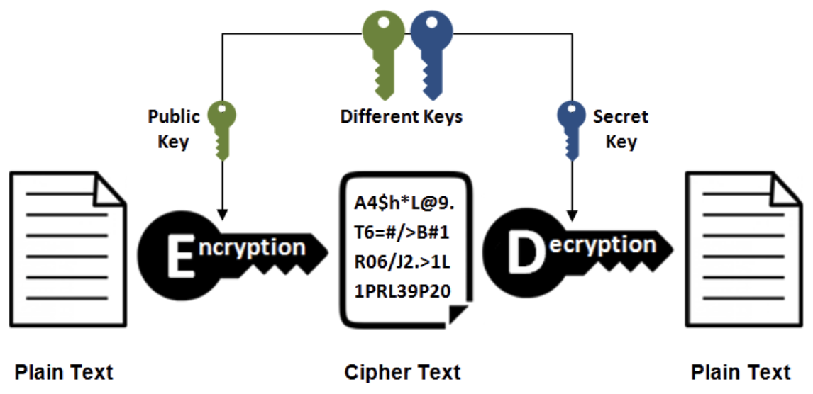

# 基础

## 7 层模型与 4 层模型


7层模型是 OSI 提出的网络协议分层标准，但是实际上的 TCP/IP 体系并没有完全遵循 OSI 的七层模型，而是实际的四层模型。

* 应用层：为特定应用程序提供数据传输服务，例如 HTTP、DNS 等协议。数据单位为报文
* 传输层：为进程提供通用数据传输服务。由于应用层协议很多，定义通用的传输层协议就可以支持不断增多的应用层协议。包括两种协议：传输控制协议 TCP，提供面向连接、可靠的数据传输服务，数据单位为报文段；用户数据报协议 UDP，提供无连接、尽最大努力的数据传输服务，数据单位为用户数据报
* 网络层：为主机提供数据传输服务。而传输层协议是为主机中的进程提供数据传输服务。网络层把传输层传递下来的报文段或者用户数据报封装成分组，IP 协议就属于网络层协议
* 网络接口层：把网络层传下来的分组封装成帧，尽可能屏蔽传输媒体和通信手段的差异，使网络层感觉不到这些差异

## IP 协议

网络层是整个互联网的核心，因此应当让网络层尽可能简单。网络层向上只提供简单灵活的、无连接的、尽最大努力交互的数据报服务。使用 IP 协议，可以把异构的物理网络设备连接起来，使得在网络层看起来好像是一个统一的网络。

**首部格式**


* **版本：**用于标识当前是 IPV4 还是 IPV6 数据报

* **源地址：**源机器的 IP 地址

* **目的地址：**目的机器的 IP 地址

* **首部长度：**占 4 位，最大值为 15。值为 1 表示的是 1 个 32 位字的长度，也就是 4 字节。因为固定部分长度为 20 字节，因此该值最小为 5。如果可选字段的长度不是 4 字节的整数倍，就用尾部的填充部分来填充。

* **区分服务：**用来获得更好的服务，一般情况下不使用

* **总长度** : 包括首部长度和数据部分长度

* **生存时间** ：TTL，它的存在是为了防止无法交付的数据报在互联网中不断兜圈子。以路由器跳数为单位，当 TTL 为 0 时就丢弃数据报

* **协议** ：指出携带的数据应该由上层哪个协议进行处理，例如 ICMP、TCP、UDP 等

* **首部检验和** ：计算方法为，首先将校验和位置零，然后对每16位二进制反码求和，结果写入校验和位置。因为数据报每经过一个路由器，都要重新计算检验和，因此检验和不包含数据部分可以减少计算的工作量

* **标志：**3位，目前只有2位有意义。最低位为 MF，MF=1 代表后面还有分片的数据报，MF=0 代表当前数据报已是最后的数据报。次低位为DF，DF=1 代表不能分片，DF=0 代表可以分片

* **标识** : 在数据报长度过长从而发生分片的情况下，相同数据报的不同分片具有相同的标识符

* **片偏移** : 和标识符一起，用于发生分片的情况。片偏移的单位为 8 字节

  

**IP 地址分类**

* A类地址：1 字节的网络地址 + 3 字节主机地址，1.0.0.0 ～ 126.0.0.0

* B类地址：2 字节的网络地址 + 2 字节主机地址，128.0.0.0 ～ 191.255.255.255

* C类地址：3 字节的网络地址 + 1 字节主机地址，192.0.0.0 ～ 223.255.255.255

## TCP 协议

传输控制协议 TCP（Transmission Control Protocol）是面向连接的，提供可靠交付，有流量控制，拥塞控制，提供全双工通信，面向字节流（把应用层传下来的报文看成字节流，把字节流组织成大小不等的数据块），每一条 TCP 连接只能是点对点的（一对一）。

**首部格式**


- **序号** ：用于对字节流进行编号，例如序号为 301，表示第一个字节的编号为 301，如果携带的数据长度为 100 字节，那么下一个报文段的序号应为 401
- **确认号** ：期望收到的下一个报文段的序号。例如 B 正确收到 A 发送来的一个报文段，序号为 501，携带的数据长度为 200 字节，因此 B 期望下一个报文段的序号为 701，B 发送给 A 的确认报文段中确认号就为 701
- **数据偏移** ：指的是数据部分距离报文段起始处的偏移量，实际上指的是首部的长度
- **确认 ACK** ：当 ACK=1 时确认号字段有效，否则无效。TCP 规定，在连接建立后所有传送的报文段都必须把 ACK 置 1
- **同步 SYN** ：在连接建立时用来同步序号。当 SYN=1，ACK=0 时表示这是一个连接请求报文段。若对方同意建立连接，则响应报文中 SYN=1，ACK=1
- **终止 FIN** ：用来释放一个连接，当 FIN=1 时，表示此报文段的发送方的数据已发送完毕，并要求释放连接
- **窗口** ：窗口值作为接收方让发送方设置其发送窗口的依据。之所以要有这个限制，是因为接收方的数据缓存空间是有限的

### TCP三次握手


#### 为什么需要第三次握手？

为了防止已经失效的连接请求报文突然又传送到了服务器，建立无效连接消耗服务器资源。

如果使用的是两次握手建立连接，假设有这样一种场景，客户端发送了第一个请求连接并且没有丢失，只是因为在网络结点中滞留的时间太长了，由于 TCP 的客户端迟迟没有收到确认报文，以为服务器没有收到，此时重新向服务器发送这条报文，此后客户端和服务器经过两次握手完成连接，传输数据，然后关闭连接。此时此前滞留的那一次请求连接，网络通畅了到达了服务器，这个报文本该是失效的，但是，两次握手的机制将会让客户端和服务器再次建立连接，这将导致不必要的错误和资源的浪费。

如果采用的是三次握手，就算是那一次失效的报文传送过来了，服务端接受到了那条失效报文并且回复了确认报文，但是客户端不会再次发出确认。由于服务器收不到确认，就知道客户端并没有请求连接，不会建立连接。

### TCP四次挥手


#### 为什么客户端最后还要等待2MSL？

MSL（Maximum Segment Lifetime），最大报文生命时长。

1. 保证客户端发送的最后一个 ACK 报文能够到达服务器，因为这个 ACK 报文可能丢失，站在服务器的角度看来，已经发送了FIN+SYN报文请求断开了，客户端还没有回应，应该是发送的请求断开报文它没有收到，于是服务器又会重新发送一次，而客户端就能在这个2MSL时间段内收到这个重传的报文，接着给出回应报文，并且会重置 2MSL 计时器
2. 防止类似与“三次握手”中提到了的“已经失效的连接请求”出现在本连接中。客户端发送完最后一个确认报文后，在这个2MSL时间中，就可以使本连接持续的时间内所产生的所有报文段都从网络中消失。这样新的连接中不会出现旧连接的请求报文

### 滑动窗口

滑动窗口是缓存的一部分，用来暂时存放字节流。发送方和接收方各有一个发送和接收窗口，接收方通过 TCP 报文段中的窗口字段告诉发送方自己的接收窗口大小，发送方根据这个值和其它信息设置自己的发送窗口大小。

接收窗口只会对窗口内最后一个按序到达的字节进行确认，例如接收窗口已经收到的字节为 {31, 34, 35}，其中 {31} 按序到达，而 {34, 35} 就不是，因此只对字节 31 进行确认。发送方得到一个字节的确认之后，就知道这个字节之前的所有字节都已经被接收。

### 拥塞控制

拥塞控制的目的主要是为了避免整个网络链路中的流量压力过大，主要通过 4 个机制实现拥塞控制，核心的是发送方需要维护一个叫做拥塞窗口（cwnd）的状态变量。


**慢开始**

发送的最初执行慢开始，令 cwnd = 1，发送方只能发送 1 个报文段；当收到确认后，将 cwnd 加倍，因此之后发送方能够发送的报文段数量为：2、4、8 ...注意到慢开始每个轮次都将 cwnd 加倍，这样会让 cwnd 增长速度非常快，从而使得发送方发送的速度增长速度过快，网络拥塞的可能性也就更高。设置一个慢开始门限 ssthresh，当 cwnd >= ssthresh 时，进入拥塞避免

**拥塞避免**

进入拥塞避免时，每个轮次只将 cwnd 加 1。如果出现了超时，则令 ssthresh = cwnd / 2，然后重新执行慢开始。

**快重传与快恢复**

在接收方，要求每次接收到报文段都应该对最后一个已收到的有序报文段进行确认。例如已经接收到 M1 和 M2，此时收到 M4，应当发送对 M2 的确认报文（包含了期望收到 M3）。发送方如果收到三个重复确认，那么可以知道下一个报文段丢失，此时执行快重传，立即重传下一个报文段。例如收到三个 M2，则 M3 丢失，立即重传 M3。

在这种情况下，只是丢失个别报文段，而不是网络拥塞。因此执行快恢复，令 ssthresh = cwnd / 2 ，cwnd = ssthresh，注意到此时直接进入拥塞避免。**慢开始和快恢复的快慢指的是 cwnd 的设定值，而不是 cwnd 的增长速率。慢开始 cwnd 设定为 1，而快恢复 cwnd 设定为 ssthresh。**

### TCP 连接异常断开

首先，Linux 下 TCP 有 keep alive 保活机制，如果两端的 TCP 连接一直没有数据交互，达到了触发 TCP 保活机制的条件，那么内核里的 TCP 协议栈就会发送探测报文。保活探测一般通过以下几个参数配置：

```bash
net.ipv4.tcp_keepalive_time=7200 // 保活时间开启时间 7200 秒（2小时），2 小时内没有数据交互就开始探测
net.ipv4.tcp_keepalive_time=75 // 探测每次间隔 75 秒
net.ipv4.tcp_keepalive_probes=9 // 探测 9 次不成功就认为失活，断开本次连接
```

另外 TCP 本身还有超时重传机制，注意区别于保活机制，超时重传是 TCP 在数据传输过程中，未及时收到对端的应答报文，会再次发送未收到应答的报文。

##### 有数据传输时异常断开

对于**正在传输数据时客户端突然异常断开物理连接（拔掉网线等）**，服务端收不到对端的应答报文，触发超时重传，根据  /proc/sys/net/ipv4/tcp_retries2 的配置值确定重试次数，默认是 15，第一次间隔 2 秒，第二次间隔 4 秒，第四次间隔 8 秒...... 

如果在服务端重传报文的过程中，客户端异常没有恢复（网线没插好），服务端超时重传报文的次数达到阈值后，内核就会判定出该 TCP 有问题，然后通过 Socket 接口告诉应用程序该 TCP 连接出问题了，于是服务端的 TCP 连接就会断开，等客户端插回网线后，如果客户端向服务端发送了数据，由于服务端已经断开连接了，因此**服务端内核就会回复 RST 报文（Connection reset by peer）**，客户端收到后就会释放该 TCP 连接。而如果在服务端超时重传报文的次数达到阈值前，客户端重新恢复了，那么之前的连接依然有效，继续在之前的连接上进行通信。

##### 无数据传输时异常断开

对于**没有传输数据时客户端突然异常断开物理连接（拔掉网线等）**，并且开启了 keep alive 机制，则服务端会在保活探测次数到达阈值断开该 TCP 连接，否则在没有数据传输的情况下，不开启  keep alive 机制无法得知连接断开。

##### 应用程序级连接断开（非物理连接断开）

例如，Linux 中使用 kill -9 杀掉进程， 操作系统会检查进程的打开的 TCP 连接进行 4 次握手正常关闭连接。

## UDP 协议

用户数据报协议 UDP（User Datagram Protocol）是无连接的，尽最大可能交付，没有拥塞控制，面向报文（对于应用程序传下来的报文不合并也不拆分，只是添加 UDP 首部），支持一对一、一对多、多对一和多对多的交互通信。

**首部格式**


相对于 TCP 来说比较简单，包括源端口、目的端口、长度、检验和。12 字节的伪首部是为了计算检验和临时添加的。

## HTTP 协议

### 请求体

- 第一行是包含了请求方法、URL、协议版本

- 接下来的多行都是请求首部 Header，每个首部都有一个首部名称，以及对应的值

- 一个空行用来分隔首部和内容主体 Body

- 最后是请求的内容主

  ```bash
  GET http://www.example.com/ HTTP/1.1
  Accept: text/html,application/xhtml+xml;q=0.9,image/webp,image/apng,*/*
  Accept-Encoding: gzip, deflate
  Accept-Language: zh-CN,zh;q=0.9,en;q=0.8
  Cache-Control: max-age=0
  Host: www.example.com
  If-Modified-Since: Thu, 17 Oct 2019 07:18:26 GMT
  If-None-Match: "3147526947+gzip"
  Proxy-Connection: keep-alive
  Upgrade-Insecure-Requests: 1
  User-Agent: Mozilla/5.0 xxx
  
  param1=1&param2=2
  ```

### 响应体

* 第一行包含协议版本、状态码以及描述，最常见的是 200 OK 表示请求成功了

* 接下来多行也是首部内容

* 一个空行分隔首部和内容主体

* 最后是响应的内容主体

  ```bash
  HTTP/1.1 200 OK
  Age: 529651
  Cache-Control: max-age=604800
  Connection: keep-alive
  Content-Encoding: gzip
  Content-Length: 648
  Content-Type: text/html; charset=UTF-8
  Date: Mon, 02 Nov 2020 17:53:39 GMT
  Etag: "3147526947+ident+gzip"
  Expires: Mon, 09 Nov 2020 17:53:39 GMT
  Keep-Alive: timeout=4
  Last-Modified: Thu, 17 Oct 2019 07:18:26 GMT
  Proxy-Connection: keep-alive
  Server: ECS (sjc/16DF)
  Vary: Accept-Encoding
  X-Cache: HIT
  
  <!doctype html>
  <html>
  <head>
      <title>Example Domain</title>
  		// 省略... 
  </body>
  </html>
  ```

### Http 方法

**GET** ：获取资源，get 方法一般用于请求，比如你在浏览器地址栏输入 `www.baidu.com` 其实就是发送了一个 get 请求，它的主要特征是请求服务器返回资源，get 相当于一个是 pull/拉的操作，是不安全的，因为在发送请求的过程中，请求参数会拼在 URL 后面，从而导致容易被攻击者窃取

**POST** ：传输实体主体，POST 主要用来传输数据，一般用于 `<form> 表单`的提交，相当于是把信息提交给服务器，等待服务器作出响应，相当于是一个 push/推的操作。

**GET 与 POST的区别**

- get 请求的 URL 有长度限制，而 post 请求会把参数和值放在消息体中，对数据长度没有要求
- get 请求会被浏览器主动 cache，而 post 不会，除非手动设置
- get 请求在浏览器反复的 `回退/前进` 操作是无害的，而 post 操作会再次提交表单请求
- get 请求在发送过程中会产生一个 TCP 数据包；post 在发送过程中会产生两个 TCP 数据包。对于 get 方式的请求，浏览器会把 http header 和 data 一并发送出去，服务器响应 200（返回数据）；而对于 post，浏览器先发送 header，服务器响应 100 continue，浏览器再发送 data，服务器响应 200 ok（返回数据）

**HEAD** ：获取报文首部，和 GET 方法类似，不返回报文实体部分。主要用于确认 URL 的有效性以及资源更新的日期时间等

**PUT** ：修改操作，上传文件，由于自身不带验证机制，任何人都可以上传文件，因此存在安全性问题，一般不使用该方法

**DELETE** ：删除文件，与 PUT 功能相反

### HTTP 状态码

| 状态码 | 类型                             | 含义                                                         |
| ------ | -------------------------------- | ------------------------------------------------------------ |
| 1xx    | Informational（信息性状态码）    | 请求正在处理，post 请求会先发 header，返回 100 continue，再发data |
| 2xx    | Success（成功状态码）            | 请求正常处理完毕                                             |
| 3xx    | Redirection（重定向状态码）      | 需要进行附加操作以完成请求                                   |
| 4xx    | Client Error（客户端错误状态码） | 客户端错误，无法处理请求                                     |
| 5xx    | Server Error（服务器错误状态码） | 服务器故障，无法处理请求                                     |

### HTTP1.0/1.1/2.0 区别

| HTTP1.0                                                      | HTTP1.1                                                      | HTTP2.0                                                      |
| ------------------------------------------------------------ | ------------------------------------------------------------ | ------------------------------------------------------------ |
| 1. 仅提供最基本的认证，用户名和密码不加密<br /> 2. 被设计用于短链接，即每次发送数据都会经过 TCP 的三次握手和四次挥手，效率较低<br /> 3. 只使用 header 中的 If-Modified-Since 和 Expires 作为缓存失效的标准<br /> 4. 不支持断点续传，每次都会传送全部的页面和数据<br /> 5. 认为每台计算机只能绑定一个 IP，请求消息中的 URL 并没有传递主机名（hostname） | 1. 使用了摘要算法来进行身份验证<br /> 2. 默认使用长连接，只需一次建立就可以传输多次数据，传输完成后，只需要一次切断连接即可，连接时长可以通过请求头中的 `keep-alive` 来设置<br />3.  中新增加了 E-tag，If-Unmodified-Since, If-Match, If-None-Match 等缓存控制标头来控制缓存失效<br />4. 支持断点续传，通过使用请求头中的 `Range` 来实现<br /> 5. 使用了虚拟网络，在一台物理服务器上可以存在多个虚拟主机（Multi-homed Web Servers），并且它们共享一个IP地址 | 1. `头部压缩`，由于 HTTP 1.1 经常会出现 **User-Agent、Cookie、Range** 等字段可能会占用几百甚至几千字节，而 Body 却经常只有几十字节，导致头部偏重。HTTP 2.0 使用 `HPACK` 算法进行压缩。<br />2.  `二进制格式`，HTTP 2.0 使用了更加靠近 TCP/IP 的二进制格式，而抛弃了 ASCII 码，提升了解析效率 `强化安全`，由于安全已经成为重中之重，所以 HTTP2.0 一般都跑在 HTTPS 上。<br />3.  `多路复用`，即每一个请求都是是用作连接共享。一个请求对应一个id，这样一个连接上可以有多个请求。 |

## HTTPS

HTTPS 是让 HTTP 先和 SSL（Secure Sockets Layer）通信，再由 SSL 和 TCP 通信，也就是说 HTTPS 使用了隧道进行通信。通过使用 SSL，HTTPS 具有了加密（防窃听）、认证（防伪装）和完整性保护（防篡改），这也是HTTPS 解决的 3 个问题。

**加密（防窃听）**

1. 对称加密：加密和解密使用同一密钥，解密速度快，但是无法保证密钥的安全性。

   

2. 非对称加密：又称公开密钥加密（Public-Key Encryption），加密和解密使用不同的密钥。公开密钥所有人都可以获得，私有密钥不公开给任何人，公钥加密的内容可以通过私钥解密，同样私钥加密的内容也可以通过公钥解密。通信发送方获得接收方的公开密钥之后，就可以使用公开密钥进行加密，接收方收到通信内容后使用私有密钥解密。这种方式不用考虑公开密钥的安全性问题，但是解密速度稍慢。

   私有密钥也可以用来加密，例如用来进行签名。因为私有密钥无法被其他人获取，因此通信发送方使用私有密钥进行签名加密，通信接收方使用发送方的公开密钥对签名进行解密，就能判断这个签名是否是对方，可以更安全地将公开密钥传输给通信发送方。

   

**HTTPS 采用的加密方式**

对称密钥加密方式的传输效率更高，但是无法安全地将密钥传输给通信方；而非对称密钥加密方式可以保证传输的安全性，因此可以利用非对称密钥加密方式将 Secret Key 传输给通信方，这就是 HTTPS 采用混合的加密机制。

**认证（防伪装）**

中间人攻击：有这么一种情况（也就是所谓的**中间人攻击**），hackers 在服务器发送给客户端公钥的时候，截取到了公钥（这里把服务器下发的公钥记为公钥A），hacker 截取之后，向客户端发送一份自己下发的公钥（这里称为公钥B），当客户端给服务器发送数据时，就使用了公钥 B 加密，hackers 截取后，通过私钥 B 进行解密就可以得到真实数据。

有一种策略方法来保证这把公钥是服务器发送而不是第三方，即数字证书。数字证书，由具有公信力并且大家都认可的认证中心CA所下发。服务器在服务部署前会先向CA认证机构申请证书，申请时会告诉CA认证中心自己的公钥，CA认证中心对服务器公钥和信息进行加密（用CA认证中心的私钥加密）后生成数字证书。服务器在给客户端下发公钥的过程前，会把先下发证书，客户端收到证书后会使用CA认证中心的公钥进行解密，得到证书对应的服务器公钥和信息，这个信息是绝对可信的，因为是由权威CA机构认证颁发的，拿到这个公钥后跟对端发送过来的公钥进行比对，相同的话则代表没有经过中间人劫持。简而言之，就是利用一个第三方权威机构，去对公钥进行认证，私钥在服务器端，从而保障了数据传递的安全性。


**完整性保护（防篡改）**

HTTPS 的报文摘要功能之所以安全，是因为它结合了加密和认证这两个操作。试想一下，加密之后的报文，遭到篡改之后，也很难重新计算报文摘要，因为无法轻易获取明文。

## 其他协议

### ARP 地址解析协议

ARP 属于链路层，用于配合 IP 协议工作。网络层实现主机之间的通信，而链路层实现具体每段链路之间的通信。因此在通信过程中，IP 数据报的源地址和目的地址始终不变，而 MAC 地址随着链路的改变而改变。ARP 地址解析协议实现由 IP 地址得到 MAC 地址。每个主机都有一个 ARP 高速缓存，里面有本局域网上的各主机和路由器的 IP 地址到 MAC 地址的映射表。

如果主机 A 知道主机 B 的 IP 地址，但是 ARP 高速缓存中没有该 IP 地址到 MAC 地址的映射，此时主机 A 通过广播的方式发送 ARP 请求分组，主机 B 收到该请求后会发送 ARP 响应给主机 A 告知其 MAC 地址，随后主机 A 向其高速缓存中写入主机 B 的 IP 地址到 MAC 地址的映射。


### ICMP 网络控制报协议

ICMP 属于网络层协议，是为了更有效地转发 IP 数据报和提高交付成功的机会。它封装在 IP 数据报中，但是不属于高层协议，很多网络诊断工具就是利用的 ICMP 协议。


| ICMP报文种类 | 类型值 | 描述                          |
| :----------- | ------ | ----------------------------- |
| 差错报告报文 | 3      | 终点不可达                    |
| 差错报告报文 | 11     | 超时                          |
| 差错报告报文 | 12     | 参数问题                      |
| 差错报告报文 | 5      | 改变路由（Redirect）          |
| 查询报文     | 8或0   | 回送（Echo）请求或回答        |
| 查询报文     | 13或14 | 时间戳（Timestamp）请求或回答 |

#### Ping

Ping 是 ICMP 的一个重要应用，主要用来测试两台主机之间的连通性。

Ping 的原理是通过向目的主机发送 ICMP Echo 请求报文，目的主机收到之后会发送 Echo 回答报文。Ping 会根据时间和成功响应的次数估算出数据包往返时间以及丢包率。


#### Traceroute

Traceroute 是 ICMP 的另一个应用，用来跟踪报文从源点到终点的路径。Traceroute 发送的 IP 数据报封装的是无法交付的 UDP 用户数据报，并由目的主机发送终点不可达差错报告报文。

- 源主机向目的主机发送一连串的 IP 数据报。第一个数据报 P1 的生存时间 TTL 设置为 1，当 P1 到达路径上的第一个路由器 R1 时，R1 收下它并把 TTL 减 1，此时 TTL 等于 0，R1 就把 P1 丢弃，并向源主机发送一个 ICMP 超时差错报告报文
- 源主机接着发送第二个数据报 P2，并把 TTL 设置为 2。P2 先到达 R1，R1 收下后把 TTL 减 1 再转发给 R2，R2 收下后也把 TTL 减 1，由于此时 TTL 等于 0，R2 就丢弃 P2，并向源主机发送一个 ICMP 超时差错报文
- 以此类推递增 TTL 重复以上步骤，直到最后一个数据报刚刚到达目的主机，主机不转发数据报，也不把 TTL 值减 1。但是因为数据报封装的是无法交付的 UDP，因此目的主机要向源主机发送 ICMP 终点不可达差错报告报文
- 根据以上步骤的中间结果，源主机就可以知道到达目的主机所经过的路由器 IP 地址以及到达每个路由器的往返时间

## 浏览器输入URL到页面渲染过程

1. URL 解析

   首先判断输入的是一个合法的 URL 还是一个待搜索的关键词，（在谷歌浏览器输入一个 URL 或者搜索关键词的时候，浏览器都能正确识别出来）。根据输入的内容进行自动完成、字符编码等操作。出于安全考虑，解析后会强制使用 HTTPS 访问。解析完成后会检查缓存，如果本地 URL 缓存还没有过期，直接加载出来，否则继续下面的步骤。

2. DNS 查询

   最终的网络通信需要用 IP 地址进行通信， 因此需要查找 URL 跟 IP 地址的映射关系。查找按照如下顺序：浏览器缓存，操作系统缓存，路由器缓存，ISP DNS 缓存，根域名服务器。

3. 建立 TCP 连接

   通过三次握手建立跟服务端建立连接，具体流程这里不说了。

4. 如果是HTTPS，会经历 SSL 握手，也就是服务端公钥、证书认证的过程

   a. 客户端发送 client_hello 报文，包含支持的 TLS 版本、加密套件 cipher suite 列表、随机数（用于后续的密钥协商）random_A

   b. 服务端收到客户端的 client_hello 之后，发送 server_hello，并返回协商的信息结果，包含选择使用的TLS协议版本、选择的加密套件 cipher suite 、 随机数 random_B

   c. 服务端发送完 server_hello 后，开始发送自己的 CA 证书，紧接着发送 Server Key Exchange 将自己的加密公钥发送给 client，最后服务端发送 Server Hello Done 通知客户端 sever_hello 结束

   d. 客户端验证步骤 c 中发送过来的 CA 证书与公钥，验证通过后发送 client_key_exchange，生成随机数 random_C 作为自己的公钥，并用服务端公钥对自己生成的公钥进行加密然后发送到服务端

   e. 服务器给客户端分配一个会话，在超时时间内，双方都以协商的密钥进行通信

5. 处理请求、渲染页面

服务器接收到对端的 HTTP 请求后，进行相应的处理，返回请求的资源，包括 html、css、js、图片、文件、视频等资源

6. 4 次挥手断开连接