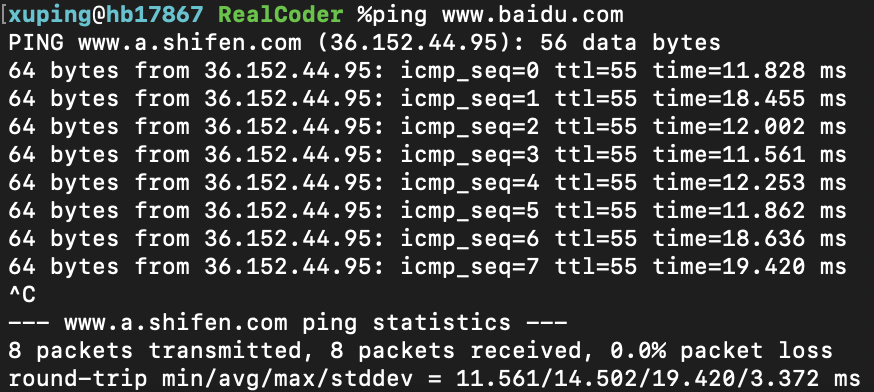

# 基础

## 7 层模型与 4 层模型

7层模型是 OSI 提出的网络协议分层标准，但是实际上的 TCP/IP 体系并没有完全遵循 OSI 的七层模型，而是实际的四层模型。

* 应用层：为特定应用程序提供数据传输服务，例如 HTTP、DNS 等协议。数据单位为报文
* 传输层：为进程提供通用数据传输服务。由于应用层协议很多，定义通用的传输层协议就可以支持不断增多的应用层协议。包括两种协议：传输控制协议 TCP，提供面向连接、可靠的数据传输服务，数据单位为报文段；用户数据报协议 UDP，提供无连接、尽最大努力的数据传输服务，数据单位为用户数据报
* 网络层：为主机提供数据传输服务。而传输层协议是为主机中的进程提供数据传输服务。网络层把传输层传递下来的报文段或者用户数据报封装成分组，IP 协议就属于网络层协议
* 网络接口层：把网络层传下来的分组封装成帧，尽可能屏蔽传输媒体和通信手段的差异，使网络层感觉不到这些差异

## IP 协议

网络层是整个互联网的核心，因此应当让网络层尽可能简单。网络层向上只提供简单灵活的、无连接的、尽最大努力交互的数据报服务。使用 IP 协议，可以把异构的物理网络设备连接起来，使得在网络层看起来好像是一个统一的网络。

**首部格式**

* **版本：**用于标识当前是 IPV4 还是 IPV6 数据报

* **源地址：**源机器的 IP 地址

* **目的地址：**目的机器的 IP 地址

* **首部长度：**占 4 位，最大值为 15。值为 1 表示的是 1 个 32 位字的长度，也就是 4 字节。因为固定部分长度为 20 字节，因此该值最小为 5。如果可选字段的长度不是 4 字节的整数倍，就用尾部的填充部分来填充。

* **区分服务：**用来获得更好的服务，一般情况下不使用

* **总长度** : 包括首部长度和数据部分长度

* **生存时间** ：TTL，它的存在是为了防止无法交付的数据报在互联网中不断兜圈子。以路由器跳数为单位，当 TTL 为 0 时就丢弃数据报

* **协议** ：指出携带的数据应该由上层哪个协议进行处理，例如 ICMP、TCP、UDP 等

* **首部检验和** ：计算方法为，首先将校验和位置零，然后对每16位二进制反码求和，结果写入校验和位置。因为数据报每经过一个路由器，都要重新计算检验和，因此检验和不包含数据部分可以减少计算的工作量

* **标志：**3位，目前只有2位有意义。最低位为 MF，MF=1 代表后面还有分片的数据报，MF=0 代表当前数据报已是最后的数据报。次低位为DF，DF=1 代表不能分片，DF=0 代表可以分片

* **标识** : 在数据报长度过长从而发生分片的情况下，相同数据报的不同分片具有相同的标识符

* **片偏移** : 和标识符一起，用于发生分片的情况。片偏移的单位为 8 字节

  

**IP 地址分类**

* A类地址：1 字节的网络地址 + 3 字节主机地址，1.0.0.0 ～ 126.0.0.0

* B类地址：2 字节的网络地址 + 2 字节主机地址，128.0.0.0 ～ 191.255.255.255

* C类地址：3 字节的网络地址 + 1 字节主机地址，192.0.0.0 ～ 223.255.255.255

## TCP 协议

传输控制协议 TCP（Transmission Control Protocol）是面向连接的，提供可靠交付，有流量控制，拥塞控制，提供全双工通信，面向字节流（把应用层传下来的报文看成字节流，把字节流组织成大小不等的数据块），每一条 TCP 连接只能是点对点的（一对一）。

**首部格式**

- **序号** ：用于对字节流进行编号，例如序号为 301，表示第一个字节的编号为 301，如果携带的数据长度为 100 字节，那么下一个报文段的序号应为 401
- **确认号** ：期望收到的下一个报文段的序号。例如 B 正确收到 A 发送来的一个报文段，序号为 501，携带的数据长度为 200 字节，因此 B 期望下一个报文段的序号为 701，B 发送给 A 的确认报文段中确认号就为 701
- **数据偏移** ：指的是数据部分距离报文段起始处的偏移量，实际上指的是首部的长度
- **确认 ACK** ：当 ACK=1 时确认号字段有效，否则无效。TCP 规定，在连接建立后所有传送的报文段都必须把 ACK 置 1
- **同步 SYN** ：在连接建立时用来同步序号。当 SYN=1，ACK=0 时表示这是一个连接请求报文段。若对方同意建立连接，则响应报文中 SYN=1，ACK=1
- **终止 FIN** ：用来释放一个连接，当 FIN=1 时，表示此报文段的发送方的数据已发送完毕，并要求释放连接
- **窗口** ：窗口值作为接收方让发送方设置其发送窗口的依据。之所以要有这个限制，是因为接收方的数据缓存空间是有限的

### TCP三次握手

### TCP四次挥手

### 超时重传

### 拥塞控制

## UDP 协议

**首部格式**

## TCP与UDP的区别

## Http 协议

## 其他协议

### ARP 地址解析协议

ARP 属于链路层，用于配合 IP 协议工作。网络层实现主机之间的通信，而链路层实现具体每段链路之间的通信。因此在通信过程中，IP 数据报的源地址和目的地址始终不变，而 MAC 地址随着链路的改变而改变。ARP 地址解析协议实现由 IP 地址得到 MAC 地址。每个主机都有一个 ARP 高速缓存，里面有本局域网上的各主机和路由器的 IP 地址到 MAC 地址的映射表。

如果主机 A 知道主机 B 的 IP 地址，但是 ARP 高速缓存中没有该 IP 地址到 MAC 地址的映射，此时主机 A 通过广播的方式发送 ARP 请求分组，主机 B 收到该请求后会发送 ARP 响应给主机 A 告知其 MAC 地址，随后主机 A 向其高速缓存中写入主机 B 的 IP 地址到 MAC 地址的映射。

### ICMP 网络控制报协议

ICMP 属于网络层协议，是为了更有效地转发 IP 数据报和提高交付成功的机会。它封装在 IP 数据报中，但是不属于高层协议，很多网络诊断工具就是利用的 ICMP 协议。

| ICMP报文种类 | 类型值 | 描述                          |
| :----------- | ------ | ----------------------------- |
| 差错报告报文 | 3      | 终点不可达                    |
| 差错报告报文 | 11     | 超时                          |
| 差错报告报文 | 12     | 参数问题                      |
| 差错报告报文 | 5      | 改变路由（Redirect）          |
| 查询报文     | 8或0   | 回送（Echo）请求或回答        |
| 查询报文     | 13或14 | 时间戳（Timestamp）请求或回答 |

#### Ping

Ping 是 ICMP 的一个重要应用，主要用来测试两台主机之间的连通性。

Ping 的原理是通过向目的主机发送 ICMP Echo 请求报文，目的主机收到之后会发送 Echo 回答报文。Ping 会根据时间和成功响应的次数估算出数据包往返时间以及丢包率。

#### Traceroute

Traceroute 是 ICMP 的另一个应用，用来跟踪报文从源点到终点的路径。Traceroute 发送的 IP 数据报封装的是无法交付的 UDP 用户数据报，并由目的主机发送终点不可达差错报告报文。

- 源主机向目的主机发送一连串的 IP 数据报。第一个数据报 P1 的生存时间 TTL 设置为 1，当 P1 到达路径上的第一个路由器 R1 时，R1 收下它并把 TTL 减 1，此时 TTL 等于 0，R1 就把 P1 丢弃，并向源主机发送一个 ICMP 超时差错报告报文
- 源主机接着发送第二个数据报 P2，并把 TTL 设置为 2。P2 先到达 R1，R1 收下后把 TTL 减 1 再转发给 R2，R2 收下后也把 TTL 减 1，由于此时 TTL 等于 0，R2 就丢弃 P2，并向源主机发送一个 ICMP 超时差错报文
- 以此类推递增 TTL 重复以上步骤，直到最后一个数据报刚刚到达目的主机，主机不转发数据报，也不把 TTL 值减 1。但是因为数据报封装的是无法交付的 UDP，因此目的主机要向源主机发送 ICMP 终点不可达差错报告报文
- 根据以上步骤的中间结果，源主机就可以知道到达目的主机所经过的路由器 IP 地址以及到达每个路由器的往返时间

## 浏览器输入URL到页面渲染过程

