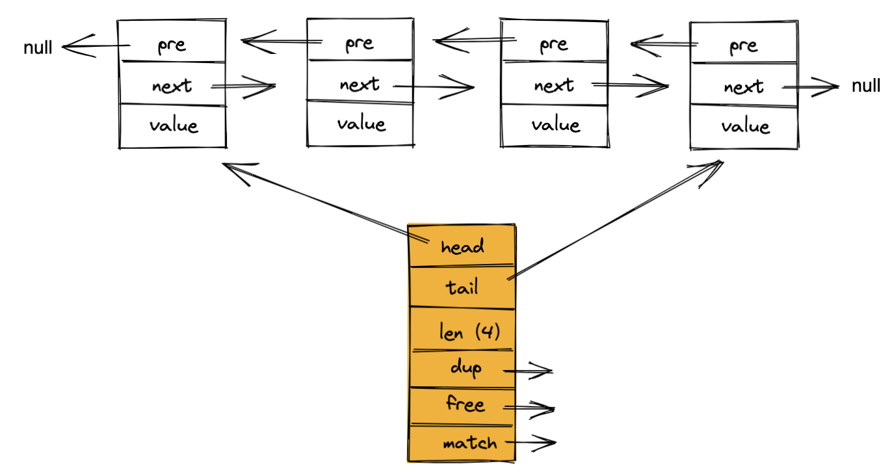

# 基础

## 基本数据类型

redis 是一个 k-v 内存型数据库，通常用来作为缓存中间件。这里的数据类型指的就是 key 和 value 的数据类型。

### string

是 redis 最基本的类型，所有的 key 都是 string 类型。是二进制安全的, 可以包含任何数据，比如 jpg 图片或者序列化的对象，最大能存储 512MB。

```bash
127.0.0.1:6379> set name "john"
OK
127.0.0.1:6379> get name
"john"
```

**底层数据结构：**

string 底层数据结构是 SDS（simple dynamic string），如下图所示：


* len：记录当前已使用的字节数（不包括'\0'），因此获取SDS长度的复杂度为O(1)，此外，len值还避免了二进制安全与缓存区溢出的问题。C语言中，用 '\0' 表示字符串的结束，如果字符串本身就有 '\0' 字符，字符串就会被截断，即非二进制安全
* alloc：记录当前字节数组总共分配的字节数量（不包括 '\0'）
* flag：标记当前字节数组的属性，是 sdshdr8 还是 sdshdr16 等，redis 会根据存储的内容长度来选择不同的结构，以节省内存
* buf: 字节数组，用于保存字符串，包括结尾空白字符 '\0'

### List

是简单的字符串列表，按照插入顺序排序。可以添加一个元素到列表的头部（左边）或者尾部（右边）。

```bash
127.0.0.1:6379> lpush mylist item1
(integer) 1
127.0.0.1:6379> lpop mylist
"item1"
127.0.0.1:6379> lpop mylist
(nil)
```

**底层数据结构：**

双向链表，如图所示：



- dup：函数，用于复制ptr值，实现深度复制。
- free：函数，用于释放对应类型结构的内存。
- match：函数，用于对比链表节点所保存的值和另一个输入值是否相等。

### Set

是string类型的无序集合。集合是通过hashtable实现的，概念和数学中的集合基本类似，可以交集，并集，差集等等，set中的元素是没有顺序的。所以添加，删除，查找的复杂度都是O(1)。

```bash
127.0.0.1:6379> sadd myset item1
(integer) 1
127.0.0.1:6379> sadd myset item2
(integer) 1
127.0.0.1:6379> smembers myset
1) "item2"
2) "item1"
```

**底层数据结构：**

有两种，一个是 hashtable，一个是 inset。其中 hashtable 的 key 为 set 中元素的值，而 value 为 null ，inset 为可以理解为数组，满足下述两个条件使用 inset ：

* 元素个数不少于默认值512
* 元素可以用整型表示

### Zset

zset 和 set 一样也是 string 类型元素的集合，且不允许重复的成员。

使用场景：与 set 类似，区别是 set 不是自动有序的，而 zset 可以通过用户额外提供一个优先级(score)的参数来为成员排序，并且是插入有序的，即自动排序。当需要一个有序的并且不重复的集合列表，那么可以选择sorted set数据结构。zset 的成员是唯一的，但分数(score)可以重复。

```bash
127.0.0.1:6379> zadd myzset 1 value1
(integer) 1
127.0.0.1:6379> zadd myzset 2 value2
(integer) 1
127.0.0.1:6379> zadd myzset 3 value3
(integer) 1
127.0.0.1:6379> zrange myzset 0 2
1) "value1"
2) "value2"
3) "value3"
```

**底层数据结构：**

有两种：一个是字典（dict） + 跳表（skiplist），一个是 ziplist ，满足以下条件时使用 ziplist： 

- 元素数量小于默认值 128 个
- 所有元素的长度小于默认值 64 字节

### Hash

Hash 是一个键值(key => value)对集合, 是一个 string 类型的 field 和 value 的映射表。hash 适用于存储对象。 常用命令：hget, hset, hgetall 等。

```bash
127.0.0.1:6379> HSET myhash field1 "Hello" field2 "World"
(integer) 0
127.0.0.1:6379> HGET myhash field1
"Hello"
```

**底层数据结构：**

有两种：一种是 ziplist，另外一种是 hashtable，满足以下条件时使用 ziplist：

* 键和值字符串长度都小于 64 字节
* 键值对数量小于 512

## 持久化

### RDB 持久化

RDB 持久化是指 Redis 周期性地为引擎中保存的数据创建快照，生成 RDB 文件，保存到磁盘中，实现数据的持久化。RDB文件占用空间小，便于移动，非常适合用于备份或迁移指定时间点的Redis数据。

### AOF 持久化

AOF 持久化是指 Redis 以日志的形式记录所有的写操作，例如 **SET**。服务重启时，Redis可以重新执行 AOF 文件中的操作的形式来恢复数据。当AOF文件过大时，原生 Redis 会自动执行 AOF Rewrite，重组 AOF 文件，降低其占用的存储空间。

## 事务