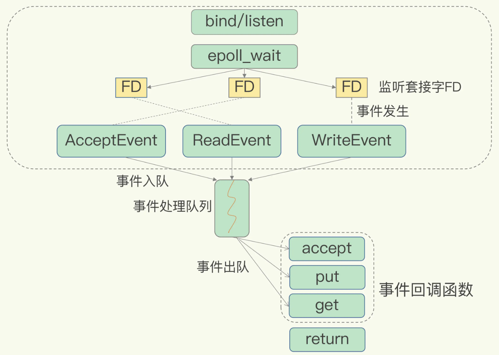

# 高性能与高可用

## Redis IO 模型

Redis是单线程，主要是指 **Redis的网络 IO 和键值对读写是由一个线程来完成的，这也是 Redis 对外提供键值存储服务的主要流程**。但Redis的其他功能，比如持久化、异步删除、集群数据同步等，都是由额外的线程执行的。

**为什么采用单线程？**

多线程可以发挥多核 CPU 的性能优势，但 Redis 的数据是在内存里共享的，如果使用多线程就会引发共享资源的竞争，需要引入互斥锁来解决，使得并行变串行，最终系统吞吐率可能并没有随着线程的增加而增加。另外线程过多反而会带来 CPU 的切换开销变大，降低利用率。多线程开发还需要精细的设计，会增加系统的复杂度，降低代码的易调试性和可维护性。为了避免这些问题，Redis采用单线程模式。

**单线程Redis为什么那么快？**

通常来说，单线程的处理能力比多线程要差很多。但 Redis 却能使用单线程模型达到每秒数十万级别的处理能力，一方面是因为 Redis 大多数操作是在内存上完成的，并且采用高效的数据结构，例如哈希表和跳表。另一方面，Redis采用了**IO多路复用机制**，使其在网络IO操作中能并发处理大量的客户端请求，实现高吞吐率。

## Redis 多级缓存

## Redis 集群模式

### 主从模式

### 哨兵模式

### Cluster 模式

